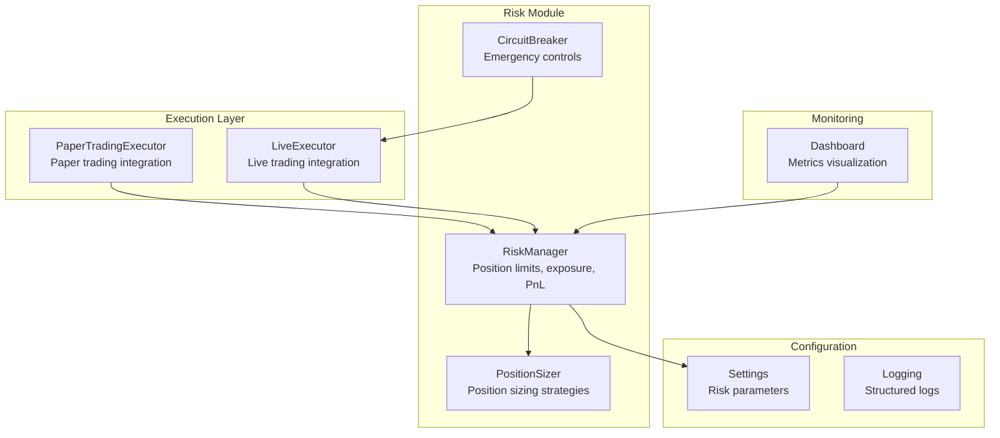
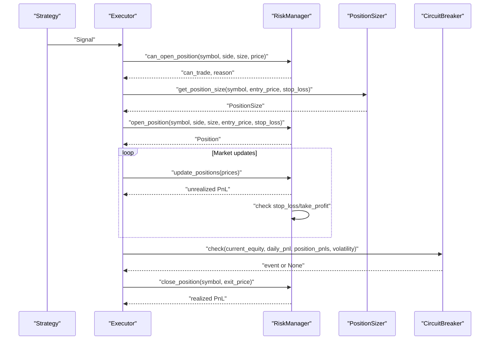
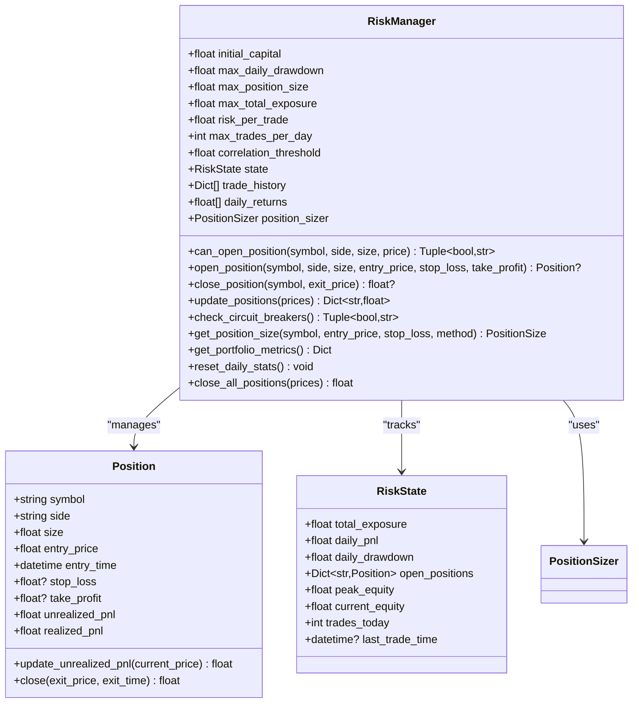
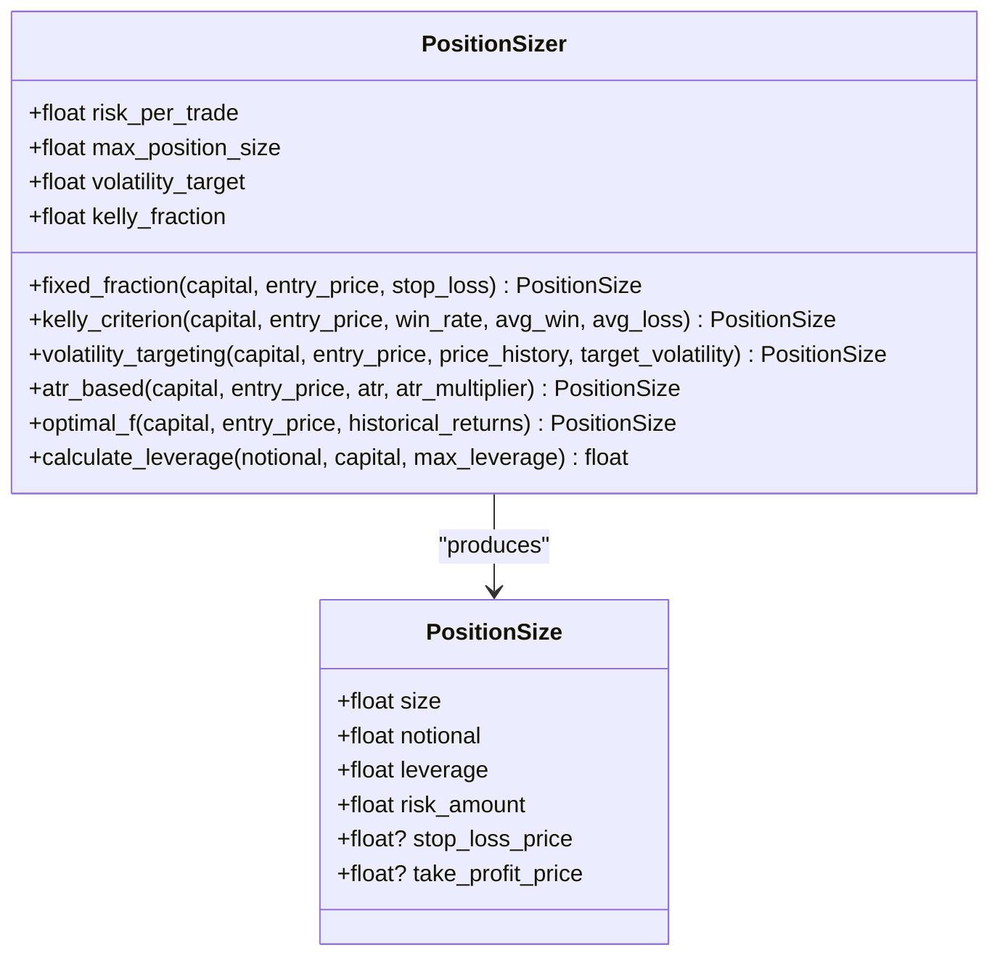
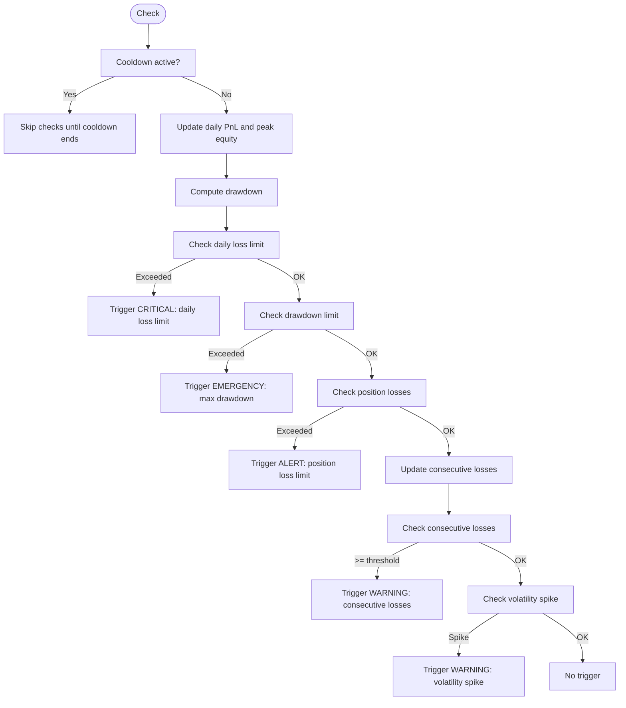
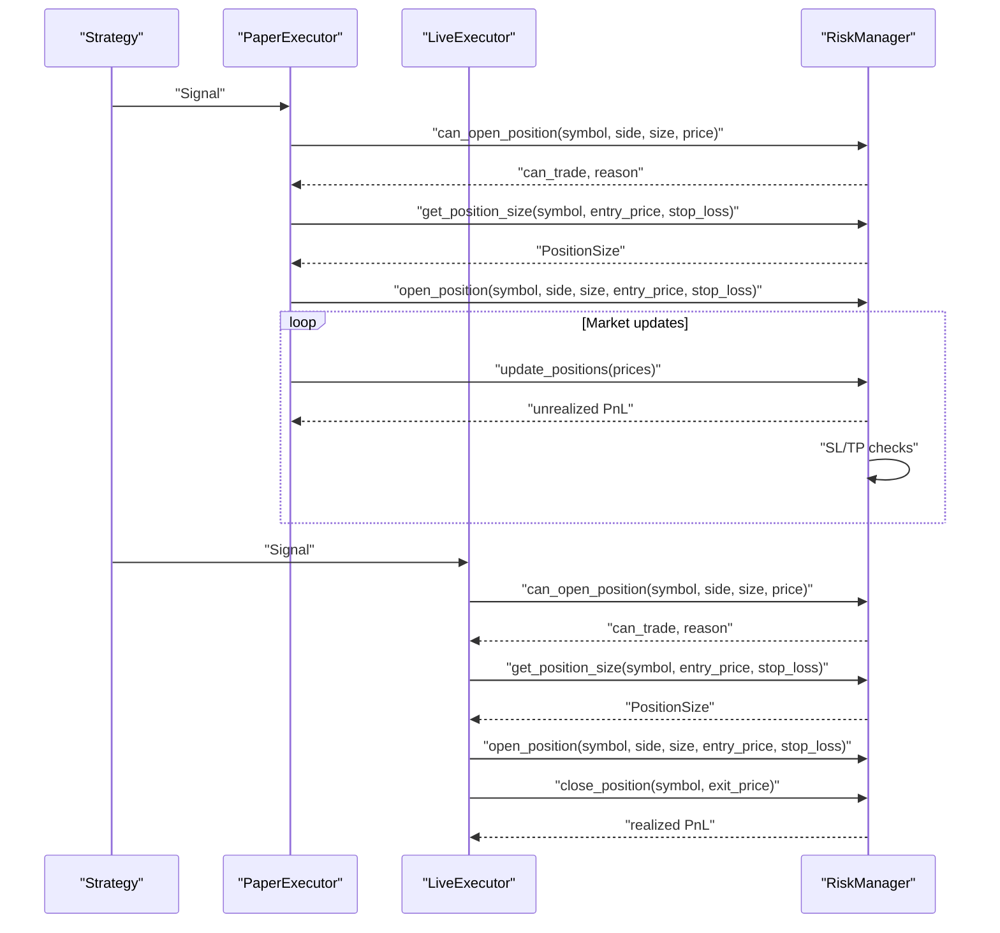
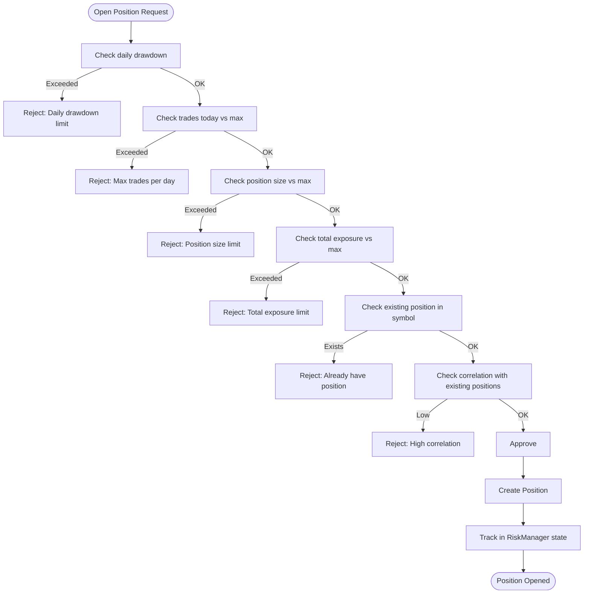
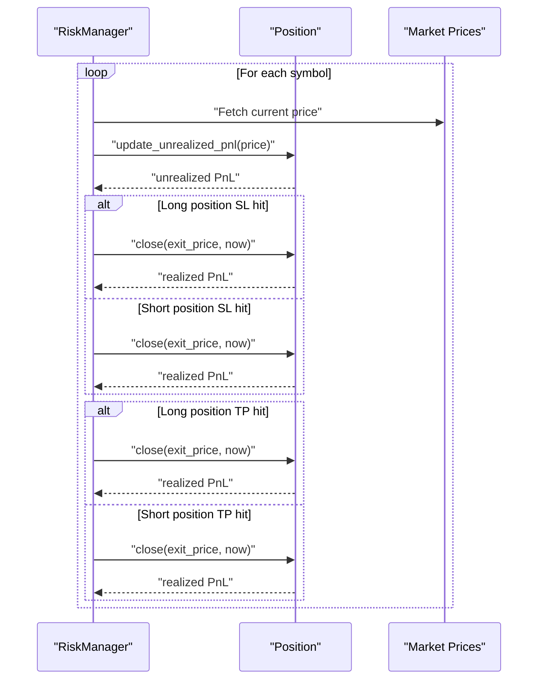
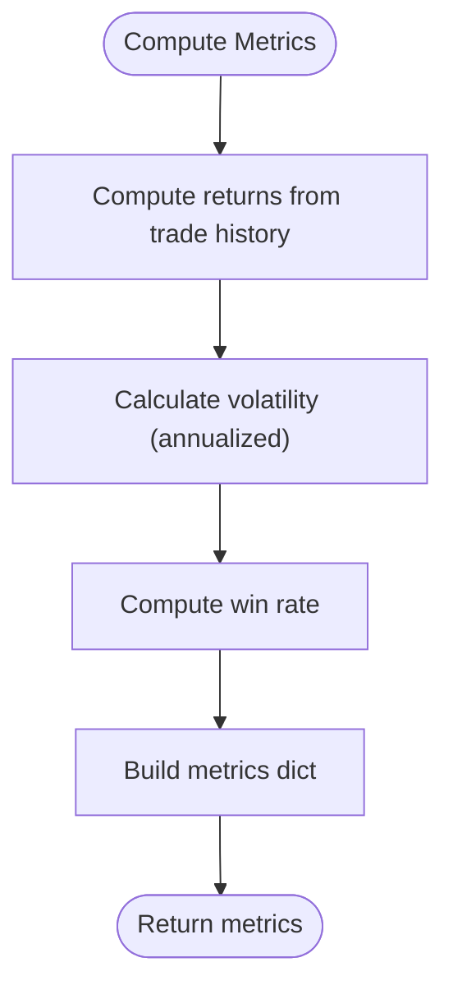
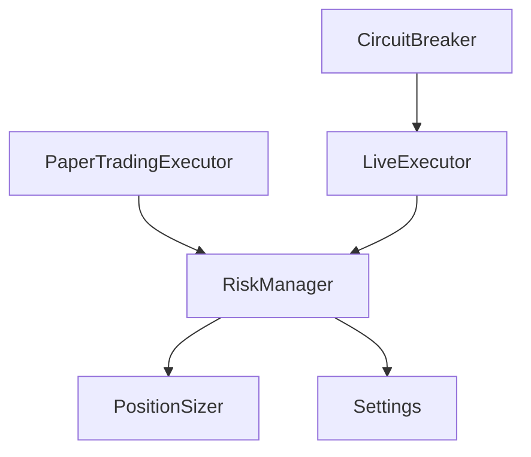

# Risk Controls

<cite>
**Referenced Files in This Document**
- [manager.py](file://trading_bot/risk/manager.py)
- [sizing.py](file://trading_bot/risk/sizing.py)
- [circuit_breaker.py](file://trading_bot/risk/circuit_breaker.py)
- [paper.py](file://trading_bot/execution/paper.py)
- [live.py](file://trading_bot/execution/live.py)
- [settings.py](file://trading_bot/config/settings.py)
- [dashboard.py](file://trading_bot/monitoring/dashboard.py)
- [test_risk.py](file://trading_bot/tests/test_risk.py)
</cite>

## Table of Contents
1. [Introduction](#introduction)
2. [Project Structure](#project-structure)
3. [Core Components](#core-components)
4. [Architecture Overview](#architecture-overview)
5. [Detailed Component Analysis](#detailed-component-analysis)
6. [Dependency Analysis](#dependency-analysis)
7. [Performance Considerations](#performance-considerations)
8. [Troubleshooting Guide](#troubleshooting-guide)
9. [Conclusion](#conclusion)
10. [Appendices](#appendices)

## Introduction
This document provides comprehensive risk control documentation for the AI Trading Bot portfolio management system. It focuses on the RiskManager implementation, covering position limits, exposure controls, daily trading constraints, correlation management, and portfolio-wide risk metrics. It explains position opening and closing logic, unrealized PnL tracking, stop loss/take profit management, and position correlation monitoring. Practical examples of risk parameter configuration, position management workflows, and risk control effectiveness analysis are included, along with portfolio metrics calculation, daily statistics tracking, and risk control violation handling.

## Project Structure
The risk control system is primarily implemented in the risk module and integrated with the execution layer (paper and live trading executors). Configuration is centralized in the settings module, and monitoring dashboards visualize portfolio metrics.

**Diagram sources**
- [manager.py:58-432](file://trading_bot/risk/manager.py#L58-L432)
- [sizing.py:25-312](file://trading_bot/risk/sizing.py#L25-L312)
- [circuit_breaker.py:32-336](file://trading_bot/risk/circuit_breaker.py#L32-L336)
- [paper.py:36-392](file://trading_bot/execution/paper.py#L36-L392)
- [live.py:38-364](file://trading_bot/execution/live.py#L38-L364)
- [settings.py:23-176](file://trading_bot/config/settings.py#L23-L176)
- [dashboard.py:16-328](file://trading_bot/monitoring/dashboard.py#L16-L328)

**Section sources**
- [manager.py:1-432](file://trading_bot/risk/manager.py#L1-L432)
- [sizing.py:1-312](file://trading_bot/risk/sizing.py#L1-L312)
- [circuit_breaker.py:1-336](file://trading_bot/risk/circuit_breaker.py#L1-L336)
- [paper.py:1-392](file://trading_bot/execution/paper.py#L1-L392)
- [live.py:1-364](file://trading_bot/execution/live.py#L1-L364)
- [settings.py:1-176](file://trading_bot/config/settings.py#L1-L176)
- [dashboard.py:1-328](file://trading_bot/monitoring/dashboard.py#L1-L328)

## Core Components
- RiskManager: Portfolio-level risk controller managing position limits, exposure, daily constraints, and portfolio metrics.
- PositionSizer: Position sizing strategies (fixed fraction, Kelly criterion, volatility targeting, ATR-based, optimal f).
- CircuitBreaker: Emergency controls for drawdown, daily loss, position loss, consecutive losses, and volatility spikes.
- PaperTradingExecutor and LiveExecutor: Integrate RiskManager into trading workflows and enforce risk checks during order placement and position management.

Key responsibilities:
- Position limits: Max position size as a fraction of capital and max total exposure.
- Exposure controls: Total exposure tracking and enforcement against capital.
- Daily trading constraints: Max trades per day and daily drawdown limits.
- Correlation management: Simplified correlation checks (placeholder for advanced correlation modeling).
- Portfolio metrics: Equity, drawdown, volatility, win rate, and exposure ratios.
- Stop loss/take profit: Automatic position closure upon triggering SL/TP thresholds.

**Section sources**
- [manager.py:58-432](file://trading_bot/risk/manager.py#L58-L432)
- [sizing.py:25-312](file://trading_bot/risk/sizing.py#L25-L312)
- [circuit_breaker.py:32-336](file://trading_bot/risk/circuit_breaker.py#L32-L336)
- [paper.py:36-392](file://trading_bot/execution/paper.py#L36-L392)
- [live.py:38-364](file://trading_bot/execution/live.py#L38-L364)

## Architecture Overview
The risk control architecture integrates RiskManager with execution engines and configuration settings. RiskManager encapsulates position lifecycle and portfolio metrics, while PositionSizer computes position sizes based on risk parameters. CircuitBreaker provides emergency safeguards that can pause trading or close positions automatically.

**Diagram sources**
- [paper.py:115-210](file://trading_bot/execution/paper.py#L115-L210)
- [live.py:115-224](file://trading_bot/execution/live.py#L115-L224)
- [manager.py:102-297](file://trading_bot/risk/manager.py#L102-L297)
- [sizing.py:25-312](file://trading_bot/risk/sizing.py#L25-L312)
- [circuit_breaker.py:88-184](file://trading_bot/risk/circuit_breaker.py#L88-L184)

## Detailed Component Analysis

### RiskManager
RiskManager centralizes portfolio risk controls:
- Position lifecycle: Opening, updating unrealized PnL, closing, and recording trade history.
- Daily constraints: Max trades per day and daily drawdown tracking.
- Exposure controls: Max position size and max total exposure relative to current equity.
- Correlation management: Placeholder logic to limit correlated positions.
- Portfolio metrics: Current equity, peak equity, total return, daily PnL, drawdown, exposure, trades count, win rate, and annualized volatility.
- Circuit breaker integration: Daily and total drawdown thresholds, and recent losing streaks.

**Diagram sources**
- [manager.py:16-432](file://trading_bot/risk/manager.py#L16-L432)

**Section sources**
- [manager.py:58-432](file://trading_bot/risk/manager.py#L58-L432)

### PositionSizer
PositionSizer provides multiple sizing strategies:
- Fixed fraction: Risk per trade as a fraction of capital, constrained by max position size.
- Kelly criterion: Optimal position sizing based on historical win rate and payoff odds.
- Volatility targeting: Adjusts position size according to realized volatility relative to a target.
- ATR-based: Uses Average True Range to set stop loss distance and compute position size.
- Optimal f: Finds optimal fraction using historical returns to maximize geometric growth.
- Leverage calculation: Computes required leverage given notional and capital.

**Diagram sources**
- [sizing.py:14-312](file://trading_bot/risk/sizing.py#L14-L312)

**Section sources**
- [sizing.py:25-312](file://trading_bot/risk/sizing.py#L25-L312)

### CircuitBreaker
CircuitBreaker enforces emergency controls:
- Daily loss limit: Triggers critical event when daily loss exceeds threshold.
- Drawdown limit: Triggers emergency event when peak-to-current drawdown exceeds threshold.
- Position loss limit: Triggers alert for individual positions exceeding loss threshold.
- Consecutive losses: Triggers warning when losing streak reaches threshold.
- Volatility spike: Triggers warning when realized volatility exceeds baseline by threshold.
- Auto actions: Pause trading, close all positions, reduce exposure, or reduce position size.
- Handlers: Event handlers can be registered for each severity level.

**Diagram sources**
- [circuit_breaker.py:88-184](file://trading_bot/risk/circuit_breaker.py#L88-L184)

**Section sources**
- [circuit_breaker.py:32-336](file://trading_bot/risk/circuit_breaker.py#L32-L336)

### Execution Integration
PaperTradingExecutor and LiveExecutor integrate RiskManager:
- Risk checks before order placement.
- Position sizing via RiskManager.get_position_size.
- Position lifecycle updates and PnL tracking.
- Automatic stop loss/take profit closures during market updates.
- Emergency close-all capability.

**Diagram sources**
- [paper.py:115-210](file://trading_bot/execution/paper.py#L115-L210)
- [live.py:115-224](file://trading_bot/execution/live.py#L115-L224)
- [manager.py:102-297](file://trading_bot/risk/manager.py#L102-L297)

**Section sources**
- [paper.py:36-392](file://trading_bot/execution/paper.py#L36-L392)
- [live.py:38-364](file://trading_bot/execution/live.py#L38-L364)

### Position Opening and Closing Logic
- Opening: RiskManager validates daily drawdown, trades per day, position size, total exposure, uniqueness of position, and correlation. On approval, a Position is created and added to open positions.
- Closing: RiskManager calculates realized PnL, updates equity and drawdown, records trade history, and removes the position.
- Stop Loss/Take Profit: During update_positions, if current price hits SL/TP, the position is automatically closed.

**Diagram sources**
- [manager.py:102-148](file://trading_bot/risk/manager.py#L102-L148)

**Section sources**
- [manager.py:102-201](file://trading_bot/risk/manager.py#L102-L201)

### Unrealized PnL Tracking and Stop Loss/Take Profit Management
- Unrealized PnL: Updated per symbol using current price and position side.
- Stop Loss: Closes long positions when price falls to SL and short positions when price rises above SL.
- Take Profit: Closes long positions when price rises to TP and short positions when price falls below TP.

**Diagram sources**
- [manager.py:263-297](file://trading_bot/risk/manager.py#L263-L297)

**Section sources**
- [manager.py:263-297](file://trading_bot/risk/manager.py#L263-L297)

### Portfolio Metrics Calculation
RiskManager computes portfolio metrics including:
- Current equity, peak equity, total return, daily PnL, daily drawdown, total drawdown.
- Exposure and exposure percentage relative to current equity.
- Open positions, trades today, total trades.
- Win rate and annualized volatility based on trade history.

**Diagram sources**
- [manager.py:355-389](file://trading_bot/risk/manager.py#L355-L389)

**Section sources**
- [manager.py:355-389](file://trading_bot/risk/manager.py#L355-L389)

### Daily Statistics Tracking and Reset
- Daily PnL, daily drawdown, and trades today are tracked and reset at the start of each new day.
- Reset is performed via reset_daily_stats.

**Section sources**
- [manager.py:391-397](file://trading_bot/risk/manager.py#L391-L397)

### Risk Control Violation Handling
- Violations are logged with reasons (e.g., daily drawdown limit, position size limit, exposure limit).
- CircuitBreaker triggers events with severity levels and optional auto-actions.
- EmergencyStop can halt trading with handlers for recovery.

**Section sources**
- [manager.py:122-148](file://trading_bot/risk/manager.py#L122-L148)
- [circuit_breaker.py:186-235](file://trading_bot/risk/circuit_breaker.py#L186-L235)

## Dependency Analysis
RiskManager depends on PositionSizer for position sizing and uses configuration parameters from Settings. Execution engines (PaperTradingExecutor and LiveExecutor) depend on RiskManager for risk checks and position lifecycle management. CircuitBreaker operates independently but integrates with execution loops to enforce emergency controls.

**Diagram sources**
- [manager.py:58-98](file://trading_bot/risk/manager.py#L58-L98)
- [paper.py:70-74](file://trading_bot/execution/paper.py#L70-L74)
- [live.py:56-56](file://trading_bot/execution/live.py#L56-L56)
- [settings.py:57-79](file://trading_bot/config/settings.py#L57-L79)
- [circuit_breaker.py:32-67](file://trading_bot/risk/circuit_breaker.py#L32-L67)

**Section sources**
- [manager.py:58-98](file://trading_bot/risk/manager.py#L58-L98)
- [paper.py:70-74](file://trading_bot/execution/paper.py#L70-L74)
- [live.py:56-56](file://trading_bot/execution/live.py#L56-L56)
- [settings.py:57-79](file://trading_bot/config/settings.py#L57-L79)
- [circuit_breaker.py:32-67](file://trading_bot/risk/circuit_breaker.py#L32-L67)

## Performance Considerations
- RiskManager.update_positions iterates over open positions; keep open_positions bounded by correlation and max positions to minimize overhead.
- PositionSizer computations are lightweight; caching or precomputing inputs (e.g., ATR, volatility) can reduce repeated calculations.
- CircuitBreaker checks are O(n) over recent trades; maintain a rolling window to bound memory usage.
- Logging should be configured appropriately to avoid I/O bottlenecks during high-frequency trading.

## Troubleshooting Guide
Common issues and resolutions:
- Position rejected due to daily drawdown limit: Wait until next day or reduce exposure to meet constraints.
- Position size limit exceeded: Reduce entry size or increase capital to lower position size percentage.
- Total exposure limit exceeded: Close positions or reduce leverage to stay within exposure caps.
- Correlation limit reached: Avoid adding highly correlated positions; diversify holdings.
- Stop loss/take profit not triggering: Verify stop_loss and take_profit values and ensure update_positions is called with current prices.
- Circuit breaker triggered: Review auto-actions taken and adjust risk parameters accordingly.

Validation and testing:
- Unit tests cover position sizing, RiskManager position lifecycle, and circuit breaker triggers.

**Section sources**
- [test_risk.py:12-178](file://trading_bot/tests/test_risk.py#L12-L178)

## Conclusion
The AI Trading Bot’s risk control system provides robust portfolio-level controls through RiskManager, PositionSizer, and CircuitBreaker. It enforces position limits, exposure controls, daily constraints, and emergency safeguards, while tracking portfolio metrics and enabling automated stop loss/take profit management. Integration with paper and live executors ensures consistent risk enforcement across environments. Proper configuration of risk parameters and monitoring of metrics are essential for maintaining risk control effectiveness.

## Appendices

### Practical Risk Parameter Configuration Examples
- Initial capital: $10,000
- Max daily drawdown: 5%
- Max position size: 30% of capital
- Max total exposure: 80% of capital
- Risk per trade: 2% of capital
- Max trades per day: 10
- Correlation threshold: 0.8 (placeholder for advanced correlation modeling)

These parameters are configurable via Settings and passed to RiskManager and PositionSizer.

**Section sources**
- [settings.py:57-79](file://trading_bot/config/settings.py#L57-L79)
- [manager.py:61-88](file://trading_bot/risk/manager.py#L61-L88)
- [sizing.py:28-46](file://trading_bot/risk/sizing.py#L28-L46)

### Position Management Workflows
- Open position: Validate constraints, compute position size, create Position, track exposure and trades.
- Update positions: Recalculate unrealized PnL, check SL/TP, close positions if triggered.
- Close position: Compute realized PnL, update equity and drawdown, record trade history.
- Reset daily stats: Clear daily counters at start of new day.

**Section sources**
- [manager.py:102-297](file://trading_bot/risk/manager.py#L102-L297)
- [paper.py:115-210](file://trading_bot/execution/paper.py#L115-L210)
- [live.py:115-224](file://trading_bot/execution/live.py#L115-L224)

### Risk Control Effectiveness Analysis
- Monitor portfolio metrics: Equity, drawdown, volatility, win rate, and exposure.
- Use CircuitBreaker events to assess control responsiveness.
- Compare realized vs. implied volatility for sizing effectiveness.
- Track trade history for SL/TP hit rates and average holding durations.

**Section sources**
- [manager.py:355-389](file://trading_bot/risk/manager.py#L355-L389)
- [circuit_breaker.py:253-277](file://trading_bot/risk/circuit_breaker.py#L253-L277)
- [dashboard.py:217-254](file://trading_bot/monitoring/dashboard.py#L217-L254)