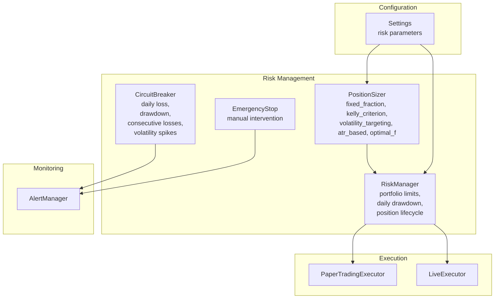
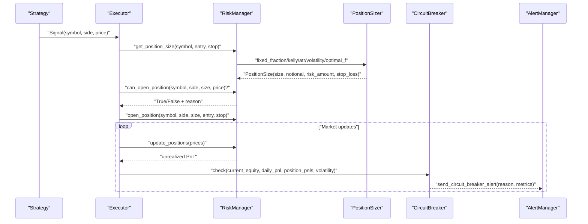
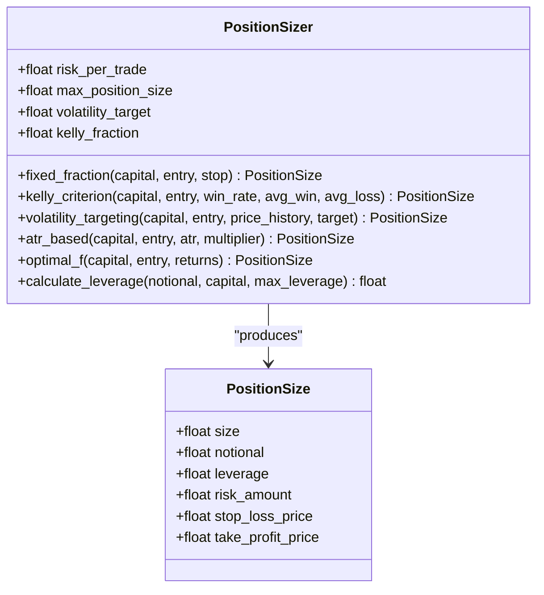
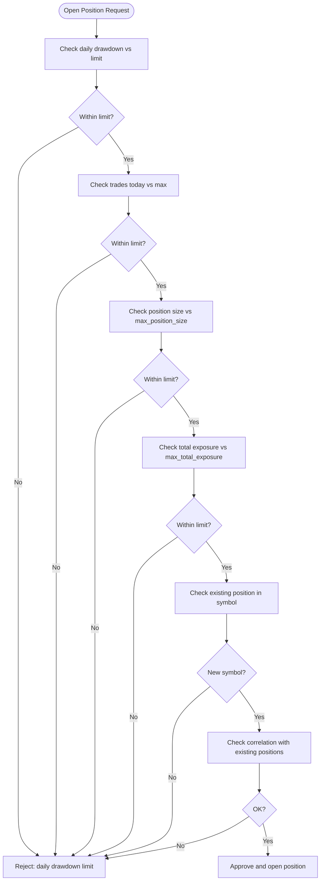
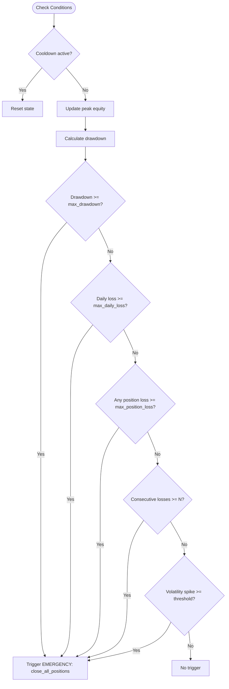
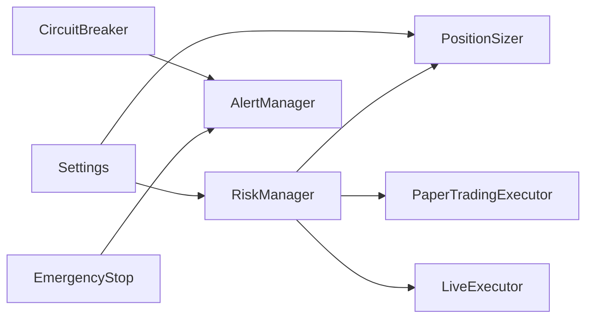

# Risk Management

<cite>
**Referenced Files in This Document**
- [manager.py](file://trading_bot/risk/manager.py)
- [sizing.py](file://trading_bot/risk/sizing.py)
- [circuit_breaker.py](file://trading_bot/risk/circuit_breaker.py)
- [paper.py](file://trading_bot/execution/paper.py)
- [live.py](file://trading_bot/execution/live.py)
- [alerts.py](file://trading_bot/monitoring/alerts.py)
- [settings.py](file://trading_bot/config/settings.py)
- [test_risk.py](file://trading_bot/tests/test_risk.py)
</cite>

## Table of Contents
1. [Introduction](#introduction)
2. [Project Structure](#project-structure)
3. [Core Components](#core-components)
4. [Architecture Overview](#architecture-overview)
5. [Detailed Component Analysis](#detailed-component-analysis)
6. [Dependency Analysis](#dependency-analysis)
7. [Performance Considerations](#performance-considerations)
8. [Troubleshooting Guide](#troubleshooting-guide)
9. [Conclusion](#conclusion)
10. [Appendices](#appendices)

## Introduction
This document provides comprehensive risk management documentation for the AI Trading Bot. It covers position sizing strategies (fixed fraction, Kelly criterion, ATR-based, volatility targeting, and Optimal f), the circuit breaker system (daily loss limits, maximum drawdown protection, consecutive loss detection, and volatility spike monitoring), risk manager implementation, portfolio limits, and emergency stop mechanisms. It also includes practical examples of risk parameter tuning, scenario analysis, and risk control effectiveness measurement.

## Project Structure
The risk management system is organized into three primary modules:
- Position sizing: calculates position sizes using multiple methodologies
- Risk manager: enforces portfolio-level constraints and tracks risk state
- Circuit breaker: monitors market conditions and triggers protective actions

These modules integrate with execution (paper/live), monitoring/alerts, and configuration settings.

**Diagram sources**
- [sizing.py:25-312](file://trading_bot/risk/sizing.py#L25-L312)
- [manager.py:58-432](file://trading_bot/risk/manager.py#L58-L432)
- [circuit_breaker.py:32-336](file://trading_bot/risk/circuit_breaker.py#L32-L336)
- [paper.py:36-392](file://trading_bot/execution/paper.py#L36-L392)
- [live.py:38-364](file://trading_bot/execution/live.py#L38-L364)
- [alerts.py:23-311](file://trading_bot/monitoring/alerts.py#L23-L311)
- [settings.py:57-79](file://trading_bot/config/settings.py#L57-L79)

**Section sources**
- [sizing.py:1-312](file://trading_bot/risk/sizing.py#L1-L312)
- [manager.py:1-432](file://trading_bot/risk/manager.py#L1-L432)
- [circuit_breaker.py:1-336](file://trading_bot/risk/circuit_breaker.py#L1-L336)
- [paper.py:1-392](file://trading_bot/execution/paper.py#L1-L392)
- [live.py:1-364](file://trading_bot/execution/live.py#L1-L364)
- [alerts.py:1-311](file://trading_bot/monitoring/alerts.py#L1-L311)
- [settings.py:1-176](file://trading_bot/config/settings.py#L1-L176)

## Core Components
- PositionSizer: Implements multiple sizing methods to compute position size, notional value, risk amount, and optional stop-loss/take-profit targets.
- RiskManager: Enforces portfolio-level constraints (daily drawdown, position size, total exposure, trades per day, correlation), manages open positions, updates unrealized PnL, and checks circuit breakers.
- CircuitBreaker: Monitors equity, drawdown, position losses, consecutive losing periods, and volatility spikes, and triggers automatic actions or manual intervention.

Key risk parameters are configurable via Settings and passed to RiskManager and PositionSizer.

**Section sources**
- [sizing.py:25-312](file://trading_bot/risk/sizing.py#L25-L312)
- [manager.py:58-432](file://trading_bot/risk/manager.py#L58-L432)
- [circuit_breaker.py:32-336](file://trading_bot/risk/circuit_breaker.py#L32-L336)
- [settings.py:57-79](file://trading_bot/config/settings.py#L57-L79)

## Architecture Overview
The risk system operates during trading cycles:
- Strategy generates signals
- Executor requests position sizing from RiskManager
- RiskManager delegates to PositionSizer for sizing
- RiskManager validates portfolio constraints and opens/closes positions
- CircuitBreaker evaluates conditions and triggers alerts/actions
- Alerts notify operators via configured channels

**Diagram sources**
- [paper.py:115-208](file://trading_bot/execution/paper.py#L115-L208)
- [live.py:115-224](file://trading_bot/execution/live.py#L115-L224)
- [manager.py:323-354](file://trading_bot/risk/manager.py#L323-L354)
- [sizing.py:48-91](file://trading_bot/risk/sizing.py#L48-L91)
- [circuit_breaker.py:88-184](file://trading_bot/risk/circuit_breaker.py#L88-L184)
- [alerts.py:260-284](file://trading_bot/monitoring/alerts.py#L260-L284)

## Detailed Component Analysis

### Position Sizing Strategies
The PositionSizer supports multiple approaches:
- Fixed Fraction: Risk a fixed percentage of capital per trade, scaled by stop distance
- Kelly Criterion: Computes optimal fractional position based on historical win rate and payoff odds, with a safety fraction
- Volatility Targeting: Scales position size according to realized volatility versus a target
- ATR-Based: Uses Average True Range to set stop-loss distance and position size
- Optimal f: Searches for the geometric mean maximizing fraction across historical returns

**Diagram sources**
- [sizing.py:14-312](file://trading_bot/risk/sizing.py#L14-L312)

Practical sizing examples (conceptual):
- Fixed Fraction: Risk $200 on a $10,000 account with a 5% stop; size constrained to 30% of capital.
- Kelly Criterion: With 55% win rate and 1.67 average gain/loss ratio, use half-Kelly fraction to reduce variance.
- Volatility Targeting: If realized annualized volatility is 20% and target is 15%, scale position size down by 15/20.
- ATR-Based: With 2.5 ATR and 2x multiplier, set stop at 5 units; size by risk budget divided by stop distance.
- Optimal f: Search historical returns to find fraction that maximizes geometric growth, then halve for safety.

**Section sources**
- [sizing.py:48-312](file://trading_bot/risk/sizing.py#L48-L312)

### Risk Manager Implementation
RiskManager enforces portfolio-level controls:
- Portfolio Limits: Max daily drawdown, max position size, max total exposure, max trades per day
- Position Lifecycle: Open/close positions, track unrealized PnL, update peak equity and daily drawdown
- Stop Loss/Take Profit: Enforced automatically when prices hit thresholds
- Circuit Breaker Checks: Daily drawdown, total drawdown, recent consecutive losses

**Diagram sources**
- [manager.py:102-148](file://trading_bot/risk/manager.py#L102-L148)

Portfolio metrics exposed by RiskManager include current equity, peak equity, total return, daily PnL, daily drawdown, total drawdown, open positions, total exposure, exposure percentage, trades today, total trades, win rate, and volatility.

**Section sources**
- [manager.py:58-432](file://trading_bot/risk/manager.py#L58-L432)

### Circuit Breaker System
CircuitBreaker monitors:
- Daily Loss Limit: Pauses trading when daily loss exceeds threshold
- Maximum Drawdown: Closes all positions when drawdown exceeds threshold
- Position Loss Limit: Closes individual positions exceeding per-position loss threshold
- Consecutive Losses: Reduces position size after N consecutive losing periods
- Volatility Spike: Reduces exposure when realized volatility exceeds baseline by threshold

**Diagram sources**
- [circuit_breaker.py:88-184](file://trading_bot/risk/circuit_breaker.py#L88-L184)

Alerts are sent via AlertManager with severity levels and structured messages.

**Section sources**
- [circuit_breaker.py:32-336](file://trading_bot/risk/circuit_breaker.py#L32-L336)
- [alerts.py:23-311](file://trading_bot/monitoring/alerts.py#L23-L311)

### Emergency Stop Mechanisms
EmergencyStop provides manual intervention:
- Stop: Immediately halt operations with a reason and notify handlers
- Resume: Restart after investigation
- Check: Query current stopped state and reason

Integration points:
- LiveExecutor can emergency-close all positions
- CircuitBreaker can trigger emergency actions and pause trading

**Section sources**
- [circuit_breaker.py:280-336](file://trading_bot/risk/circuit_breaker.py#L280-L336)
- [live.py:357-364](file://trading_bot/execution/live.py#L357-L364)

## Dependency Analysis
Risk management depends on configuration, execution, and monitoring modules.

**Diagram sources**
- [settings.py:57-79](file://trading_bot/config/settings.py#L57-L79)
- [manager.py:58-98](file://trading_bot/risk/manager.py#L58-L98)
- [sizing.py:25-46](file://trading_bot/risk/sizing.py#L25-L46)
- [paper.py:70-74](file://trading_bot/execution/paper.py#L70-L74)
- [live.py:56-56](file://trading_bot/execution/live.py#L56-L56)
- [circuit_breaker.py:32-67](file://trading_bot/risk/circuit_breaker.py#L32-L67)
- [alerts.py:23-46](file://trading_bot/monitoring/alerts.py#L23-L46)

**Section sources**
- [settings.py:57-79](file://trading_bot/config/settings.py#L57-L79)
- [manager.py:58-98](file://trading_bot/risk/manager.py#L58-L98)
- [sizing.py:25-46](file://trading_bot/risk/sizing.py#L25-L46)
- [paper.py:70-74](file://trading_bot/execution/paper.py#L70-L74)
- [live.py:56-56](file://trading_bot/execution/live.py#L56-L56)
- [circuit_breaker.py:32-67](file://trading_bot/risk/circuit_breaker.py#L32-L67)
- [alerts.py:23-46](file://trading_bot/monitoring/alerts.py#L23-L46)

## Performance Considerations
- Position sizing computations are lightweight; ensure price history lengths meet minimum requirements for volatility-based methods.
- RiskManager maintains O(n) open positions; keep symbol lists bounded to control overhead.
- CircuitBreaker evaluations are constant-time checks; baseline volatility should be updated periodically for accurate spike detection.
- Slippage and commission modeling in PaperTradingExecutor adds realism without significant computational cost.

[No sources needed since this section provides general guidance]

## Troubleshooting Guide
Common issues and resolutions:
- Position Rejected: Verify daily drawdown, position size, total exposure, trades per day, and correlation checks.
- Zero or Near-Zero Volatility: Volatility-targeting and ATR-based methods guard against zero values; fallback to fixed fraction sizing.
- Insufficient Capital: PaperTradingExecutor applies slippage and commission; ensure capital covers notional plus fees.
- Circuit Breaker Triggers: Review daily loss, drawdown, position losses, consecutive losses, and volatility spikes; adjust thresholds accordingly.
- Emergency Stop: Confirm reason and resume after remediation; ensure handlers are registered.

Validation references:
- Unit tests cover sizing methods, position opening/closing, and circuit breaker triggers.

**Section sources**
- [test_risk.py:12-178](file://trading_bot/tests/test_risk.py#L12-L178)
- [paper.py:115-208](file://trading_bot/execution/paper.py#L115-L208)
- [live.py:115-224](file://trading_bot/execution/live.py#L115-L224)
- [circuit_breaker.py:88-184](file://trading_bot/risk/circuit_breaker.py#L88-L184)

## Conclusion
The AI Trading Bot’s risk management system combines robust position sizing with strict portfolio-level controls and dynamic circuit breakers. By tuning parameters such as risk per trade, maximum position size, daily drawdown limits, and volatility targets, operators can adapt the system to varying market regimes. The integration with execution and alerts ensures timely intervention and transparency.

[No sources needed since this section summarizes without analyzing specific files]

## Appendices

### Practical Risk Parameter Tuning Examples
- Conservative Mode: Lower risk_per_trade (e.g., 0.5%), smaller max_position_size (e.g., 10–15%), stricter max_daily_drawdown (e.g., 2–3%)
- Aggressive Mode: Higher risk_per_trade (e.g., 1.5–2.5%), larger max_position_size (e.g., 40–60%), moderate max_daily_drawdown (e.g., 5–7%)
- Volatility Targeting: Align realized volatility with target; scale position size inversely proportional to realized volatility
- ATR-Based: Use 1.5–3.0 ATR multipliers depending on strategy stability; adjust stop distances to balance risk/reward

[No sources needed since this section provides general guidance]

### Scenario Analysis
- High-Volatility Environment: Expect frequent volatility spikes; tighten position size and increase volatility target; monitor consecutive losses
- Downtrend: Watch for drawdown breaches; consider reducing exposure or pausing trading until conditions improve
- Correlation Risk: Limit simultaneous positions in highly correlated assets; enforce correlation thresholds to diversify risk

[No sources needed since this section provides general guidance]

### Risk Control Effectiveness Measurement
- Portfolio Metrics: Track daily drawdown, total drawdown, win rate, volatility, Sharpe ratio, and profit factor
- Circuit Breaker Metrics: Count triggers, average time to reset, and impact on equity curve
- Position Sizing Validation: Compare realized volatility to target, evaluate stop-hit frequency, and assess geometric growth under Optimal f

[No sources needed since this section provides general guidance]