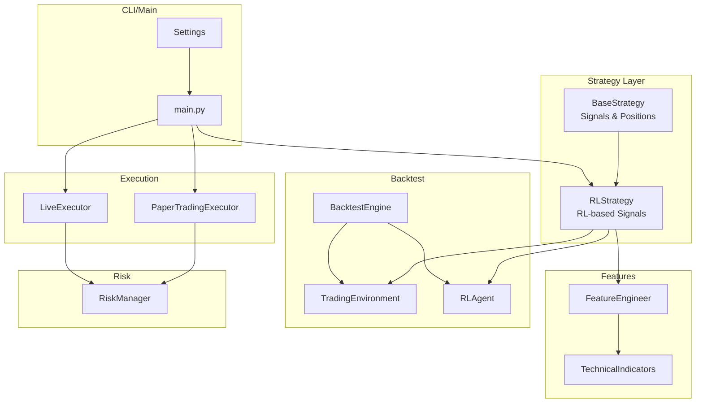
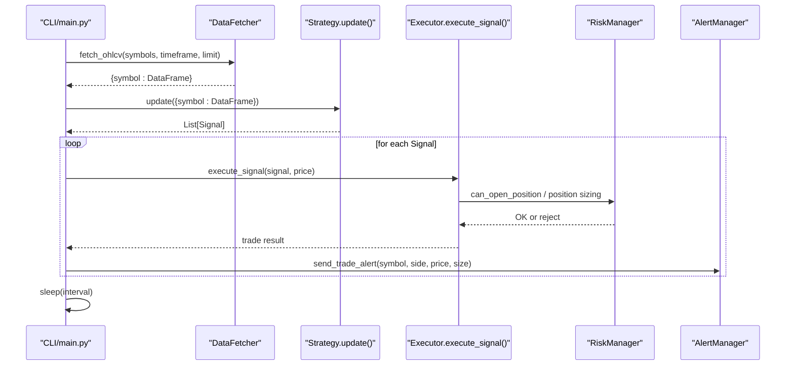
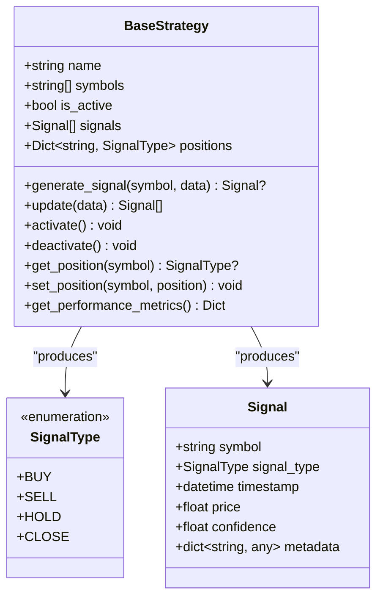
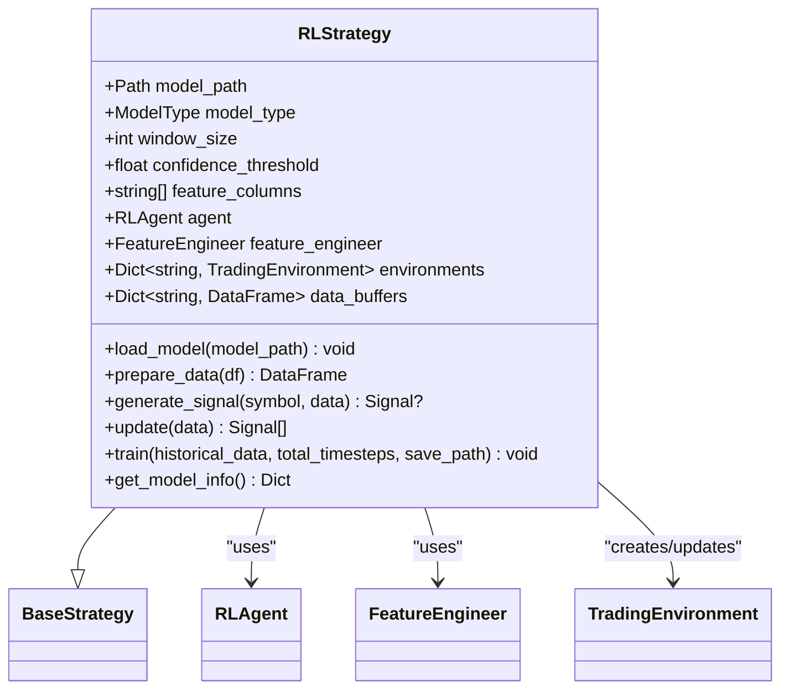
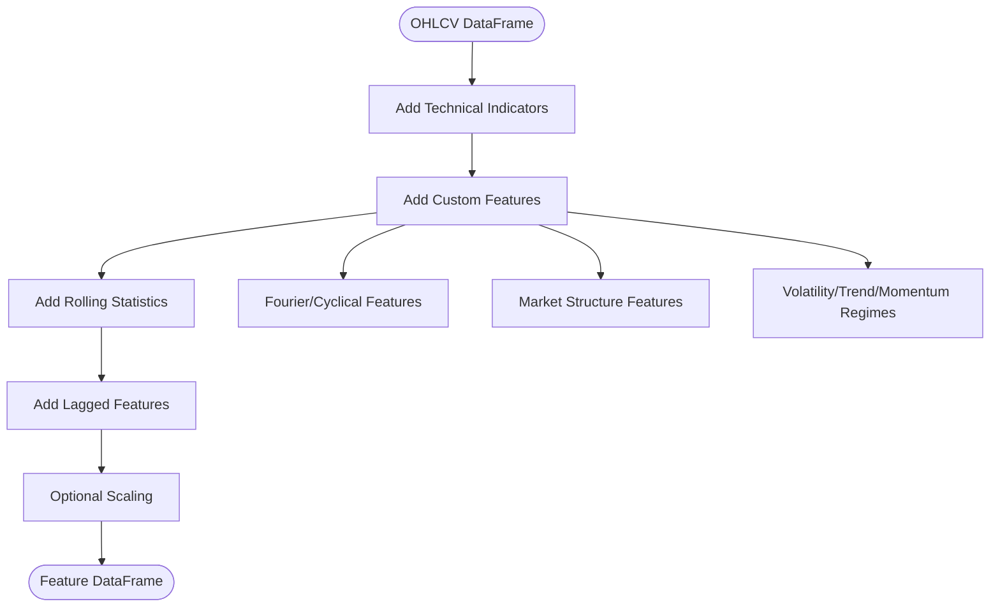
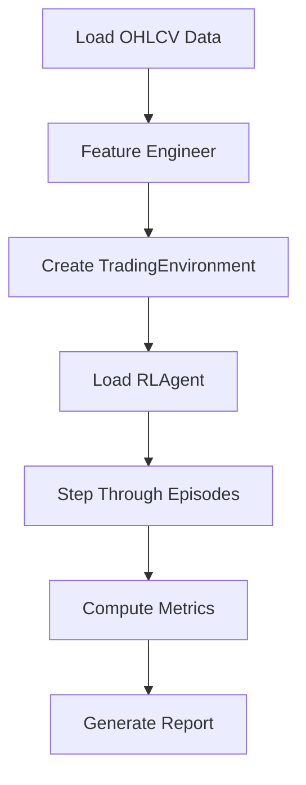
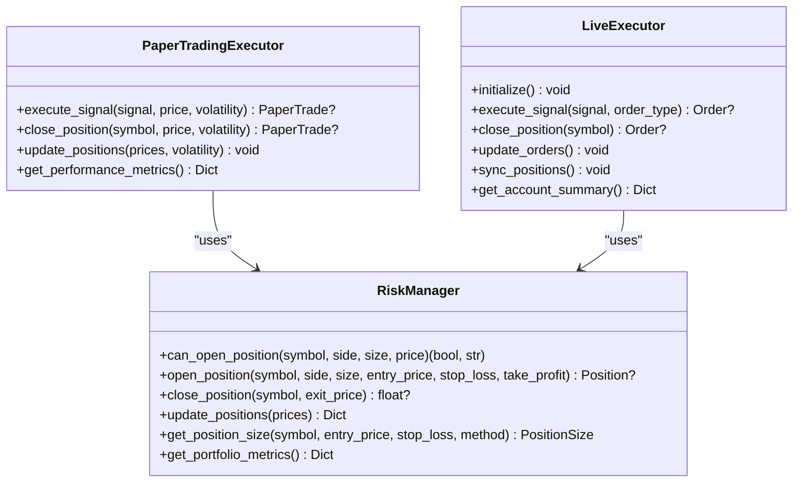
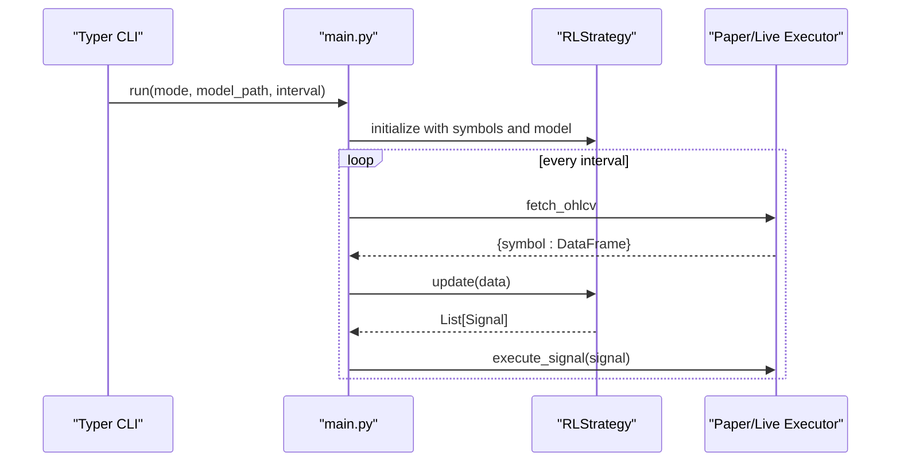
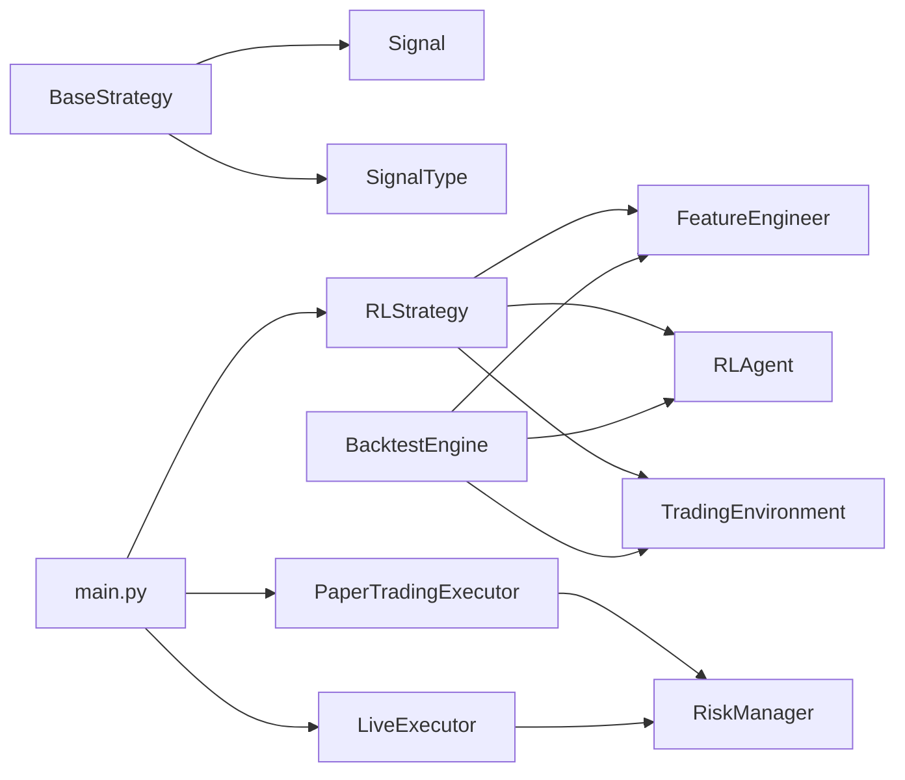

# Custom Strategy Development

<cite>
**Referenced Files in This Document**
- [base.py](file://trading_bot/strategy/base.py)
- [rl_strategy.py](file://trading_bot/strategy/rl_strategy.py)
- [__init__.py](file://trading_bot/strategy/__init__.py)
- [engine.py](file://trading_bot/backtest/engine.py)
- [main.py](file://trading_bot/main.py)
- [indicators.py](file://trading_bot/features/indicators.py)
- [engineering.py](file://trading_bot/features/engineering.py)
- [environment.py](file://trading_bot/models/environment.py)
- [agent.py](file://trading_bot/models/agent.py)
- [paper.py](file://trading_bot/execution/paper.py)
- [live.py](file://trading_bot/execution/live.py)
- [manager.py](file://trading_bot/risk/manager.py)
- [settings.py](file://trading_bot/config/settings.py)
</cite>

## Table of Contents
1. [Introduction](#introduction)
2. [Project Structure](#project-structure)
3. [Core Components](#core-components)
4. [Architecture Overview](#architecture-overview)
5. [Detailed Component Analysis](#detailed-component-analysis)
6. [Dependency Analysis](#dependency-analysis)
7. [Performance Considerations](#performance-considerations)
8. [Troubleshooting Guide](#troubleshooting-guide)
9. [Conclusion](#conclusion)
10. [Appendices](#appendices)

## Introduction
This document explains how to build custom trading strategies by extending the BaseStrategy interface. It covers the BaseStrategy abstract class structure, required methods (update and generate_signal), the Signal data structure and SignalType enumeration, position tracking mechanisms, and practical examples for technical indicator-based strategies, statistical arbitrage strategies, and rule-based approaches. It also provides best practices for strategy testing, parameter optimization, performance evaluation, strategy registration, configuration, and integration with the main trading loop.

## Project Structure
The strategy framework is organized around a shared base class and reusable building blocks:
- Strategy base and RL strategy: define the interface and a concrete RL-based implementation
- Feature engineering: builds rich feature sets from OHLCV data
- Backtesting engine: evaluates strategies using vectorbt and custom environments
- Execution layer: paper and live executors translate signals into trades
- Risk manager: enforces position sizing and portfolio-level risk controls
- CLI and main loop: orchestrate data fetching, strategy updates, and execution

**Diagram sources**
- [base.py:39-135](file://trading_bot/strategy/base.py#L39-L135)
- [rl_strategy.py:19-285](file://trading_bot/strategy/rl_strategy.py#L19-L285)
- [engineering.py:17-442](file://trading_bot/features/engineering.py#L17-L442)
- [indicators.py:13-294](file://trading_bot/features/indicators.py#L13-L294)
- [engine.py:41-418](file://trading_bot/backtest/engine.py#L41-L418)
- [environment.py:15-405](file://trading_bot/models/environment.py#L15-L405)
- [agent.py:206-502](file://trading_bot/models/agent.py#L206-L502)
- [paper.py:36-392](file://trading_bot/execution/paper.py#L36-L392)
- [live.py:38-364](file://trading_bot/execution/live.py#L38-L364)
- [manager.py:58-432](file://trading_bot/risk/manager.py#L58-L432)
- [main.py:214-325](file://trading_bot/main.py#L214-L325)
- [settings.py:23-176](file://trading_bot/config/settings.py#L23-L176)

**Section sources**
- [base.py:1-136](file://trading_bot/strategy/base.py#L1-L136)
- [rl_strategy.py:1-285](file://trading_bot/strategy/rl_strategy.py#L1-L285)
- [__init__.py:1-7](file://trading_bot/strategy/__init__.py#L1-L7)
- [engineering.py:1-442](file://trading_bot/features/engineering.py#L1-L442)
- [indicators.py:1-294](file://trading_bot/features/indicators.py#L1-L294)
- [engine.py:1-418](file://trading_bot/backtest/engine.py#L1-L418)
- [environment.py:1-405](file://trading_bot/models/environment.py#L1-L405)
- [agent.py:1-502](file://trading_bot/models/agent.py#L1-L502)
- [paper.py:1-392](file://trading_bot/execution/paper.py#L1-L392)
- [live.py:1-364](file://trading_bot/execution/live.py#L1-L364)
- [manager.py:1-432](file://trading_bot/risk/manager.py#L1-L432)
- [main.py:1-347](file://trading_bot/main.py#L1-L347)
- [settings.py:1-176](file://trading_bot/config/settings.py#L1-L176)

## Core Components
- BaseStrategy defines the contract for all strategies:
  - Methods: generate_signal(symbol, data) -> Optional[Signal], update(data: Dict[str, pd.DataFrame]) -> List[Signal]
  - State: name, symbols, is_active, signals, positions
  - Utilities: activate/deactivate, get/set_position, get_performance_metrics
- Signal and SignalType:
  - Signal carries symbol, signal_type, timestamp, price, confidence, and optional metadata
  - SignalType enumerates BUY, SELL, HOLD, CLOSE
- Position tracking:
  - Internal mapping from symbol to current SignalType (None means flat)
- RLStrategy demonstrates a concrete implementation using RLAgent and TradingEnvironment

Key responsibilities:
- Strategy: produce signals from incoming market data
- Executor: convert signals into trades with slippage and commission
- Risk Manager: enforce position sizing and portfolio risk limits
- Backtest Engine: evaluate strategies offline using vectorbt or custom environments

**Section sources**
- [base.py:16-37](file://trading_bot/strategy/base.py#L16-L37)
- [base.py:39-135](file://trading_bot/strategy/base.py#L39-L135)
- [rl_strategy.py:19-181](file://trading_bot/strategy/rl_strategy.py#L19-L181)
- [paper.py:36-208](file://trading_bot/execution/paper.py#L36-L208)
- [manager.py:58-262](file://trading_bot/risk/manager.py#L58-L262)

## Architecture Overview
The trading loop integrates data fetching, strategy updates, and execution:

**Diagram sources**
- [main.py:264-325](file://trading_bot/main.py#L264-L325)
- [paper.py:115-208](file://trading_bot/execution/paper.py#L115-L208)
- [live.py:115-224](file://trading_bot/execution/live.py#L115-L224)
- [manager.py:102-148](file://trading_bot/risk/manager.py#L102-L148)

## Detailed Component Analysis

### BaseStrategy and Signal Data Model
- SignalType: BUY, SELL, HOLD, CLOSE
- Signal: symbol, signal_type, timestamp, price, confidence, metadata
- BaseStrategy:
  - Abstract methods: generate_signal, update
  - Lifecycle: activate/deactivate
  - Position tracking: get_position, set_position
  - Metrics: get_performance_metrics

**Diagram sources**
- [base.py:16-37](file://trading_bot/strategy/base.py#L16-L37)
- [base.py:39-135](file://trading_bot/strategy/base.py#L39-L135)

**Section sources**
- [base.py:16-135](file://trading_bot/strategy/base.py#L16-L135)

### RLStrategy Implementation
RLStrategy extends BaseStrategy and integrates:
- Feature engineering via FeatureEngineer
- RLAgent for inference
- TradingEnvironment for observation construction
- Position tracking and confidence thresholds

Key behaviors:
- update iterates symbols, buffers data, prepares features, and generates signals
- generate_signal converts agent actions into SignalType, applies confidence thresholds, and updates internal positions

**Diagram sources**
- [rl_strategy.py:19-285](file://trading_bot/strategy/rl_strategy.py#L19-L285)
- [agent.py:206-502](file://trading_bot/models/agent.py#L206-L502)
- [engineering.py:17-86](file://trading_bot/features/engineering.py#L17-L86)
- [environment.py:15-104](file://trading_bot/models/environment.py#L15-L104)

**Section sources**
- [rl_strategy.py:19-285](file://trading_bot/strategy/rl_strategy.py#L19-L285)

### Feature Engineering Pipeline
FeatureEngineer adds:
- Technical indicators (trend, momentum, volatility, volume, support/resistance)
- Custom features (volatility regime, trend strength, momentum regime, market structure, Fourier/cyclical)
- Rolling statistics and lagged features
- Cross-asset correlation features
- Scaling and feature importance utilities

**Diagram sources**
- [engineering.py:31-86](file://trading_bot/features/engineering.py#L31-L86)
- [indicators.py:20-225](file://trading_bot/features/indicators.py#L20-L225)

**Section sources**
- [engineering.py:17-442](file://trading_bot/features/engineering.py#L17-L442)
- [indicators.py:13-294](file://trading_bot/features/indicators.py#L13-L294)

### Backtesting Engine
BacktestEngine supports:
- VectorBT-based backtests with entries/exits (and optional short entries/exits)
- RL backtests using TradingEnvironment and RLAgent
- Walk-forward analysis and Monte Carlo simulation
- Comprehensive performance reporting

**Diagram sources**
- [engine.py:147-240](file://trading_bot/backtest/engine.py#L147-L240)
- [environment.py:105-250](file://trading_bot/models/environment.py#L105-L250)
- [agent.py:415-434](file://trading_bot/models/agent.py#L415-L434)

**Section sources**
- [engine.py:41-418](file://trading_bot/backtest/engine.py#L41-L418)

### Execution Layer and Risk Controls
- PaperTradingExecutor simulates trades with slippage and commission, tracks PnL, and integrates with RiskManager
- LiveExecutor places real orders via DataFetcher, enforces rate limits, and synchronizes positions
- RiskManager enforces daily drawdown, position size, exposure, and correlation constraints

**Diagram sources**
- [paper.py:36-392](file://trading_bot/execution/paper.py#L36-L392)
- [live.py:38-364](file://trading_bot/execution/live.py#L38-L364)
- [manager.py:58-432](file://trading_bot/risk/manager.py#L58-L432)

**Section sources**
- [paper.py:36-392](file://trading_bot/execution/paper.py#L36-L392)
- [live.py:38-364](file://trading_bot/execution/live.py#L38-L364)
- [manager.py:58-432](file://trading_bot/risk/manager.py#L58-L432)

### Strategy Registration and Integration
- Strategy module exports BaseStrategy, Signal, SignalType, and RLStrategy
- main.py constructs RLStrategy from CLI arguments, runs the trading loop, and integrates with executors and alerts

**Diagram sources**
- [__init__.py:1-7](file://trading_bot/strategy/__init__.py#L1-L7)
- [main.py:214-325](file://trading_bot/main.py#L214-L325)
- [rl_strategy.py:22-57](file://trading_bot/strategy/rl_strategy.py#L22-L57)

**Section sources**
- [__init__.py:1-7](file://trading_bot/strategy/__init__.py#L1-L7)
- [main.py:214-325](file://trading_bot/main.py#L214-L325)

## Dependency Analysis
- BaseStrategy depends on SignalType and Signal
- RLStrategy depends on FeatureEngineer, RLAgent, TradingEnvironment
- BacktestEngine depends on FeatureEngineer, RLAgent, TradingEnvironment
- Executors depend on RiskManager and Signal
- main.py orchestrates CLI, DataFetcher, Strategy, and Executors

**Diagram sources**
- [base.py:39-135](file://trading_bot/strategy/base.py#L39-L135)
- [rl_strategy.py:19-285](file://trading_bot/strategy/rl_strategy.py#L19-L285)
- [engine.py:41-146](file://trading_bot/backtest/engine.py#L41-L146)
- [paper.py:36-392](file://trading_bot/execution/paper.py#L36-L392)
- [live.py:38-364](file://trading_bot/execution/live.py#L38-L364)
- [main.py:214-325](file://trading_bot/main.py#L214-L325)

**Section sources**
- [base.py:39-135](file://trading_bot/strategy/base.py#L39-L135)
- [rl_strategy.py:19-285](file://trading_bot/strategy/rl_strategy.py#L19-L285)
- [engine.py:41-146](file://trading_bot/backtest/engine.py#L41-L146)
- [paper.py:36-392](file://trading_bot/execution/paper.py#L36-L392)
- [live.py:38-364](file://trading_bot/execution/live.py#L38-L364)
- [main.py:214-325](file://trading_bot/main.py#L214-L325)

## Performance Considerations
- Feature computation cost: FeatureEngineer adds many derived features; cache or reuse buffers where appropriate
- RL inference: Ensure deterministic predictions and avoid redundant environment resets
- Execution latency: PaperTradingExecutor applies slippage and commission; tune slippage model for realism
- Risk checks: RiskManager enforces daily drawdown and exposure caps; monitor portfolio metrics during live runs
- Backtesting: Use walk-forward analysis to guard against lookahead bias; validate with Monte Carlo simulations

[No sources needed since this section provides general guidance]

## Troubleshooting Guide
Common issues and resolutions:
- No model loaded in RLStrategy: Ensure model_path is valid and load_model is called
- Insufficient data for signal generation: RLStrategy requires sufficient window_size observations
- Position already exists: RLStrategy avoids duplicate positions; handle HOLD/CLOSE appropriately
- Risk check failures: LiveExecutor and RiskManager may reject trades exceeding daily or exposure limits
- Backtest discrepancies: Verify feature columns and environment initialization in BacktestEngine

**Section sources**
- [rl_strategy.py:58-103](file://trading_bot/strategy/rl_strategy.py#L58-L103)
- [rl_strategy.py:124-180](file://trading_bot/strategy/rl_strategy.py#L124-L180)
- [paper.py:140-168](file://trading_bot/execution/paper.py#L140-L168)
- [live.py:153-161](file://trading_bot/execution/live.py#L153-L161)
- [manager.py:122-148](file://trading_bot/risk/manager.py#L122-L148)
- [engine.py:147-240](file://trading_bot/backtest/engine.py#L147-L240)

## Conclusion
By extending BaseStrategy, developers can implement diverse trading strategies. RLStrategy demonstrates a production-ready RL pipeline integrating feature engineering, environment modeling, and execution. The backtesting engine and risk controls provide robust evaluation and safety nets. Follow the best practices outlined here to design, test, and deploy reliable strategies.

[No sources needed since this section summarizes without analyzing specific files]

## Appendices

### A. Creating a Custom Strategy
Steps:
1. Define a subclass of BaseStrategy
2. Implement generate_signal(symbol, data) -> Optional[Signal]
3. Implement update(data: Dict[str, pd.DataFrame]) -> List[Signal]
4. Use get_position/set_position to track state
5. Integrate with main.py by instantiating your strategy and wiring it into the loop

Best practices:
- Keep generate_signal pure and deterministic for reproducible backtests
- Use confidence and metadata fields to capture model uncertainty
- Respect position constraints and avoid duplicate orders

**Section sources**
- [base.py:55-82](file://trading_bot/strategy/base.py#L55-L82)
- [base.py:94-116](file://trading_bot/strategy/base.py#L94-L116)

### B. Signal Generation Patterns
- Threshold-based signals: compare indicator values to thresholds
- Cross-based signals: detect MA or RSI crossovers
- Reversal signals: detect divergences or pattern breaks
- Confidence gating: require minimum confidence before emitting trades

**Section sources**
- [rl_strategy.py:124-180](file://trading_bot/strategy/rl_strategy.py#L124-L180)
- [indicators.py:48-225](file://trading_bot/features/indicators.py#L48-L225)

### C. Statistical Arbitrage Strategy Example
Approach:
- Build cointegrated pairs or multi-asset features
- Compute spread/z-score using FeatureEngineer
- Emit signals when z-score crosses thresholds
- Use RiskManager to enforce maximum exposure per pair

**Section sources**
- [engineering.py:337-374](file://trading_bot/features/engineering.py#L337-L374)
- [manager.py:323-353](file://trading_bot/risk/manager.py#L323-L353)

### D. Rule-Based Strategy Example
Approach:
- Define rules using TechnicalIndicators outputs (RSI, MACD, Bollinger Bands)
- Generate BUY/SELL/HOLD/CLOSE signals based on rule conditions
- Use BaseStrategy.get_position to prevent duplicate positions

**Section sources**
- [indicators.py:48-225](file://trading_bot/features/indicators.py#L48-L225)
- [base.py:94-116](file://trading_bot/strategy/base.py#L94-L116)

### E. Parameter Optimization and Backtesting
- Use BacktestEngine.walk_forward for walk-forward optimization
- Tune confidence thresholds and feature columns
- Evaluate with vectorbt and custom metrics

**Section sources**
- [engine.py:242-295](file://trading_bot/backtest/engine.py#L242-L295)
- [rl_strategy.py:223-269](file://trading_bot/strategy/rl_strategy.py#L223-L269)

### F. Configuration and Settings
- Configure symbols, timeframe, initial capital, and risk parameters via Settings
- Use get_settings() to centralize configuration across modules

**Section sources**
- [settings.py:23-176](file://trading_bot/config/settings.py#L23-L176)
- [main.py:30-34](file://trading_bot/main.py#L30-L34)