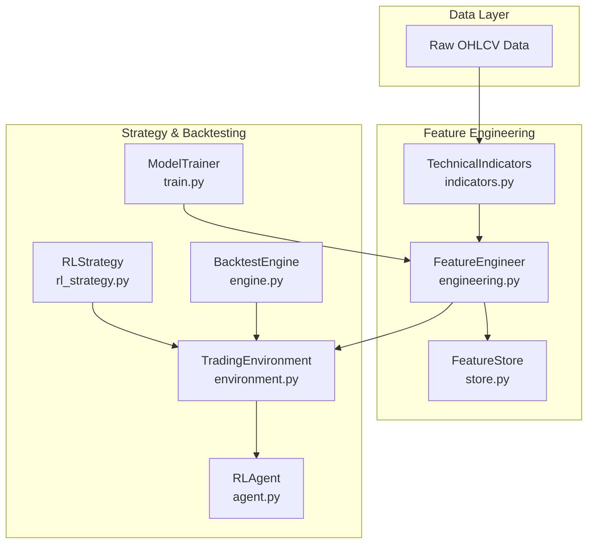
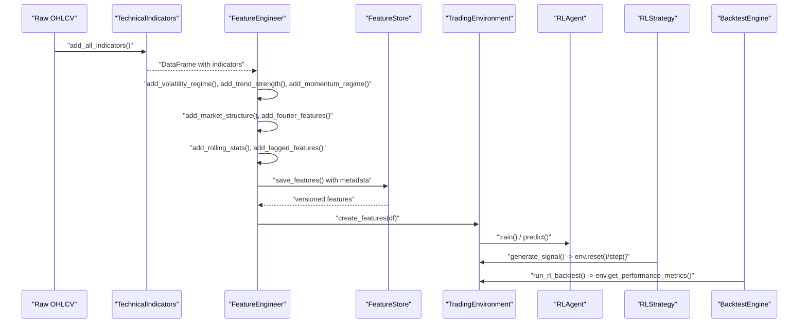
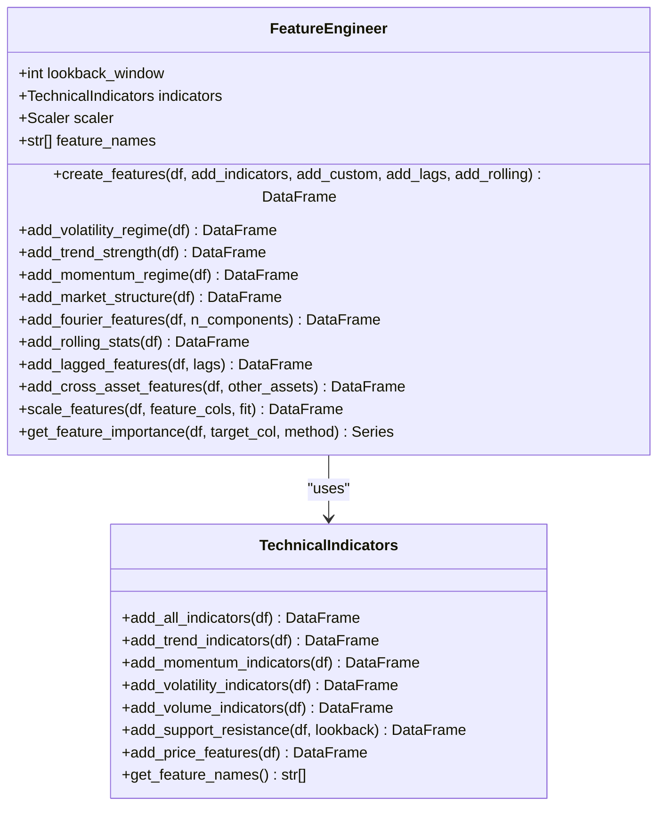
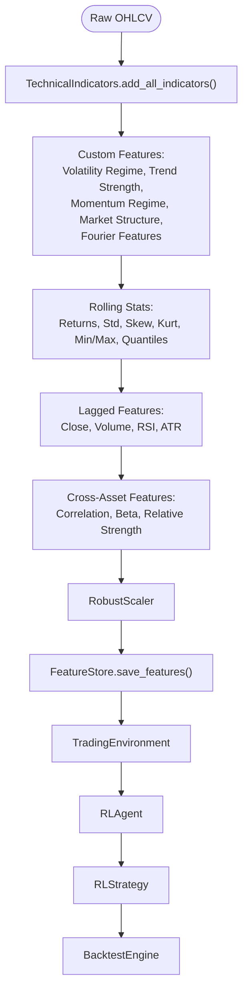
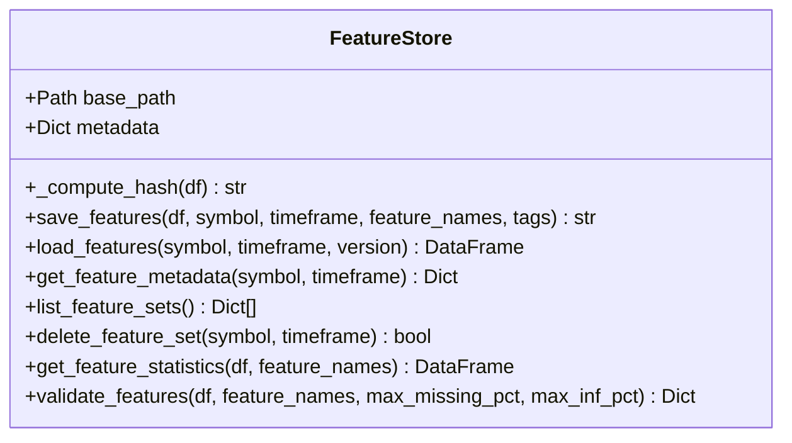
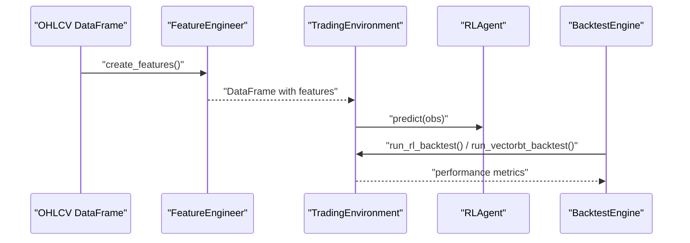
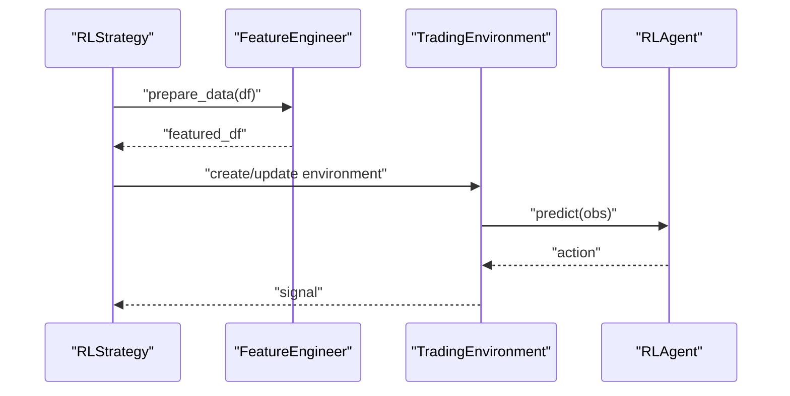
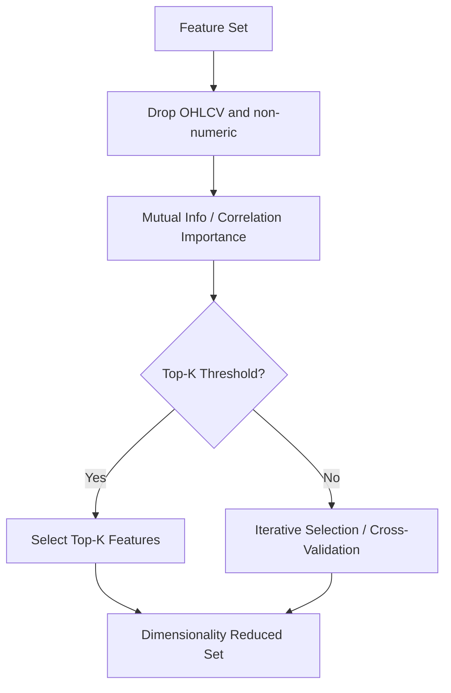
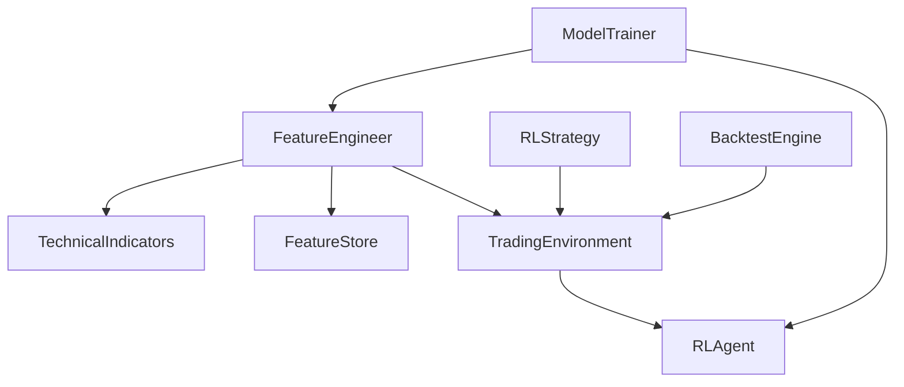

# Feature Engineering Integration

<cite>
**Referenced Files in This Document**
- [engineering.py](file://trading_bot/features/engineering.py)
- [indicators.py](file://trading_bot/features/indicators.py)
- [store.py](file://trading_bot/features/store.py)
- [engine.py](file://trading_bot/backtest/engine.py)
- [environment.py](file://trading_bot/models/environment.py)
- [agent.py](file://trading_bot/models/agent.py)
- [rl_strategy.py](file://trading_bot/strategy/rl_strategy.py)
- [base.py](file://trading_bot/strategy/base.py)
- [main.py](file://trading_bot/main.py)
- [train.py](file://trading_bot/models/train.py)
- [README.md](file://README.md)
</cite>

## Table of Contents
1. [Introduction](#introduction)
2. [Project Structure](#project-structure)
3. [Core Components](#core-components)
4. [Architecture Overview](#architecture-overview)
5. [Detailed Component Analysis](#detailed-component-analysis)
6. [Dependency Analysis](#dependency-analysis)
7. [Performance Considerations](#performance-considerations)
8. [Troubleshooting Guide](#troubleshooting-guide)
9. [Conclusion](#conclusion)
10. [Appendices](#appendices)

## Introduction
This document explains how feature engineering integrates with trading strategies in the system. It focuses on the FeatureEngineer class, technical indicator calculations, and the feature pipeline architecture. It covers the relationship between raw OHLCV data and engineered features, including rolling windows, transformations, and normalization techniques. It also documents indicator combinations, feature selection strategies, and dimensionality reduction approaches. Practical examples demonstrate custom indicator development, feature importance analysis, and backtesting with different feature sets. Finally, it addresses performance optimization for large datasets and real-time feature computation.

## Project Structure
The feature engineering system is organized around three pillars:
- Feature calculation and engineering: Technical indicators and custom features
- Feature storage and validation: Persistent caching and quality checks
- Strategy integration: Backtesting and real-time inference with RL agents

**Diagram sources**
- [indicators.py:13-294](file://trading_bot/features/indicators.py#L13-L294)
- [engineering.py:17-442](file://trading_bot/features/engineering.py#L17-L442)
- [store.py:18-301](file://trading_bot/features/store.py#L18-L301)
- [environment.py:15-405](file://trading_bot/models/environment.py#L15-L405)
- [agent.py:206-502](file://trading_bot/models/agent.py#L206-L502)
- [rl_strategy.py:19-285](file://trading_bot/strategy/rl_strategy.py#L19-L285)
- [engine.py:41-418](file://trading_bot/backtest/engine.py#L41-L418)
- [train.py:23-446](file://trading_bot/models/train.py#L23-L446)

**Section sources**
- [README.md:198-231](file://README.md#L198-L231)

## Core Components
- FeatureEngineer: Orchestrates feature creation, rolling statistics, lagged features, cross-asset features, scaling, and feature importance analysis.
- TechnicalIndicators: Calculates standard technical indicators (EMAs, RSI, MACD, Bollinger Bands, ATR, etc.) and price-based features.
- FeatureStore: Manages persistent storage of engineered features with versioning, metadata, and validation.
- TradingEnvironment: RL environment that consumes engineered features for training and inference.
- RLAgent: RL agent wrapper with LSTM/Transformer feature extractors.
- RLStrategy: Strategy that generates signals using a trained RL model and engineered features.
- BacktestEngine: Backtesting engine that evaluates strategies using vectorbt and RL-based environments.
- ModelTrainer: Training pipeline that prepares features, optimizes hyperparameters, and saves models.

**Section sources**
- [engineering.py:17-442](file://trading_bot/features/engineering.py#L17-L442)
- [indicators.py:13-294](file://trading_bot/features/indicators.py#L13-L294)
- [store.py:18-301](file://trading_bot/features/store.py#L18-L301)
- [environment.py:15-405](file://trading_bot/models/environment.py#L15-L405)
- [agent.py:206-502](file://trading_bot/models/agent.py#L206-L502)
- [rl_strategy.py:19-285](file://trading_bot/strategy/rl_strategy.py#L19-L285)
- [engine.py:41-418](file://trading_bot/backtest/engine.py#L41-L418)
- [train.py:23-446](file://trading_bot/models/train.py#L23-L446)

## Architecture Overview
The feature engineering pipeline transforms raw OHLCV data into a rich feature set, enabling robust strategy development and backtesting.

**Diagram sources**
- [indicators.py:20-46](file://trading_bot/features/indicators.py#L20-L46)
- [engineering.py:31-85](file://trading_bot/features/engineering.py#L31-L85)
- [store.py:56-107](file://trading_bot/features/store.py#L56-L107)
- [environment.py:105-250](file://trading_bot/models/environment.py#L105-L250)
- [agent.py:353-434](file://trading_bot/models/agent.py#L353-L434)
- [rl_strategy.py:79-180](file://trading_bot/strategy/rl_strategy.py#L79-L180)
- [engine.py:147-240](file://trading_bot/backtest/engine.py#L147-L240)

## Detailed Component Analysis

### FeatureEngineer Class
The FeatureEngineer class orchestrates feature creation from raw OHLCV data. It composes:
- Technical indicators via TechnicalIndicators
- Custom features: volatility regime, trend strength, momentum regime, market structure, Fourier features
- Rolling statistics and lagged features
- Cross-asset correlation features
- Scaling and feature importance analysis

Key capabilities:
- Rolling windows: standardized windows (5, 10, 20, 50) for returns, volatility, skewness, kurtosis, quantiles
- Transformations: returns, log returns, normalized price positions, squared returns, detrended price for FFT
- Normalization: RobustScaler for feature scaling
- Feature importance: mutual information or correlation-based importance

**Diagram sources**
- [engineering.py:17-442](file://trading_bot/features/engineering.py#L17-L442)
- [indicators.py:13-294](file://trading_bot/features/indicators.py#L13-L294)

**Section sources**
- [engineering.py:17-442](file://trading_bot/features/engineering.py#L17-L442)
- [indicators.py:13-294](file://trading_bot/features/indicators.py#L13-L294)

### Technical Indicator Calculations
TechnicalIndicators computes:
- Trend: EMAs (9, 21, 50, 200), SMAs (20, 50, 200), MACD, ADX (simplified)
- Momentum: RSI (7, 14, 21), Stochastic, Williams %R, ROC (10, 20)
- Volatility: Bollinger Bands, ATR (7, 14, 21), Historical Volatility, Donchian Channels
- Volume: Volume SMA (20, 50), OBV, VWAP, Volume EMA, Volume Ratio
- Support/Resistance: Pivot points, Fibonacci retracements, distances to levels
- Price features: Returns (1, 5, 10, 20), log returns, price position within range, body size and wicks, gap detection

Rolling windows and exponential smoothing are used consistently across indicators.

**Section sources**
- [indicators.py:20-256](file://trading_bot/features/indicators.py#L20-L256)

### Feature Pipeline Architecture
The pipeline stages:
1. Raw OHLCV ingestion
2. Indicator computation via TechnicalIndicators
3. Custom feature engineering (volatility regime, trend strength, momentum regime, market structure, Fourier features)
4. Rolling statistics and lagged features
5. Cross-asset correlation features
6. Feature scaling
7. Persistence via FeatureStore
8. Consumption by TradingEnvironment for RL training/inference
9. Backtesting via BacktestEngine

**Diagram sources**
- [engineering.py:31-85](file://trading_bot/features/engineering.py#L31-L85)
- [store.py:56-107](file://trading_bot/features/store.py#L56-L107)
- [environment.py:105-250](file://trading_bot/models/environment.py#L105-L250)
- [agent.py:353-434](file://trading_bot/models/agent.py#L353-L434)
- [rl_strategy.py:79-180](file://trading_bot/strategy/rl_strategy.py#L79-L180)
- [engine.py:147-240](file://trading_bot/backtest/engine.py#L147-L240)

**Section sources**
- [engineering.py:31-85](file://trading_bot/features/engineering.py#L31-L85)
- [store.py:56-107](file://trading_bot/features/store.py#L56-L107)

### FeatureStore: Persistence and Validation
FeatureStore provides:
- Versioning via hash of sampled rows and shape
- Parquet storage for efficient I/O
- Metadata tracking (dataset info, feature names, tags)
- Quality validation (missing values, infinite values, constant features, outliers)
- Statistics collection for feature diagnostics

**Diagram sources**
- [store.py:18-301](file://trading_bot/features/store.py#L18-L301)

**Section sources**
- [store.py:18-301](file://trading_bot/features/store.py#L18-L301)

### Backtesting with Different Feature Sets
BacktestEngine supports:
- VectorBT-based backtests with realistic slippage and fees
- RL-based backtests using TradingEnvironment and RLAgent
- Walk-forward analysis and Monte Carlo simulation
- Comprehensive reporting with performance metrics

**Diagram sources**
- [engine.py:63-146](file://trading_bot/backtest/engine.py#L63-L146)
- [engine.py:147-240](file://trading_bot/backtest/engine.py#L147-L240)
- [environment.py:105-250](file://trading_bot/models/environment.py#L105-L250)
- [agent.py:415-434](file://trading_bot/models/agent.py#L415-L434)

**Section sources**
- [engine.py:63-146](file://trading_bot/backtest/engine.py#L63-L146)
- [engine.py:147-240](file://trading_bot/backtest/engine.py#L147-L240)

### RL Strategy Integration
RLStrategy integrates feature engineering with RL:
- Loads a trained model
- Prepares features from raw data
- Generates signals by predicting actions in TradingEnvironment
- Updates positions and maintains signal history

**Diagram sources**
- [rl_strategy.py:68-180](file://trading_bot/strategy/rl_strategy.py#L68-L180)
- [environment.py:105-250](file://trading_bot/models/environment.py#L105-L250)
- [agent.py:415-434](file://trading_bot/models/agent.py#L415-L434)

**Section sources**
- [rl_strategy.py:68-180](file://trading_bot/strategy/rl_strategy.py#L68-L180)

### Custom Indicator Development
To add a custom indicator:
- Implement the calculation in TechnicalIndicators or FeatureEngineer
- Ensure consistent indexing and rolling semantics
- Validate feature names and column naming conventions
- Integrate into FeatureEngineer.create_features() if part of the standard pipeline

Examples of custom features already present:
- Volatility regime and trend alignment
- Momentum divergence and acceleration
- Market structure scores and breakout detection
- Fourier amplitude/frequency components and cyclical time features

**Section sources**
- [engineering.py:87-278](file://trading_bot/features/engineering.py#L87-L278)
- [indicators.py:227-256](file://trading_bot/features/indicators.py#L227-L256)

### Feature Selection Strategies and Dimensionality Reduction
- Mutual Information and Correlation-based importance ranking
- Constant and near-constant feature filtering
- Outlier detection and removal
- Cross-asset correlation features for diversification insights

**Diagram sources**
- [engineering.py:406-442](file://trading_bot/features/engineering.py#L406-L442)

**Section sources**
- [engineering.py:406-442](file://trading_bot/features/engineering.py#L406-L442)

### Real-Time Feature Computation
- Streaming updates: RLStrategy maintains data buffers and re-engineers features on new bars
- Environment resets and observations: TradingEnvironment constructs windows and account info
- Efficient scaling: RobustScaler fitted once and reused for inference

**Section sources**
- [rl_strategy.py:182-221](file://trading_bot/strategy/rl_strategy.py#L182-L221)
- [environment.py:252-289](file://trading_bot/models/environment.py#L252-L289)
- [engineering.py:376-404](file://trading_bot/features/engineering.py#L376-L404)

## Dependency Analysis
The feature engineering stack exhibits clear separation of concerns:
- FeatureEngineer depends on TechnicalIndicators for baseline indicators
- FeatureStore persists features and metadata
- TradingEnvironment consumes features for RL training/inference
- RLAgent encapsulates model logic and feature extractors
- RLStrategy orchestrates feature preparation and signal generation
- BacktestEngine integrates both vectorbt and RL backtests
- ModelTrainer coordinates feature preparation, hyperparameter optimization, and model saving

**Diagram sources**
- [engineering.py:17-442](file://trading_bot/features/engineering.py#L17-L442)
- [indicators.py:13-294](file://trading_bot/features/indicators.py#L13-L294)
- [store.py:18-301](file://trading_bot/features/store.py#L18-L301)
- [environment.py:15-405](file://trading_bot/models/environment.py#L15-L405)
- [agent.py:206-502](file://trading_bot/models/agent.py#L206-L502)
- [rl_strategy.py:19-285](file://trading_bot/strategy/rl_strategy.py#L19-L285)
- [engine.py:41-418](file://trading_bot/backtest/engine.py#L41-L418)
- [train.py:23-446](file://trading_bot/models/train.py#L23-L446)

**Section sources**
- [engineering.py:17-442](file://trading_bot/features/engineering.py#L17-L442)
- [train.py:99-185](file://trading_bot/models/train.py#L99-L185)

## Performance Considerations
- Rolling computations: Use vectorized pandas operations and appropriate window sizes to balance responsiveness and stability
- Memory efficiency: Persist features to disk (Parquet) and load subsets for training/inference
- Scaling: Fit scalers on training windows only; reuse fitted scalers for inference
- Feature importance: Reduce dimensionality iteratively to improve training speed and reduce overfitting
- Real-time updates: Maintain rolling windows efficiently; avoid recomputing full windows when only the newest bar arrives
- Vectorized backtesting: Use vectorbt for fast out-of-sample evaluation

[No sources needed since this section provides general guidance]

## Troubleshooting Guide
Common issues and resolutions:
- Missing features after engineering: Verify indicator availability and column names; drop NaN rows post-engineering
- Infinite or extreme values: Use FeatureStore.validate_features() to detect and address outliers
- Model loading failures: Ensure correct model type and hyperparameters; confirm metadata consistency
- Insufficient data for signals: RLStrategy requires sufficient bars for window_size; handle early-stage warm-up gracefully
- Performance regressions: Re-run feature importance analysis and prune redundant features

**Section sources**
- [store.py:247-301](file://trading_bot/features/store.py#L247-L301)
- [rl_strategy.py:100-102](file://trading_bot/strategy/rl_strategy.py#L100-L102)

## Conclusion
The feature engineering system provides a robust, scalable foundation for trading strategies. By combining standardized technical indicators with custom engineered features, persistent storage, and rigorous backtesting, it enables disciplined strategy development. The modular design supports iterative improvements, real-time deployment, and continuous validation through walk-forward analysis and Monte Carlo simulations.

[No sources needed since this section summarizes without analyzing specific files]

## Appendices

### Example Workflows
- Training with feature engineering and hyperparameter optimization:
  - Use ModelTrainer.prepare_data() to engineer features
  - Optimize hyperparameters with Optuna
  - Train RLAgent and evaluate with walk-forward validation
- Backtesting with different feature sets:
  - Engineer features with FeatureEngineer.create_features()
  - Run vectorbt-based and RL-based backtests via BacktestEngine
- Real-time inference:
  - RLStrategy.update() streams new bars, re-engineers features, and predicts signals

**Section sources**
- [train.py:99-185](file://trading_bot/models/train.py#L99-L185)
- [engine.py:63-146](file://trading_bot/backtest/engine.py#L63-L146)
- [rl_strategy.py:182-221](file://trading_bot/strategy/rl_strategy.py#L182-L221)