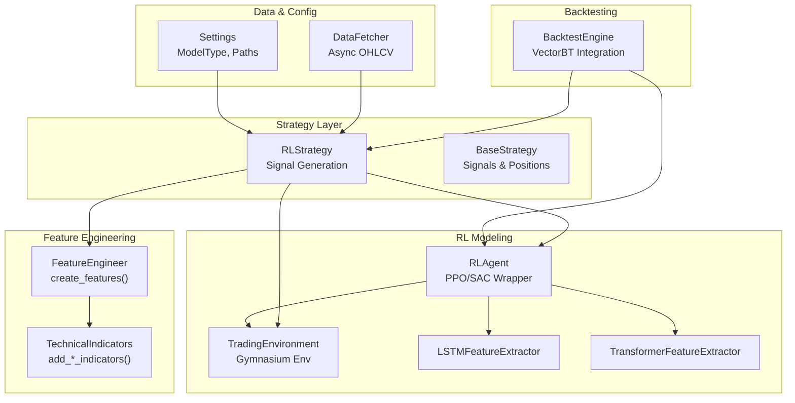
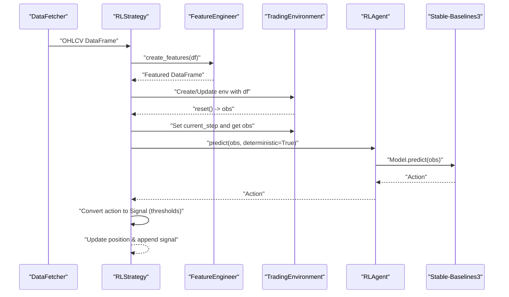
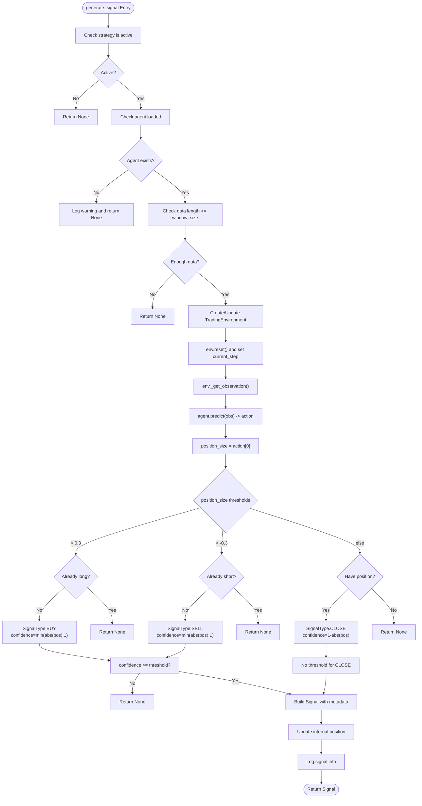
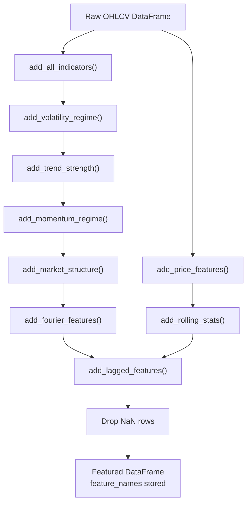
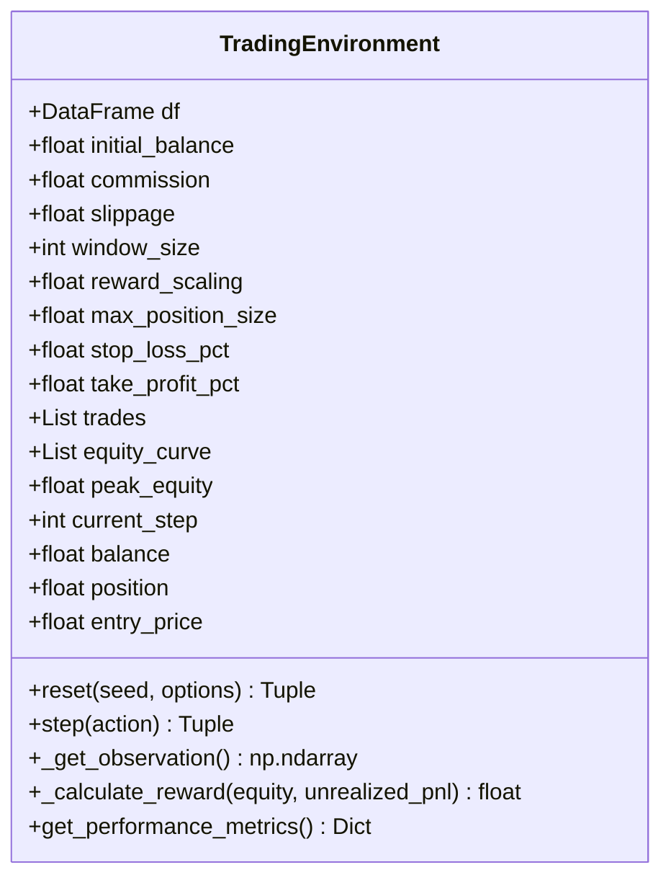
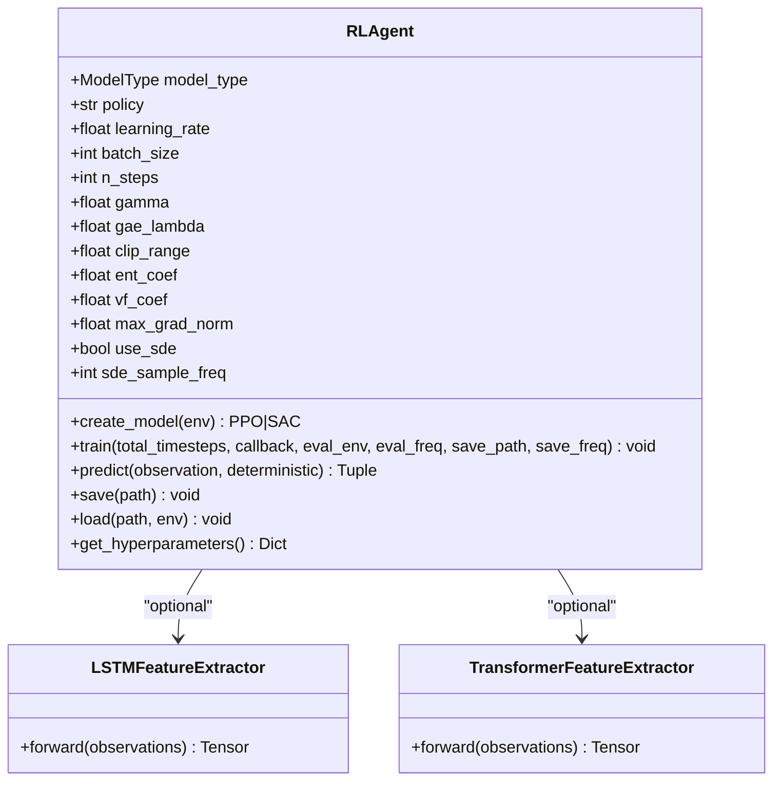
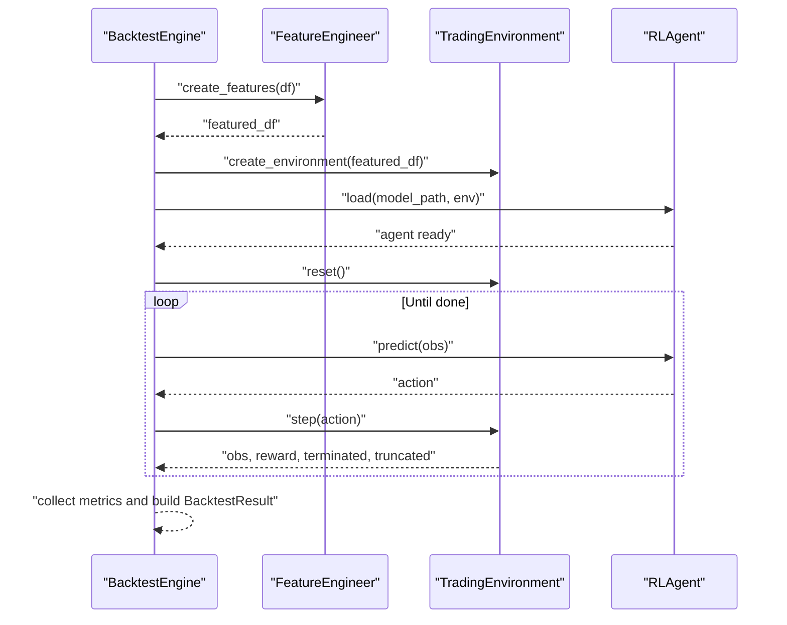
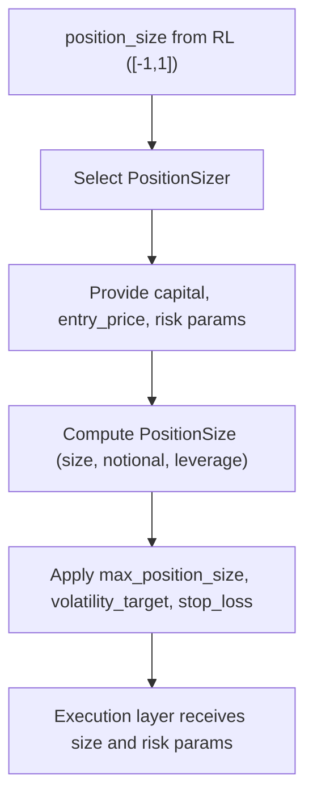
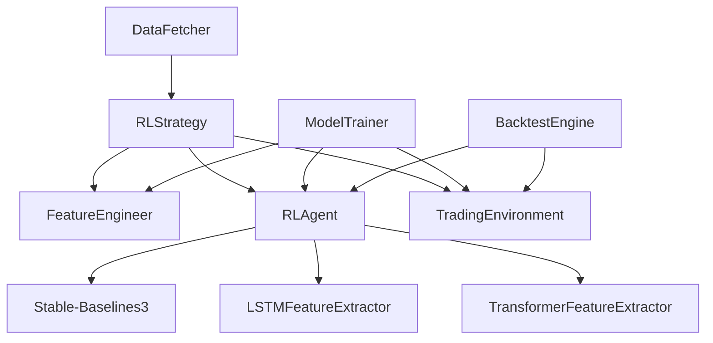

# RL Strategy Implementation

<cite>
**Referenced Files in This Document**
- [rl_strategy.py](file://trading_bot/strategy/rl_strategy.py)
- [base.py](file://trading_bot/strategy/base.py)
- [engineering.py](file://trading_bot/features/engineering.py)
- [indicators.py](file://trading_bot/features/indicators.py)
- [environment.py](file://trading_bot/models/environment.py)
- [agent.py](file://trading_bot/models/agent.py)
- [train.py](file://trading_bot/models/train.py)
- [engine.py](file://trading_bot/backtest/engine.py)
- [settings.py](file://trading_bot/config/settings.py)
- [fetcher.py](file://trading_bot/data/fetcher.py)
- [sizing.py](file://trading_bot/risk/sizing.py)
- [requirements.txt](file://requirements.txt)
</cite>

## Table of Contents
1. [Introduction](#introduction)
2. [Project Structure](#project-structure)
3. [Core Components](#core-components)
4. [Architecture Overview](#architecture-overview)
5. [Detailed Component Analysis](#detailed-component-analysis)
6. [Dependency Analysis](#dependency-analysis)
7. [Performance Considerations](#performance-considerations)
8. [Troubleshooting Guide](#troubleshooting-guide)
9. [Conclusion](#conclusion)
10. [Appendices](#appendices)

## Introduction
This document explains the RL-based trading strategy implementation, focusing on the RLStrategy class, its integration with Stable-Baselines3 agents (PPO/SAC), TradingEnvironment setup, and observation space handling. It also covers feature engineering, position sizing, confidence thresholds, and signal conversion from model outputs. Practical examples demonstrate training, prediction workflows, and parameter tuning, along with the relationship between raw market data and RL decision-making.

## Project Structure
The RL strategy is composed of several modules:
- Strategy layer: RLStrategy orchestrates data preparation, environment creation, model inference, and signal generation.
- Feature engineering: Advanced feature extraction and technical indicators enrich raw OHLCV data.
- RL modeling: Stable-Baselines3 agents wrap PPO/SAC policies with custom feature extractors.
- Environment: A Gymnasium-based TradingEnvironment defines the RL state/action/reward dynamics.
- Backtesting: VectorBT-backed engine evaluates strategy performance.
- Configuration and data: Settings define runtime parameters; DataFetcher retrieves OHLCV asynchronously.

**Diagram sources**
- [rl_strategy.py:19-285](file://trading_bot/strategy/rl_strategy.py#L19-L285)
- [engineering.py:17-442](file://trading_bot/features/engineering.py#L17-L442)
- [indicators.py:14-332](file://trading_bot/features/indicators.py#L14-L332)
- [agent.py:206-502](file://trading_bot/models/agent.py#L206-L502)
- [environment.py:15-405](file://trading_bot/models/environment.py#L15-L405)
- [engine.py:41-418](file://trading_bot/backtest/engine.py#L41-L418)
- [settings.py:17-176](file://trading_bot/config/settings.py#L17-L176)
- [fetcher.py:32-331](file://trading_bot/data/fetcher.py#L32-L331)

**Section sources**
- [rl_strategy.py:19-285](file://trading_bot/strategy/rl_strategy.py#L19-L285)
- [engineering.py:17-442](file://trading_bot/features/engineering.py#L17-L442)
- [agent.py:206-502](file://trading_bot/models/agent.py#L206-L502)
- [environment.py:15-405](file://trading_bot/models/environment.py#L15-L405)
- [engine.py:41-418](file://trading_bot/backtest/engine.py#L41-L418)
- [settings.py:17-176](file://trading_bot/config/settings.py#L17-L176)
- [fetcher.py:32-331](file://trading_bot/data/fetcher.py#L32-L331)

## Core Components
- RLStrategy: Implements BaseStrategy to generate signals from RL model predictions. Handles model loading, feature engineering, environment creation, and signal conversion with confidence thresholds.
- FeatureEngineer: Adds technical indicators, custom regime features, rolling statistics, lags, and Fourier/cyclical features; drops NaNs and stores feature names.
- TechnicalIndicators: Uses pandas-ta to compute trend/momentum/volatility/volume indicators and price features.
- RLAgent: Wraps Stable-Baselines3 PPO/SAC with configurable hyperparameters, callbacks, and optional custom feature extractors (LSTM/Transformer).
- TradingEnvironment: Defines Gymnasium environment with action/observation spaces, slippage/commission, and reward shaping based on equity changes, Sharpe-like risk-adjustment, drawdown penalties, and overtrading costs.
- BacktestEngine: Runs vectorbt-based and RL-agent-based backtests; computes performance metrics and generates reports.
- Settings: Provides ModelType enumeration (PPO/SAC), paths, and runtime configuration.
- DataFetcher: Async OHLCV retrieval from exchanges with rate limiting and retries.

**Section sources**
- [rl_strategy.py:19-285](file://trading_bot/strategy/rl_strategy.py#L19-L285)
- [base.py:39-136](file://trading_bot/strategy/base.py#L39-L136)
- [engineering.py:17-442](file://trading_bot/features/engineering.py#L17-L442)
- [indicators.py:14-332](file://trading_bot/features/indicators.py#L14-L332)
- [agent.py:206-502](file://trading_bot/models/agent.py#L206-L502)
- [environment.py:15-405](file://trading_bot/models/environment.py#L15-L405)
- [engine.py:41-418](file://trading_bot/backtest/engine.py#L41-L418)
- [settings.py:17-176](file://trading_bot/config/settings.py#L17-L176)
- [fetcher.py:32-331](file://trading_bot/data/fetcher.py#L32-L331)

## Architecture Overview
The RL strategy integrates raw market data through feature engineering, feeds the processed features into a TradingEnvironment, and uses an RLAgent to produce actions. The RLAgent’s action is a continuous vector representing position size and risk parameters, which RLStrategy converts into discrete BUY/SELL/CLOSE signals with confidence thresholds and position tracking.

**Diagram sources**
- [rl_strategy.py:79-180](file://trading_bot/strategy/rl_strategy.py#L79-L180)
- [engineering.py:31-85](file://trading_bot/features/engineering.py#L31-L85)
- [environment.py:105-132](file://trading_bot/models/environment.py#L105-L132)
- [agent.py:415-433](file://trading_bot/models/agent.py#L415-L433)

## Detailed Component Analysis

### RLStrategy Class
- Initialization parameters:
  - symbols: List of tradable instruments.
  - model_path: Path to a pre-trained model (optional).
  - model_type: ModelType (PPO/SAC).
  - window_size: Observation window for environment.
  - confidence_threshold: Minimum confidence for generating non-neutral signals.
  - feature_columns: Optional subset of feature names for environment.
- Model loading: Creates RLAgent and loads a saved model via agent.load().
- Data preparation: Delegates to FeatureEngineer.create_features() to add indicators, custom features, rolling stats, lags, and drop NaNs.
- Signal generation:
  - Ensures strategy is active and model is loaded.
  - Validates sufficient data length against window_size.
  - Creates or updates TradingEnvironment for the symbol with latest data.
  - Resets environment and sets current_step to the last bar; extracts observation.
  - Predicts action with agent.predict(); interprets position_size in [-1, 1].
  - Converts position_size to BUY/SELL/CLOSE signals using thresholds (e.g., ±0.3) and checks current position to avoid duplicate entries.
  - Computes confidence from absolute position_size and enforces confidence_threshold (except CLOSE).
  - Builds Signal with metadata including position_size and model_type; updates internal position tracking.
- Update loop: Aggregates incoming data per symbol, maintains a bounded buffer, prepares features, and generates signals.
- Training: Uses ModelTrainer to prepare features, split data, optimize hyperparameters (via Optuna), create environments, train agent, and save artifacts with metadata.

**Diagram sources**
- [rl_strategy.py:79-180](file://trading_bot/strategy/rl_strategy.py#L79-L180)

**Section sources**
- [rl_strategy.py:22-57](file://trading_bot/strategy/rl_strategy.py#L22-L57)
- [rl_strategy.py:58-66](file://trading_bot/strategy/rl_strategy.py#L58-L66)
- [rl_strategy.py:68-77](file://trading_bot/strategy/rl_strategy.py#L68-L77)
- [rl_strategy.py:79-180](file://trading_bot/strategy/rl_strategy.py#L79-L180)
- [rl_strategy.py:182-221](file://trading_bot/strategy/rl_strategy.py#L182-L221)
- [rl_strategy.py:223-269](file://trading_bot/strategy/rl_strategy.py#L223-L269)
- [rl_strategy.py:271-284](file://trading_bot/strategy/rl_strategy.py#L271-L284)

### Feature Engineering Pipeline
- FeatureEngineer.create_features orchestrates:
  - TechnicalIndicators.add_all_indicators and add_price_features.
  - add_volatility_regime, add_trend_strength, add_momentum_regime, add_market_structure, add_fourier_features.
  - add_rolling_stats and add_lagged_features.
  - Drops NaN rows and records feature_names for downstream use.
- TechnicalIndicators leverages pandas-ta for EMA/SMA/MACD/RSI/Stochastic/ATR/Bollinger/Keltner/VWAP/MFI and more.

**Diagram sources**
- [engineering.py:31-85](file://trading_bot/features/engineering.py#L31-L85)
- [engineering.py:87-278](file://trading_bot/features/engineering.py#L87-L278)
- [indicators.py:21-294](file://trading_bot/features/indicators.py#L21-L294)

**Section sources**
- [engineering.py:31-85](file://trading_bot/features/engineering.py#L31-L85)
- [engineering.py:87-278](file://trading_bot/features/engineering.py#L87-L278)
- [indicators.py:21-294](file://trading_bot/features/indicators.py#L21-L294)

### TradingEnvironment (RL Environment)
- Action space: Box(-1, 1) for position_size; plus bounded stop_loss/take_profit for risk management.
- Observation space: window_size × (n_features + 3), where the +3 accounts for normalized balance, current position, and unrealized PnL repeated across the window.
- Reward function: Equity change scaled, Sharpe-like risk term, squared drawdown penalty, and small overtrading penalty; scaled by reward_scaling.
- Slippage and commission applied on executions; bankruptcy and max drawdown termination conditions enforced.

**Diagram sources**
- [environment.py:15-405](file://trading_bot/models/environment.py#L15-L405)

**Section sources**
- [environment.py:20-103](file://trading_bot/models/environment.py#L20-L103)
- [environment.py:134-250](file://trading_bot/models/environment.py#L134-L250)
- [environment.py:252-289](file://trading_bot/models/environment.py#L252-L289)
- [environment.py:306-347](file://trading_bot/models/environment.py#L306-L347)
- [environment.py:364-404](file://trading_bot/models/environment.py#L364-L404)

### RLAgent and Model Types (PPO/SAC)
- RLAgent wraps Stable-Baselines3 PPO or SAC with:
  - Configurable hyperparameters (learning_rate, batch_size, n_steps, gamma, gae_lambda, clip_range, ent_coef, vf_coef, max_grad_norm, use_sde).
  - Optional custom feature extractors: LSTMFeatureExtractor and TransformerFeatureExtractor.
  - Training callbacks: TrainingCallback, EvalCallback, CheckpointCallback.
  - Save/load model and expose hyperparameters.
- ModelTrainer performs:
  - Feature engineering, train/test split, optional Optuna hyperparameter optimization, environment creation, agent training, and artifact saving with metadata.

**Diagram sources**
- [agent.py:206-502](file://trading_bot/models/agent.py#L206-L502)

**Section sources**
- [agent.py:209-351](file://trading_bot/models/agent.py#L209-L351)
- [agent.py:353-414](file://trading_bot/models/agent.py#L353-L414)
- [agent.py:415-433](file://trading_bot/models/agent.py#L415-L433)
- [agent.py:435-461](file://trading_bot/models/agent.py#L435-L461)
- [agent.py:462-482](file://trading_bot/models/agent.py#L462-L482)
- [agent.py:27-98](file://trading_bot/models/agent.py#L27-L98)
- [agent.py:101-176](file://trading_bot/models/agent.py#L101-L176)

### Backtesting and Walk-Forward Validation
- BacktestEngine.run_rl_backtest:
  - Prepares features, constructs TradingEnvironment, loads trained agent, runs episode to completion, collects metrics, and builds a comprehensive BacktestResult.
- ModelTrainer.walk_forward_validation:
  - Performs walk-forward analysis across rolling windows, training on train_df and evaluating on test_df per fold, returning per-fold metrics.

**Diagram sources**
- [engine.py:147-240](file://trading_bot/backtest/engine.py#L147-L240)
- [train.py:310-383](file://trading_bot/models/train.py#L310-L383)

**Section sources**
- [engine.py:147-240](file://trading_bot/backtest/engine.py#L147-L240)
- [train.py:310-383](file://trading_bot/models/train.py#L310-L383)

### Position Sizing Mechanism
- RLStrategy does not directly implement position sizing; it produces a continuous position_size in [-1, 1] from the RL model.
- Position sizing strategies are available in risk/sizing.py:
  - Fixed Fraction, Kelly Criterion, Volatility Targeting, ATR-based, Optimal F.
  - These calculators return a PositionSize dataclass with size, notional, leverage, and risk parameters.
- Integration suggestion: After obtaining position_size from RLStrategy, apply a PositionSizer to derive concrete order sizes and risk controls.

**Diagram sources**
- [sizing.py:14-312](file://trading_bot/risk/sizing.py#L14-L312)

**Section sources**
- [sizing.py:14-312](file://trading_bot/risk/sizing.py#L14-L312)

## Dependency Analysis
- RLStrategy depends on:
  - FeatureEngineer for data preparation.
  - RLAgent for inference.
  - TradingEnvironment for observation/action/reward dynamics.
- RLAgent depends on:
  - Stable-Baselines3 (PPO/SAC).
  - Optional custom feature extractors (LSTM/Transformer).
  - Callbacks for training/evaluation/checkpointing.
- ModelTrainer composes:
  - FeatureEngineer, TradingEnvironment, RLAgent, Optuna for hyperparameter optimization.
- BacktestEngine integrates:
  - VectorBT for performance metrics and trade analytics.
  - RLAgent and TradingEnvironment for RL backtests.
- DataFetcher supplies OHLCV for training and live/paper trading.

**Diagram sources**
- [rl_strategy.py:19-285](file://trading_bot/strategy/rl_strategy.py#L19-L285)
- [agent.py:206-502](file://trading_bot/models/agent.py#L206-L502)
- [train.py:23-185](file://trading_bot/models/train.py#L23-L185)
- [engine.py:41-418](file://trading_bot/backtest/engine.py#L41-L418)
- [fetcher.py:32-331](file://trading_bot/data/fetcher.py#L32-L331)

**Section sources**
- [rl_strategy.py:19-285](file://trading_bot/strategy/rl_strategy.py#L19-L285)
- [agent.py:206-502](file://trading_bot/models/agent.py#L206-L502)
- [train.py:23-185](file://trading_bot/models/train.py#L23-L185)
- [engine.py:41-418](file://trading_bot/backtest/engine.py#L41-L418)
- [fetcher.py:32-331](file://trading_bot/data/fetcher.py#L32-L331)

## Performance Considerations
- Observation window_size: Larger windows capture more context but increase computational cost; tune based on available features and latency constraints.
- Feature count: Extensive feature engineering improves signal quality but may require regularization or feature selection; monitor overfitting.
- Hyperparameter optimization: Use Optuna via ModelTrainer.optimize_hyperparameters to find robust configurations for PPO/SAC.
- Reward shaping: The environment’s reward encourages positive equity change and risk-adjusted returns while penalizing drawdowns and excessive trading.
- Training stability: Enable SDE for stochastic exploration; adjust entropy coefficient and clipping ranges for PPO; ensure adequate timesteps and evaluation frequency.
- Data freshness: RLStrategy buffers recent bars; keep data streams updated to reflect latest market conditions.

[No sources needed since this section provides general guidance]

## Troubleshooting Guide
- No model loaded: RLStrategy logs a warning and returns None when agent is missing; ensure model_path is provided and agent.load() succeeds.
- Insufficient data: If data length is less than window_size, RLStrategy returns None; ensure sufficient historical bars after feature engineering.
- Duplicate signals: RLStrategy avoids re-entering the same side; it returns None if current position matches intended signal.
- Confidence threshold: Signals below confidence_threshold (except CLOSE) are ignored; adjust threshold to control signal frequency.
- Training failures: Verify Optuna study and saved artifacts; check tensorboard logs for convergence; reduce n_trials or adjust search space.
- Environment errors: Confirm feature_columns align with feature names produced by FeatureEngineer; ensure OHLCV completeness and absence of NaNs after feature engineering.

**Section sources**
- [rl_strategy.py:93-102](file://trading_bot/strategy/rl_strategy.py#L93-L102)
- [rl_strategy.py:96-98](file://trading_bot/strategy/rl_strategy.py#L96-L98)
- [rl_strategy.py:129-150](file://trading_bot/strategy/rl_strategy.py#L129-L150)
- [rl_strategy.py:148-150](file://trading_bot/strategy/rl_strategy.py#L148-L150)
- [train.py:230-244](file://trading_bot/models/train.py#L230-L244)

## Conclusion
The RL-based trading strategy integrates robust feature engineering, a Gymnasium environment tailored for trading, and Stable-Baselines3 agents (PPO/SAC) to produce actionable signals. RLStrategy translates model outputs into discrete, confidence-aware trades while maintaining position discipline. The ecosystem includes training with hyperparameter optimization, backtesting with comprehensive metrics, and modular components for future enhancements such as advanced position sizing and multi-symbol training.

[No sources needed since this section summarizes without analyzing specific files]

## Appendices

### Practical Examples

- Training a model:
  - Use the training script to fetch or load historical data, prepare features, and train PPO or SAC with optional hyperparameter optimization.
  - Example invocation: python train.py --symbols BTC/USDT ETH/USDT --model PPO --timesteps 100000 --trials 20 --output ./models

- Running a backtest:
  - Load a trained model and run a backtest on historical data; optionally enable walk-forward or Monte Carlo simulation.
  - Example invocation: python backtest.py --model ./models/PPO_YYYYMMDD_HHMMSS.zip --data ./data --symbol BTC/USDT --output ./backtest_results --walk-forward

- Prediction workflow:
  - Initialize RLStrategy with model_path and model_type; call update() with symbol-to-DataFrame mapping; iterate through returned signals and execute orders with position sizing.

- Parameter tuning:
  - Adjust window_size, confidence_threshold, and environment reward parameters to improve signal quality and risk-adjusted returns.
  - Tune agent hyperparameters (learning_rate, batch_size, n_steps, gamma, clip_range, ent_coef) via ModelTrainer.optimize_hyperparameters.

**Section sources**
- [train.py:43-101](file://train.py#L43-L101)
- [backtest.py:16-110](file://backtest.py#L16-L110)
- [rl_strategy.py:22-57](file://trading_bot/strategy/rl_strategy.py#L22-L57)
- [rl_strategy.py:223-269](file://trading_bot/strategy/rl_strategy.py#L223-L269)
- [train.py:187-244](file://trading_bot/models/train.py#L187-L244)

### Relationship Between Raw Market Data, Feature Engineering, and RL Decision Making
- Raw market data (OHLCV) is transformed into a rich feature set by FeatureEngineer and TechnicalIndicators, capturing trends, momentum, volatility, volume, and structural patterns.
- The TradingEnvironment packages these features into a sliding-window observation augmented with account state, enabling the RL agent to learn temporal dependencies and risk controls.
- RLStrategy interprets the agent’s continuous action as a desired position size and converts it into executable signals with confidence thresholds and position tracking.

**Section sources**
- [engineering.py:31-85](file://trading_bot/features/engineering.py#L31-L85)
- [indicators.py:21-294](file://trading_bot/features/indicators.py#L21-L294)
- [environment.py:80-87](file://trading_bot/models/environment.py#L80-L87)
- [rl_strategy.py:115-180](file://trading_bot/strategy/rl_strategy.py#L115-L180)