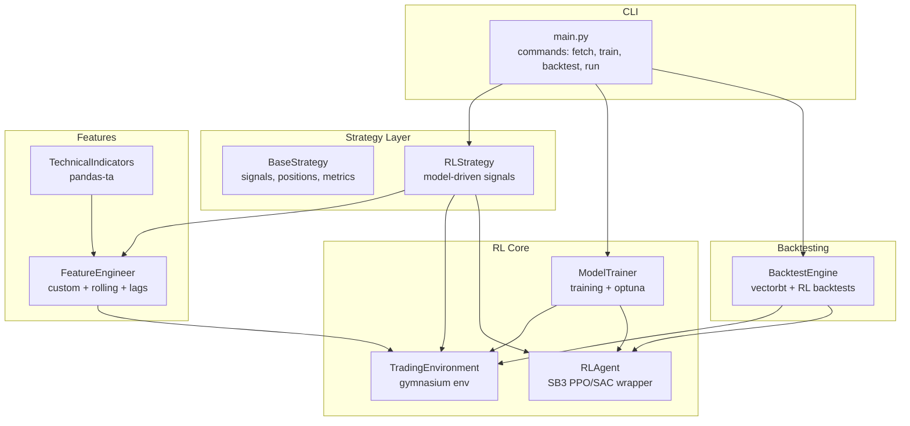
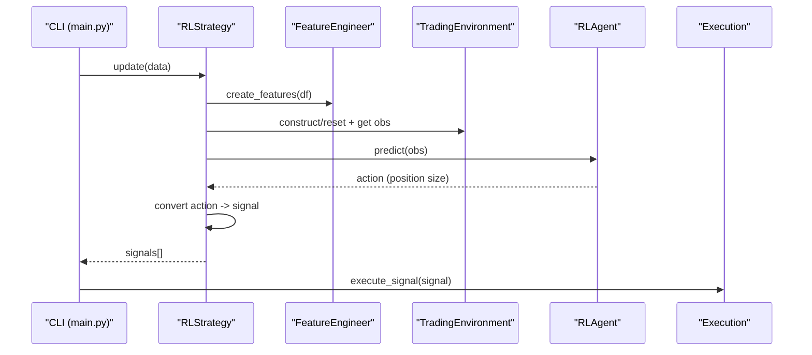
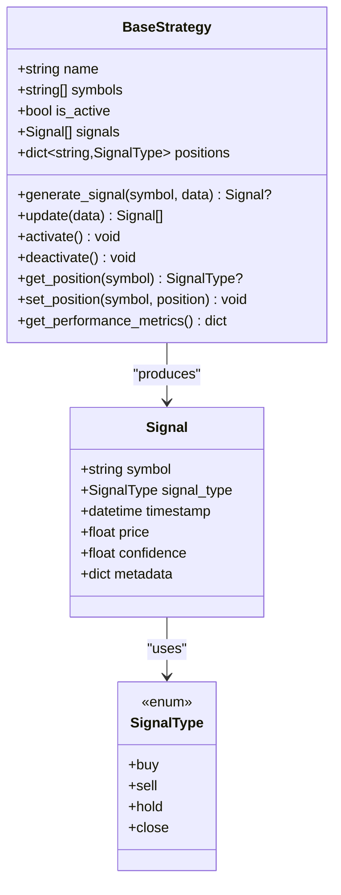
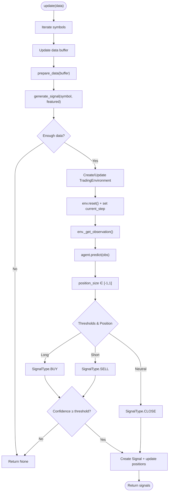
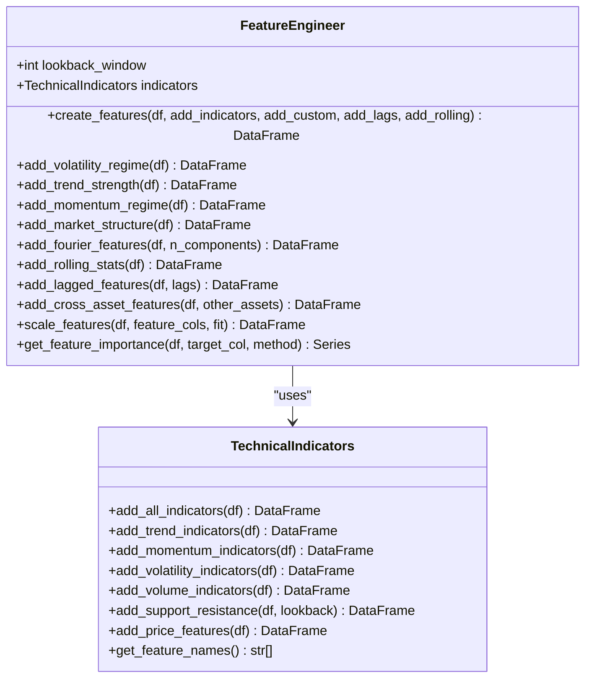
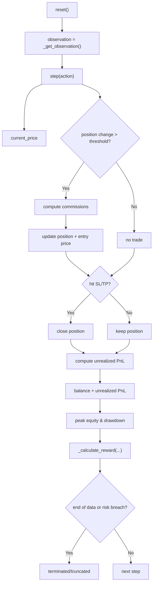
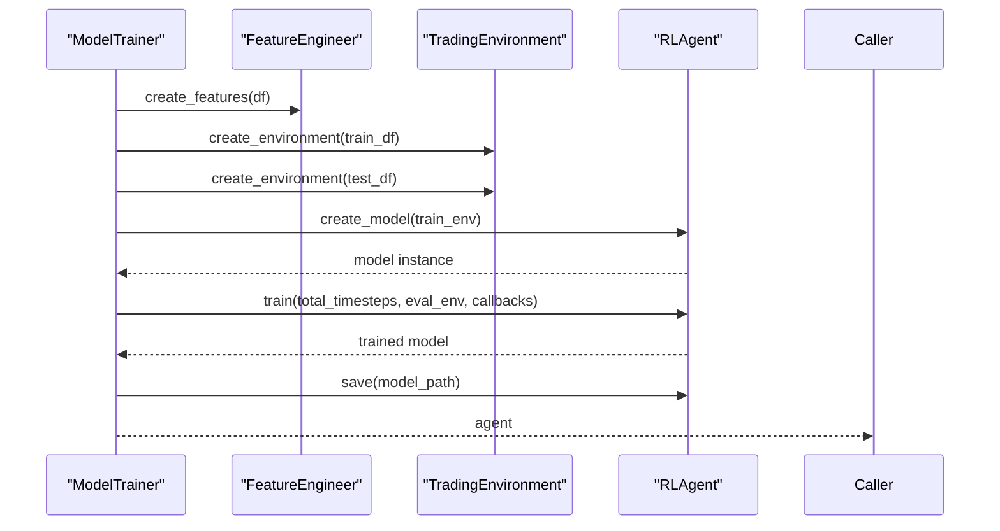
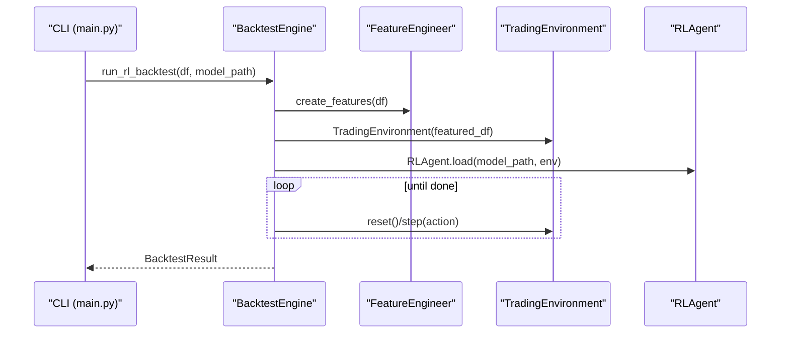
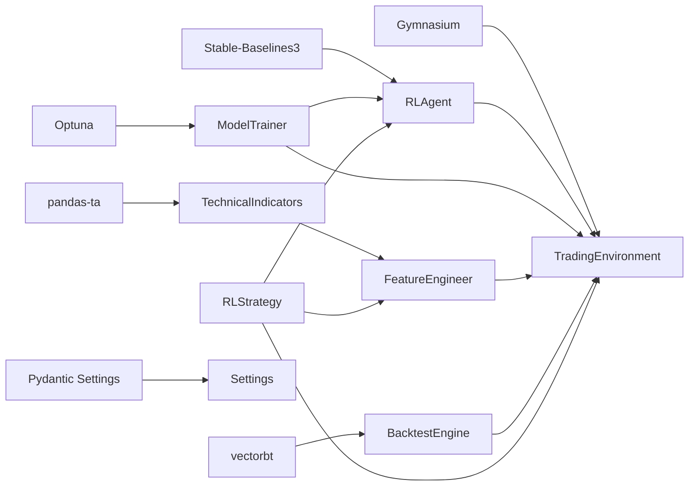

# Strategy Development

<cite>
**Referenced Files in This Document**
- [base.py](file://trading_bot/strategy/base.py)
- [rl_strategy.py](file://trading_bot/strategy/rl_strategy.py)
- [engineering.py](file://trading_bot/features/engineering.py)
- [indicators.py](file://trading_bot/features/indicators.py)
- [environment.py](file://trading_bot/models/environment.py)
- [agent.py](file://trading_bot/models/agent.py)
- [train.py](file://trading_bot/models/train.py)
- [engine.py](file://trading_bot/backtest/engine.py)
- [settings.py](file://trading_bot/config/settings.py)
- [main.py](file://trading_bot/main.py)
- [requirements.txt](file://requirements.txt)
- [README.md](file://README.md)
</cite>

## Table of Contents
1. [Introduction](#introduction)
2. [Project Structure](#project-structure)
3. [Core Components](#core-components)
4. [Architecture Overview](#architecture-overview)
5. [Detailed Component Analysis](#detailed-component-analysis)
6. [Dependency Analysis](#dependency-analysis)
7. [Performance Considerations](#performance-considerations)
8. [Troubleshooting Guide](#troubleshooting-guide)
9. [Conclusion](#conclusion)
10. [Appendices](#appendices)

## Introduction
This document explains the AI Trading Bot’s RL-based strategy development framework built on Stable-Baselines3 (PPO/SAC). It covers the strategy architecture, signal generation, decision-making process, feature engineering integration, and environment setup. It also provides practical guidance for creating custom strategies, adapting existing ones, and optimizing parameters. The focus is on how features, models, and trading decisions relate within the system.

## Project Structure
The strategy development stack is organized around modular components:
- Strategy layer: BaseStrategy interface and RLStrategy implementation
- Feature engineering: Technical indicators and advanced feature creation
- RL modeling: Environment, agent wrapper, and training pipeline
- Backtesting and CLI: VectorBT-backed backtests and command-line orchestration

**Diagram sources**
- [base.py:1-136](file://trading_bot/strategy/base.py#L1-L136)
- [rl_strategy.py:1-285](file://trading_bot/strategy/rl_strategy.py#L1-L285)
- [engineering.py:1-442](file://trading_bot/features/engineering.py#L1-L442)
- [indicators.py:1-332](file://trading_bot/features/indicators.py#L1-L332)
- [environment.py:1-405](file://trading_bot/models/environment.py#L1-L405)
- [agent.py:1-502](file://trading_bot/models/agent.py#L1-L502)
- [train.py:1-446](file://trading_bot/models/train.py#L1-L446)
- [engine.py:1-418](file://trading_bot/backtest/engine.py#L1-L418)
- [main.py:1-347](file://trading_bot/main.py#L1-L347)

**Section sources**
- [README.md:198-231](file://README.md#L198-L231)
- [requirements.txt:1-46](file://requirements.txt#L1-L46)

## Core Components
- BaseStrategy: Defines the contract for generating signals, tracking positions, and computing performance metrics.
- RLStrategy: Implements a model-driven strategy that prepares features, builds environments, predicts actions, and converts them to trading signals.
- FeatureEngineer: Creates a rich feature set including technical indicators, custom regime features, rolling statistics, lags, and cross-asset features.
- TechnicalIndicators: Adds standardized TA features via pandas-ta.
- TradingEnvironment: A gymnasium environment that encapsulates state, actions, rewards, and risk controls.
- RLAgent: Wraps Stable-Baselines3 agents (PPO/SAC), with optional LSTM/Transformer feature extractors and training callbacks.
- ModelTrainer: Orchestrates feature engineering, environment creation, hyperparameter optimization (Optuna), and training with evaluation.
- BacktestEngine: Provides vectorbt-backed backtests and RL backtests with performance metrics and reporting.
- CLI (main.py): Commands to fetch data, train models, backtest, run paper/live trading, and launch dashboards.

**Section sources**
- [base.py:39-136](file://trading_bot/strategy/base.py#L39-L136)
- [rl_strategy.py:19-285](file://trading_bot/strategy/rl_strategy.py#L19-L285)
- [engineering.py:17-442](file://trading_bot/features/engineering.py#L17-L442)
- [indicators.py:14-332](file://trading_bot/features/indicators.py#L14-L332)
- [environment.py:15-405](file://trading_bot/models/environment.py#L15-L405)
- [agent.py:206-502](file://trading_bot/models/agent.py#L206-L502)
- [train.py:23-446](file://trading_bot/models/train.py#L23-L446)
- [engine.py:41-418](file://trading_bot/backtest/engine.py#L41-L418)
- [main.py:1-347](file://trading_bot/main.py#L1-L347)

## Architecture Overview
The RL strategy architecture integrates data, features, environment, and model to produce actionable signals. The flow is:
- Data ingestion and storage
- Feature engineering (technical indicators + custom features)
- Environment construction (observation/action spaces, reward shaping)
- Model training (PPO/SAC) with hyperparameter optimization
- Signal generation (model prediction -> position size -> signal)
- Execution and monitoring

**Diagram sources**
- [main.py:214-325](file://trading_bot/main.py#L214-L325)
- [rl_strategy.py:79-181](file://trading_bot/strategy/rl_strategy.py#L79-L181)
- [engineering.py:31-86](file://trading_bot/features/engineering.py#L31-L86)
- [environment.py:105-250](file://trading_bot/models/environment.py#L105-L250)
- [agent.py:415-434](file://trading_bot/models/agent.py#L415-L434)

## Detailed Component Analysis

### BaseStrategy Interface
- Responsibilities:
  - Define abstract methods for signal generation and updates
  - Track active signals and positions per symbol
  - Compute performance metrics (counts of buy/sell/hold/close)
- Design:
  - Signals carry symbol, type, timestamp, price, confidence, and metadata
  - Positions are tracked as a mapping from symbol to signal type
- Extensibility:
  - Subclasses implement generate_signal and update to define custom logic

**Diagram sources**
- [base.py:16-136](file://trading_bot/strategy/base.py#L16-L136)

**Section sources**
- [base.py:39-136](file://trading_bot/strategy/base.py#L39-L136)

### RLStrategy Implementation
- Initialization:
  - Loads model (PPO/SAC) from disk if provided
  - Sets window size, confidence threshold, feature columns
  - Maintains per-symbol environments and buffers
- Data preparation:
  - Uses FeatureEngineer to create features
- Signal generation:
  - Builds/updates TradingEnvironment for the symbol
  - Resets environment, sets current step, extracts observation
  - Predicts action from RLAgent
  - Converts continuous action (-1 to 1) to discrete signals (buy/sell/close)
  - Applies confidence threshold and position filters
  - Updates internal position tracking
- Training:
  - Uses ModelTrainer to prepare features, create environments, and train
  - Supports hyperparameter optimization and walk-forward validation

**Diagram sources**
- [rl_strategy.py:182-222](file://trading_bot/strategy/rl_strategy.py#L182-L222)
- [rl_strategy.py:79-181](file://trading_bot/strategy/rl_strategy.py#L79-L181)
- [environment.py:252-290](file://trading_bot/models/environment.py#L252-L290)
- [agent.py:415-434](file://trading_bot/models/agent.py#L415-L434)

**Section sources**
- [rl_strategy.py:19-285](file://trading_bot/strategy/rl_strategy.py#L19-L285)

### Feature Engineering Integration
- FeatureEngineer:
  - Adds technical indicators (via TechnicalIndicators)
  - Adds custom features: volatility regime, trend strength, momentum regime, market structure, Fourier features
  - Adds rolling statistics and lagged features
  - Stores feature names for downstream use
  - Provides scaling and feature importance utilities
- TechnicalIndicators:
  - Trend: EMAs, MACD, ADX, Supertrend, Ichimoku
  - Momentum: RSI, Stochastic, Stochastic RSI, Williams %R, CCI, AO, KDJ, ROC
  - Volatility: BB, KC, ATR, Historical Volatility, Donchian Channels
  - Volume: OBV, VWAP, MFI, Volume EMA/Ratio, CMF, AD
  - Support/Resistance: Pivot points, Fibonacci levels, distances

**Diagram sources**
- [engineering.py:17-442](file://trading_bot/features/engineering.py#L17-L442)
- [indicators.py:14-332](file://trading_bot/features/indicators.py#L14-L332)

**Section sources**
- [engineering.py:31-86](file://trading_bot/features/engineering.py#L31-L86)
- [engineering.py:87-279](file://trading_bot/features/engineering.py#L87-L279)
- [engineering.py:280-336](file://trading_bot/features/engineering.py#L280-L336)
- [engineering.py:337-442](file://trading_bot/features/engineering.py#L337-L442)
- [indicators.py:21-47](file://trading_bot/features/indicators.py#L21-L47)

### Trading Environment and Decision Logic
- Observation space:
  - Windowed features plus normalized balance, current position, and unrealized PnL
- Action space:
  - Continuous position size (-1 short to 1 long), plus stop-loss/take-profit bounds
- Reward function:
  - Equity change, Sharpe-like risk-adjusted component, drawdown penalty, overtrading penalty
- Risk controls:
  - Slippage, bankruptcy threshold, max drawdown, stop-loss/take-profit triggers
- Step mechanics:
  - Executes trades when position changes, updates equity, computes reward, checks termination

**Diagram sources**
- [environment.py:105-250](file://trading_bot/models/environment.py#L105-L250)
- [environment.py:252-348](file://trading_bot/models/environment.py#L252-L348)

**Section sources**
- [environment.py:20-104](file://trading_bot/models/environment.py#L20-L104)
- [environment.py:134-250](file://trading_bot/models/environment.py#L134-L250)
- [environment.py:306-405](file://trading_bot/models/environment.py#L306-L405)

### RL Agent and Training Pipeline
- RLAgent:
  - Wraps SB3 PPO/SAC with configurable policy kwargs, net architecture, activation, SDE
  - Supports custom LSTM/Transformer feature extractors
  - Provides training callbacks, evaluation, checkpointing, saving/loading
- ModelTrainer:
  - Prepares features, splits data, optimizes hyperparameters with Optuna
  - Creates train/test environments, trains agent, saves artifacts and metadata
  - Supports walk-forward validation and detailed evaluation

**Diagram sources**
- [train.py:99-185](file://trading_bot/models/train.py#L99-L185)
- [agent.py:274-414](file://trading_bot/models/agent.py#L274-L414)
- [agent.py:435-461](file://trading_bot/models/agent.py#L435-L461)

**Section sources**
- [agent.py:206-502](file://trading_bot/models/agent.py#L206-L502)
- [train.py:99-185](file://trading_bot/models/train.py#L99-L185)
- [train.py:187-244](file://trading_bot/models/train.py#L187-L244)
- [train.py:310-383](file://trading_bot/models/train.py#L310-L383)

### Backtesting and Reporting
- BacktestEngine:
  - VectorBT backtests: generates entries/exits and computes comprehensive metrics
  - RL backtests: runs agent in environment, collects equity curve and trades
  - Walk-forward analysis and Monte Carlo simulation helpers
  - Generates detailed reports with performance and additional metrics

**Diagram sources**
- [engine.py:147-240](file://trading_bot/backtest/engine.py#L147-L240)
- [engine.py:63-146](file://trading_bot/backtest/engine.py#L63-L146)

**Section sources**
- [engine.py:41-418](file://trading_bot/backtest/engine.py#L41-L418)

### CLI and Configuration
- CLI commands:
  - config, fetch-data, train, backtest, run, dashboard
- Settings:
  - Strongly typed configuration for trading mode, symbols, timeframe, risk parameters, model settings, logging, and notification channels

**Section sources**
- [main.py:24-347](file://trading_bot/main.py#L24-L347)
- [settings.py:23-176](file://trading_bot/config/settings.py#L23-L176)

## Dependency Analysis
Key dependencies and their roles:
- Stable-Baselines3: RL algorithms (PPO/SAC), vectorized environments, callbacks
- Gymnasium: Environment interface and spaces
- Optuna: Hyperparameter optimization
- pandas-ta: Technical indicators
- vectorbt: Vectorized backtesting
- Pydantic/Settings: Configuration management

**Diagram sources**
- [requirements.txt:21-29](file://requirements.txt#L21-L29)
- [agent.py:10-21](file://trading_bot/models/agent.py#L10-L21)
- [environment.py:5-8](file://trading_bot/models/environment.py#L5-L8)
- [train.py:10-18](file://trading_bot/models/train.py#L10-L18)
- [engine.py:10-17](file://trading_bot/backtest/engine.py#L10-L17)
- [settings.py:7-11](file://trading_bot/config/settings.py#L7-L11)

**Section sources**
- [requirements.txt:1-46](file://requirements.txt#L1-L46)

## Performance Considerations
- Feature computation cost:
  - Rolling computations and FFT features can be expensive; consider reducing window sizes or feature count for real-time operation.
- Environment observation size:
  - Large feature sets and long windows increase memory and compute; tune window_size and feature_columns.
- Model inference:
  - Deterministic predictions reduce variability; ensure model is saved with correct observation shapes.
- Training efficiency:
  - Use Optuna pruning and smaller episodes during optimization; evaluate on test_env to prevent overfitting.
- Backtesting:
  - VectorBT backtests are fast; RL backtests simulate full environment dynamics and are slower but realistic.

[No sources needed since this section provides general guidance]

## Troubleshooting Guide
Common issues and resolutions:
- Import errors:
  - Ensure all dependencies are installed per requirements.
- API connectivity:
  - Verify API keys and testnet settings in configuration.
- Memory issues:
  - Reduce batch size, window_size, or feature count.
- Model loading failures:
  - Confirm model path and that the environment matches the model’s observation space.
- Insufficient data:
  - RLStrategy requires sufficient data to build observations; ensure buffers are populated.

**Section sources**
- [README.md:309-323](file://README.md#L309-L323)
- [rl_strategy.py:100-102](file://trading_bot/strategy/rl_strategy.py#L100-L102)

## Conclusion
The AI Trading Bot’s RL strategy framework cleanly separates concerns: BaseStrategy defines the interface, FeatureEngineer enriches data, TradingEnvironment encapsulates the decision-making world, and RLAgent trains and executes policies. ModelTrainer automates hyperparameter tuning and evaluation. Together, these components enable robust strategy development, rigorous backtesting, and safe deployment in paper/live modes.

[No sources needed since this section summarizes without analyzing specific files]

## Appendices

### Practical Strategy Development Examples

- Implementing a new trading strategy:
  - Inherit from BaseStrategy and implement generate_signal and update to define custom logic.
  - Use FeatureEngineer to prepare features and TradingEnvironment to validate environment readiness.
  - Integrate with CLI via main.py to run and monitor.

- Customizing RLStrategy:
  - Adjust window_size, confidence_threshold, feature_columns to tailor sensitivity and responsiveness.
  - Switch model_type between PPO and SAC depending on problem characteristics.
  - Modify thresholds in generate_signal to adapt to different instruments or timeframes.

- Optimizing strategy parameters:
  - Use ModelTrainer.optimize_hyperparameters with Optuna to search learning_rate, batch_size, gamma, entropy coefficient, and PPO-specific parameters.
  - Perform walk-forward validation to assess out-of-sample stability.
  - Use BacktestEngine.walk_forward and Monte Carlo simulation to stress-test performance.

- Relationship between features, models, and decisions:
  - FeatureEngineer produces a rich, validated feature set that TradingEnvironment consumes.
  - RLAgent learns a policy mapping observations to actions; RLStrategy translates actions to signals.
  - BacktestEngine evaluates both vectorbt-style and RL-style strategies to quantify performance.

**Section sources**
- [base.py:39-136](file://trading_bot/strategy/base.py#L39-L136)
- [rl_strategy.py:19-285](file://trading_bot/strategy/rl_strategy.py#L19-L285)
- [train.py:187-244](file://trading_bot/models/train.py#L187-L244)
- [engine.py:242-295](file://trading_bot/backtest/engine.py#L242-L295)