# Testing Strategy

<cite>
**Referenced Files in This Document**
- [README.md](file://README.md)
- [pyproject.toml](file://pyproject.toml)
- [requirements.txt](file://requirements.txt)
- [trading_bot/tests/test_api_integration.py](file://trading_bot/tests/test_api_integration.py)
- [trading_bot/tests/test_config.py](file://trading_bot/tests/test_config.py)
- [trading_bot/tests/test_risk.py](file://trading_bot/tests/test_risk.py)
- [trading_bot/config/settings.py](file://trading_bot/config/settings.py)
- [trading_bot/risk/sizing.py](file://trading_bot/risk/sizing.py)
- [trading_bot/risk/manager.py](file://trading_bot/risk/manager.py)
- [trading_bot/risk/circuit_breaker.py](file://trading_bot/risk/circuit_breaker.py)
- [trading_bot/backtest/engine.py](file://trading_bot/backtest/engine.py)
- [trading_bot/strategy/base.py](file://trading_bot/strategy/base.py)
- [trading_bot/features/engineering.py](file://trading_bot/features/engineering.py)
- [trading_bot/models/environment.py](file://trading_bot/models/environment.py)
- [trading_bot/models/agent.py](file://trading_bot/models/agent.py)
- [trading_bot/api/server.py](file://trading_bot/api/server.py)
- [trading_bot/api/routes/signals.py](file://trading_bot/api/routes/signals.py)
- [trading_bot/api/routes/broker.py](file://trading_bot/api/routes/broker.py)
- [trading_bot/persistence/db.py](file://trading_bot/persistence/db.py)
- [trading_bot/persistence/repositories.py](file://trading_bot/persistence/repositories.py)
- [trading_bot/persistence/schema.py](file://trading_bot/persistence/schema.py)
- [trading_bot/api/models.py](file://trading_bot/api/models.py)
</cite>

## Update Summary
**Changes Made**
- Added comprehensive API integration testing section covering new endpoints and functionality
- Expanded testing methodology to include database persistence testing
- Added broker connectivity and order placement testing
- Included signal prediction and outcome tracking validation
- Enhanced testing strategy with new API route coverage
- Updated architecture overview to reflect expanded testing infrastructure

## Table of Contents
1. [Introduction](#introduction)
2. [Project Structure](#project-structure)
3. [Core Components](#core-components)
4. [Architecture Overview](#architecture-overview)
5. [Detailed Component Analysis](#detailed-component-analysis)
6. [API Integration Testing](#api-integration-testing)
7. [Database Persistence Testing](#database-persistence-testing)
8. [Broker Integration Testing](#broker-integration-testing)
9. [Signal Processing Testing](#signal-processing-testing)
10. [Dependency Analysis](#dependency-analysis)
11. [Performance Considerations](#performance-considerations)
12. [Troubleshooting Guide](#troubleshooting-guide)
13. [Conclusion](#conclusion)
14. [Appendices](#appendices)

## Introduction
This document defines a comprehensive testing strategy for the AI Trading Bot. It covers unit testing frameworks, methodologies, and validation procedures across configuration, risk management, API integration, and database persistence domains. The testing strategy has been significantly expanded to include comprehensive API integration tests covering new endpoints and functionality, ensuring robust validation across all major components of the trading system.

## Project Structure
The repository follows a modular structure with dedicated packages for configuration, risk management, backtesting, feature engineering, strategies, execution, and API services. Tests now comprehensively cover all major components including API integration, database persistence, and broker connectivity.

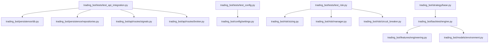

**Diagram sources**
- [trading_bot/tests/test_api_integration.py:1-154](file://trading_bot/tests/test_api_integration.py#L1-L154)
- [trading_bot/persistence/db.py:1-36](file://trading_bot/persistence/db.py#L1-L36)
- [trading_bot/persistence/repositories.py:1-277](file://trading_bot/persistence/repositories.py#L1-L277)
- [trading_bot/api/routes/signals.py:1-638](file://trading_bot/api/routes/signals.py#L1-L638)
- [trading_bot/api/routes/broker.py:1-337](file://trading_bot/api/routes/broker.py#L1-L337)
- [trading_bot/tests/test_config.py:1-50](file://trading_bot/tests/test_config.py#L1-L50)
- [trading_bot/tests/test_risk.py:1-178](file://trading_bot/tests/test_risk.py#L1-L178)
- [trading_bot/config/settings.py:1-176](file://trading_bot/config/settings.py#L1-L176)
- [trading_bot/risk/sizing.py:1-312](file://trading_bot/risk/sizing.py#L1-L312)
- [trading_bot/risk/manager.py:1-432](file://trading_bot/risk/manager.py#L1-L432)
- [trading_bot/risk/circuit_breaker.py:1-336](file://trading_bot/risk/circuit_breaker.py#L1-L336)
- [trading_bot/backtest/engine.py:1-418](file://trading_bot/backtest/engine.py#L1-L418)
- [trading_bot/features/engineering.py:1-442](file://trading_bot/features/engineering.py#L1-L442)
- [trading_bot/models/environment.py:1-200](file://trading_bot/models/environment.py#L1-L200)
- [trading_bot/strategy/base.py:1-136](file://trading_bot/strategy/base.py#L1-L136)

**Section sources**
- [README.md:198-232](file://README.md#L198-L232)

## Core Components
- Configuration module validates and normalizes settings, ensuring defaults and path handling are correct.
- Risk management module includes position sizing, portfolio risk controls, and circuit breakers.
- Backtesting engine integrates vectorbt and RL environments to compute performance metrics and supports walk-forward and Monte Carlo analysis.
- Strategy base class defines the interface for trading strategies.
- Feature engineering module builds robust feature sets for training and backtesting.
- **New**: API integration testing validates comprehensive endpoint coverage including signals, broker connectivity, and persistence.
- **New**: Database persistence testing ensures reliable data storage and retrieval across all trading components.

Key testing areas:
- Configuration validation and directory creation
- Position sizing correctness and constraints
- Risk manager decision logic and state transitions
- Circuit breaker thresholds and event generation
- Backtesting result computation and report generation
- Strategy interface compliance and performance metrics
- **New**: API endpoint validation and response consistency
- **New**: Database schema integrity and data persistence
- **New**: Broker connectivity and order placement functionality
- **New**: Signal prediction and outcome tracking

**Section sources**
- [trading_bot/tests/test_config.py:1-50](file://trading_bot/tests/test_config.py#L1-L50)
- [trading_bot/tests/test_risk.py:1-178](file://trading_bot/tests/test_risk.py#L1-L178)
- [trading_bot/tests/test_api_integration.py:1-154](file://trading_bot/tests/test_api_integration.py#L1-L154)
- [trading_bot/config/settings.py:124-162](file://trading_bot/config/settings.py#L124-L162)
- [trading_bot/risk/sizing.py:48-195](file://trading_bot/risk/sizing.py#L48-L195)
- [trading_bot/risk/manager.py:102-321](file://trading_bot/risk/manager.py#L102-L321)
- [trading_bot/risk/circuit_breaker.py:88-184](file://trading_bot/risk/circuit_breaker.py#L88-L184)
- [trading_bot/backtest/engine.py:41-145](file://trading_bot/backtest/engine.py#L41-L145)
- [trading_bot/strategy/base.py:39-135](file://trading_bot/strategy/base.py#L39-L135)
- [trading_bot/features/engineering.py:31-85](file://trading_bot/features/engineering.py#L31-L85)

## Architecture Overview
The testing strategy targets the following architecture layers with expanded API integration coverage:
- Configuration and settings validation
- Risk management and circuit breakers
- Feature engineering and indicator generation
- Backtesting engines (vectorbt and RL)
- Strategy interfaces and environment wrappers
- **New**: API service layer with comprehensive endpoint testing
- **New**: Database persistence layer with schema validation
- **New**: Broker integration layer with connectivity testing

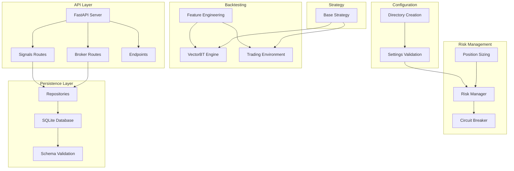

**Diagram sources**
- [trading_bot/config/settings.py:23-176](file://trading_bot/config/settings.py#L23-L176)
- [trading_bot/risk/sizing.py:25-312](file://trading_bot/risk/sizing.py#L25-L312)
- [trading_bot/risk/manager.py:58-432](file://trading_bot/risk/manager.py#L58-L432)
- [trading_bot/risk/circuit_breaker.py:32-336](file://trading_bot/risk/circuit_breaker.py#L32-L336)
- [trading_bot/backtest/engine.py:41-418](file://trading_bot/backtest/engine.py#L41-L418)
- [trading_bot/features/engineering.py:17-442](file://trading_bot/features/engineering.py#L17-L442)
- [trading_bot/strategy/base.py:39-135](file://trading_bot/strategy/base.py#L39-L135)
- [trading_bot/api/server.py:1-115](file://trading_bot/api/server.py#L1-L115)
- [trading_bot/api/routes/signals.py:1-638](file://trading_bot/api/routes/signals.py#L1-L638)
- [trading_bot/api/routes/broker.py:1-337](file://trading_bot/api/routes/broker.py#L1-L337)
- [trading_bot/persistence/db.py:1-36](file://trading_bot/persistence/db.py#L1-L36)
- [trading_bot/persistence/repositories.py:1-277](file://trading_bot/persistence/repositories.py#L1-L277)
- [trading_bot/persistence/schema.py:1-137](file://trading_bot/persistence/schema.py#L1-L137)

## Detailed Component Analysis

### Configuration Testing
Objectives:
- Validate default settings and environment variable overrides
- Parse and validate symbol lists and timeframes
- Ensure required directories and log files are created

Methodology:
- Parameterized tests for valid/invalid timeframes
- Path creation assertions using temporary directories
- Symbol list parsing and normalization

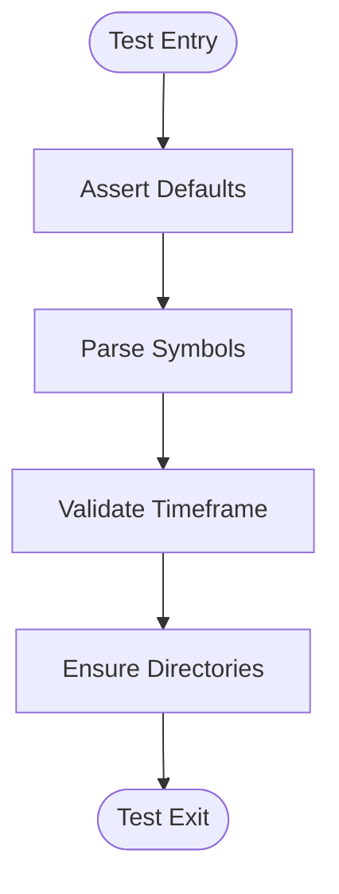

**Diagram sources**
- [trading_bot/tests/test_config.py:9-49](file://trading_bot/tests/test_config.py#L9-L49)
- [trading_bot/config/settings.py:124-162](file://trading_bot/config/settings.py#L124-L162)

**Section sources**
- [trading_bot/tests/test_config.py:1-50](file://trading_bot/tests/test_config.py#L1-L50)
- [trading_bot/config/settings.py:124-162](file://trading_bot/config/settings.py#L124-L162)

### Risk Management Testing
Objectives:
- Verify position sizing methods (fixed fraction, Kelly, ATR-based)
- Validate risk manager decisions (position limits, exposure caps, correlation checks)
- Exercise circuit breaker thresholds (daily drawdown, position loss, volatility spikes)

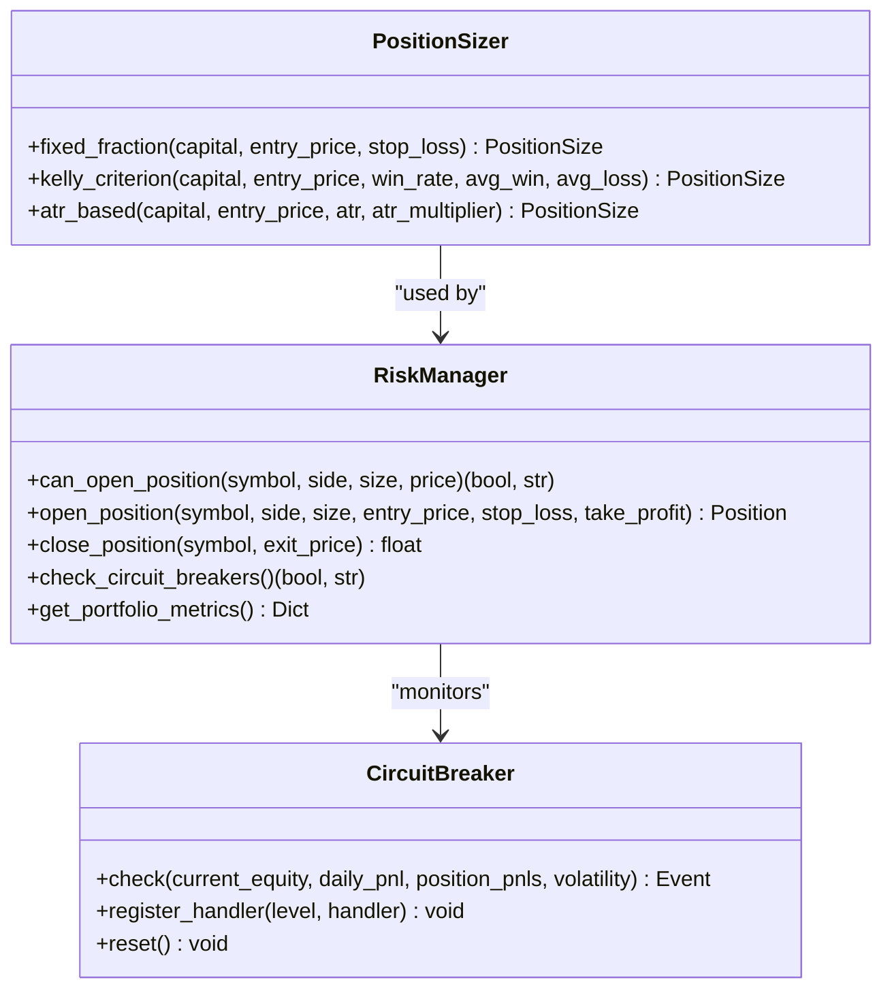

**Diagram sources**
- [trading_bot/risk/sizing.py:25-312](file://trading_bot/risk/sizing.py#L25-L312)
- [trading_bot/risk/manager.py:58-432](file://trading_bot/risk/manager.py#L58-L432)
- [trading_bot/risk/circuit_breaker.py:32-336](file://trading_bot/risk/circuit_breaker.py#L32-L336)

**Section sources**
- [trading_bot/tests/test_risk.py:12-178](file://trading_bot/tests/test_risk.py#L12-L178)
- [trading_bot/risk/sizing.py:48-195](file://trading_bot/risk/sizing.py#L48-L195)
- [trading_bot/risk/manager.py:102-321](file://trading_bot/risk/manager.py#L102-L321)
- [trading_bot/risk/circuit_breaker.py:88-184](file://trading_bot/risk/circuit_breaker.py#L88-L184)

### Backtesting Validation
Objectives:
- Validate vectorbt-based backtests produce expected metrics
- Ensure RL backtest environment runs and computes performance
- Confirm walk-forward and Monte Carlo simulations execute without errors

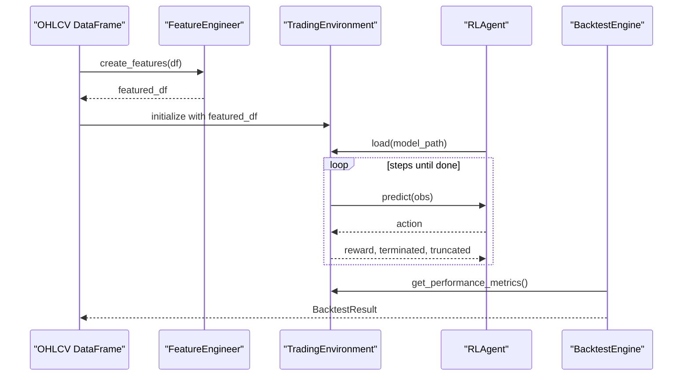

**Diagram sources**
- [trading_bot/backtest/engine.py:147-240](file://trading_bot/backtest/engine.py#L147-L240)
- [trading_bot/features/engineering.py:31-85](file://trading_bot/features/engineering.py#L31-L85)
- [trading_bot/models/environment.py:15-200](file://trading_bot/models/environment.py#L15-L200)
- [trading_bot/models/agent.py:1-200](file://trading_bot/models/agent.py#L1-L200)

**Section sources**
- [trading_bot/backtest/engine.py:63-145](file://trading_bot/backtest/engine.py#L63-L145)
- [trading_bot/backtest/engine.py:242-295](file://trading_bot/backtest/engine.py#L242-L295)
- [trading_bot/backtest/engine.py:297-356](file://trading_bot/backtest/engine.py#L297-L356)

### Strategy and Feature Engineering Testing
Objectives:
- Ensure strategy base class enforces interface contracts
- Validate feature engineering completeness and NaN handling
- Confirm feature scaling and importance computations

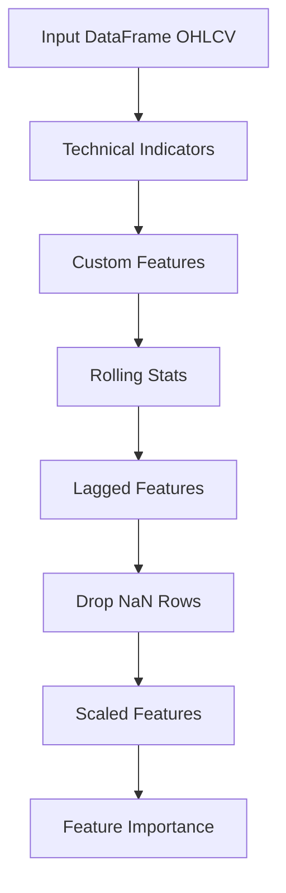

**Diagram sources**
- [trading_bot/features/engineering.py:31-442](file://trading_bot/features/engineering.py#L31-L442)
- [trading_bot/strategy/base.py:39-135](file://trading_bot/strategy/base.py#L39-L135)

**Section sources**
- [trading_bot/features/engineering.py:31-442](file://trading_bot/features/engineering.py#L31-L442)
- [trading_bot/strategy/base.py:39-135](file://trading_bot/strategy/base.py#L39-L135)

## API Integration Testing

### Overview
The API integration testing framework provides comprehensive validation of all REST endpoints, ensuring reliable communication between the trading bot and external systems. This testing layer validates endpoint functionality, data persistence, and business logic consistency.

### Test Categories

#### Persistence Testing
Validates database operations for paper trading, scanner configurations, settings, and signal tracking:

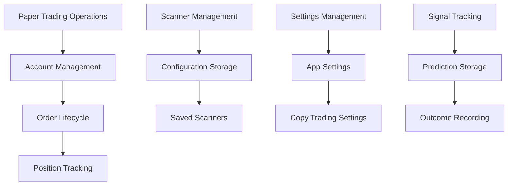

**Diagram sources**
- [trading_bot/tests/test_api_integration.py:25-93](file://trading_bot/tests/test_api_integration.py#L25-L93)
- [trading_bot/persistence/repositories.py:57-201](file://trading_bot/persistence/repositories.py#L57-L201)

#### Broker Truthfulness Testing
Ensures broker endpoints return accurate, non-mock data:

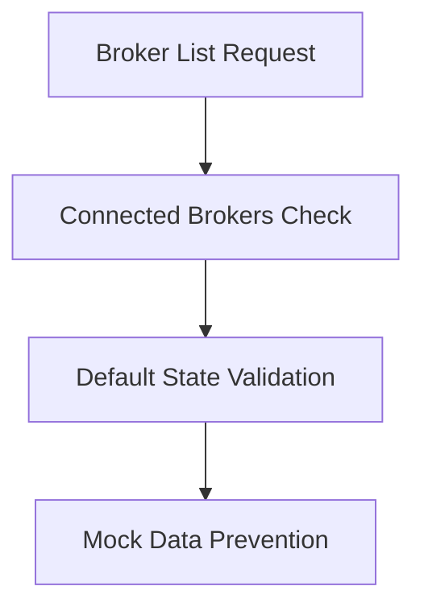

**Diagram sources**
- [trading_bot/tests/test_api_integration.py:126-134](file://trading_bot/tests/test_api_integration.py#L126-L134)
- [trading_bot/api/routes/broker.py:35-38](file://trading_bot/api/routes/broker.py#L35-L38)

#### Signal Source Labeling Testing
Validates signal response consistency and prediction source identification:

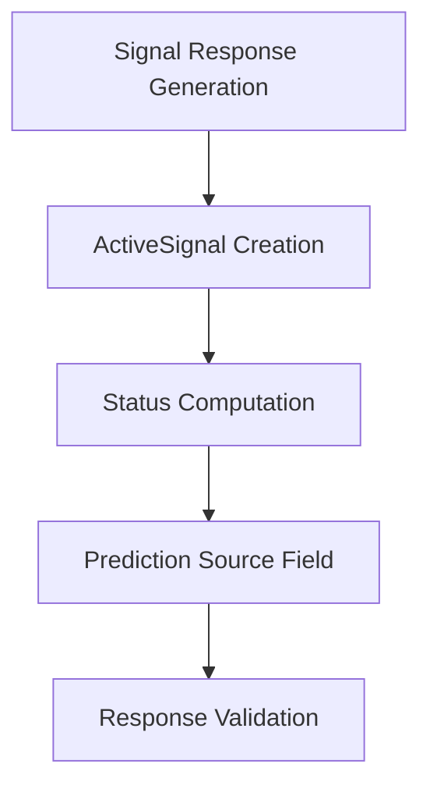

**Diagram sources**
- [trading_bot/tests/test_api_integration.py:136-154](file://trading_bot/tests/test_api_integration.py#L136-L154)
- [trading_bot/api/routes/signals.py:135-162](file://trading_bot/api/routes/signals.py#L135-L162)

**Section sources**
- [trading_bot/tests/test_api_integration.py:1-154](file://trading_bot/tests/test_api_integration.py#L1-L154)
- [trading_bot/persistence/repositories.py:1-277](file://trading_bot/persistence/repositories.py#L1-L277)
- [trading_bot/api/routes/broker.py:1-337](file://trading_bot/api/routes/broker.py#L1-L337)
- [trading_bot/api/routes/signals.py:1-638](file://trading_bot/api/routes/signals.py#L1-L638)

## Database Persistence Testing

### Schema Validation
Ensures database schema integrity and table relationships:

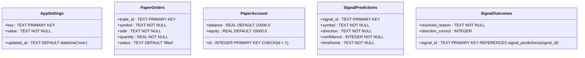

**Diagram sources**
- [trading_bot/persistence/schema.py:4-136](file://trading_bot/persistence/schema.py#L4-L136)
- [trading_bot/persistence/repositories.py:13-277](file://trading_bot/persistence/repositories.py#L13-L277)

### Repository Pattern Testing
Validates data access layer operations:

- **Settings Management**: CRUD operations for application settings
- **Paper Trading**: Account state and order lifecycle management
- **Signal Tracking**: Prediction storage and outcome recording
- **Copy Trading**: Settings and trade management
- **Scanner Management**: Saved scanner configurations

**Section sources**
- [trading_bot/persistence/schema.py:1-137](file://trading_bot/persistence/schema.py#L1-L137)
- [trading_bot/persistence/repositories.py:1-277](file://trading_bot/persistence/repositories.py#L1-L277)
- [trading_bot/persistence/db.py:1-36](file://trading_bot/persistence/db.py#L1-L36)

## Broker Integration Testing

### Connectivity Testing
Validates broker connection management and authentication:

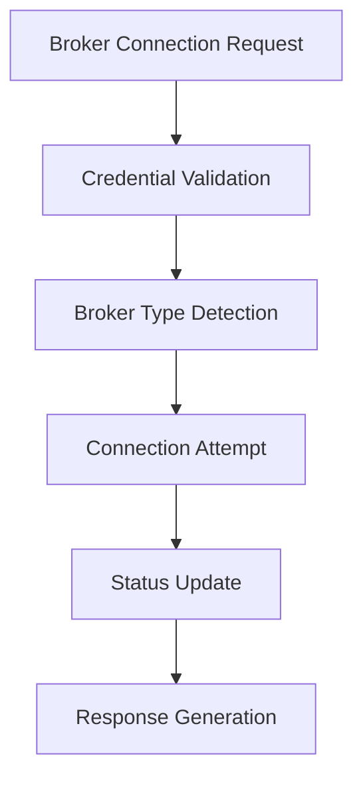

**Diagram sources**
- [trading_bot/api/routes/broker.py:41-100](file://trading_bot/api/routes/broker.py#L41-L100)
- [trading_bot/api/models.py:88-105](file://trading_bot/api/models.py#L88-L105)

### Order Management Testing
Ensures proper order placement and lifecycle management:

- **Order Placement**: Validates broker existence and connection status
- **Position Retrieval**: Aggregates positions across multiple brokers
- **Balance Management**: Handles account balance queries with error states
- **Order Cancellation**: Manages order cancellation requests

**Section sources**
- [trading_bot/api/routes/broker.py:162-337](file://trading_bot/api/routes/broker.py#L162-L337)
- [trading_bot/api/models.py:88-105](file://trading_bot/api/models.py#L88-L105)

## Signal Processing Testing

### Signal Lifecycle Management
Validates comprehensive signal processing pipeline:

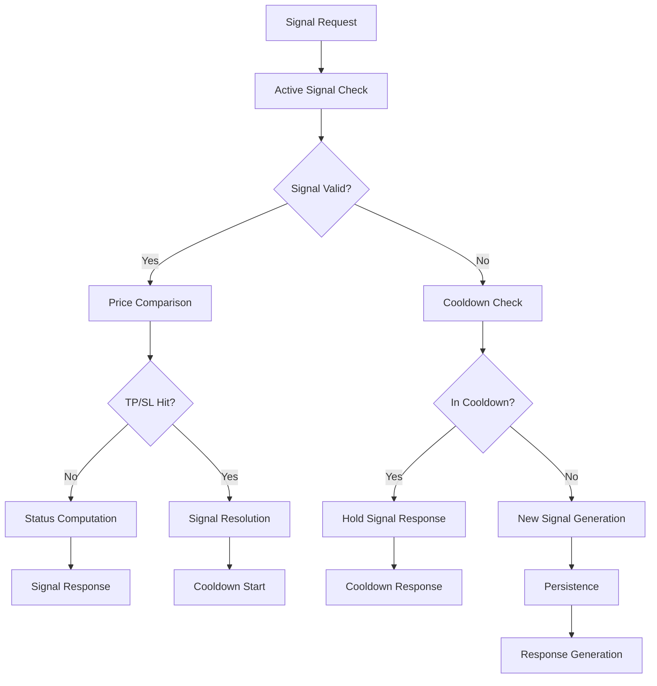

**Diagram sources**
- [trading_bot/api/routes/signals.py:165-422](file://trading_bot/api/routes/signals.py#L165-L422)
- [trading_bot/api/routes/signals.py:135-162](file://trading_bot/api/routes/signals.py#L135-L162)

### Signal Persistence Testing
Validates signal prediction and outcome tracking:

- **Prediction Storage**: Stores signal metadata for tracking
- **Outcome Recording**: Captures resolution outcomes and performance metrics
- **Metrics Calculation**: Computes directional accuracy and PnL statistics
- **Group Analysis**: Provides source and timeframe-based performance breakdowns

**Section sources**
- [trading_bot/api/routes/signals.py:165-422](file://trading_bot/api/routes/signals.py#L165-L422)
- [trading_bot/persistence/repositories.py:205-277](file://trading_bot/persistence/repositories.py#L205-L277)

## Dependency Analysis
Testing dependencies and external libraries with expanded API coverage:
- pytest for unit and integration tests with async support
- vectorbt for fast backtesting
- gymnasium and stable-baselines3 for RL environments and agents
- scikit-learn for feature importance
- pandas, numpy for numerical computations
- **New**: fastapi for API testing and validation
- **New**: sqlite3 for database persistence testing
- **New**: ccxt for broker connectivity testing

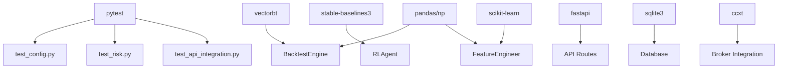

**Diagram sources**
- [pyproject.toml:74-82](file://pyproject.toml#L74-L82)
- [requirements.txt:28-29](file://requirements.txt#L28-L29)
- [requirements.txt:23-24](file://requirements.txt#L23-L24)
- [requirements.txt:48-49](file://requirements.txt#L48-L49)
- [requirements.txt:42-43](file://requirements.txt#L42-L43)
- [trading_bot/api/server.py:63-78](file://trading_bot/api/server.py#L63-L78)
- [trading_bot/api/routes/broker.py:13-13](file://trading_bot/api/routes/broker.py#L13-L13)

**Section sources**
- [pyproject.toml:74-82](file://pyproject.toml#L74-L82)
- [requirements.txt:1-46](file://requirements.txt#L1-L46)

## Performance Considerations
- Backtesting performance: vectorbt enables vectorized operations; ensure datasets are appropriately sized and preprocessed.
- RL environment performance: LSTM/Transformer feature extractors add computational overhead; tune sequence length and model dimensions.
- Risk manager performance: keep correlation checks lightweight; avoid heavy computations in hot paths.
- Feature engineering: cache expensive computations and drop unnecessary columns to reduce memory footprint.
- **New**: API endpoint performance: implement rate limiting and caching for frequently accessed endpoints.
- **New**: Database query optimization: ensure proper indexing on frequently queried columns.
- **New**: Broker connectivity: implement connection pooling and retry mechanisms for external API calls.

## Troubleshooting Guide
Common issues and resolutions:
- Import errors: Install dependencies via requirements or editable install.
- API connectivity: Verify environment variables and testnet settings.
- Memory issues: Reduce batch sizes or observation windows.
- Model loading failures: Confirm model file paths and compatibility.
- **New**: Database connection errors: Verify SQLite file permissions and disk space.
- **New**: API timeout issues: Implement proper retry logic and connection timeouts.
- **New**: Broker authentication failures: Validate API credentials and network connectivity.

Operational tips:
- Run tests with coverage to identify untested code paths.
- Use temporary directories in configuration tests to avoid filesystem side effects.
- Mock external services for integration tests to isolate unit concerns.
- **New**: Implement database fixtures for consistent test data across API tests.
- **New**: Use pytest-asyncio for proper async endpoint testing.
- **New**: Validate API response schemas using Pydantic models.

**Section sources**
- [README.md:309-323](file://README.md#L309-L323)
- [pyproject.toml:113-117](file://pyproject.toml#L113-L117)

## Conclusion
This comprehensive testing strategy ensures robust validation across configuration, risk management, API integration, and database persistence. The expanded testing infrastructure now covers all major components of the trading system, including API endpoints, broker connectivity, signal processing, and data persistence. By combining unit tests, integration tests, API validation, and performance validations, the project maintains reliability and safety for trading operations. Continuous integration should enforce test execution, coverage thresholds, and linting/formatting standards across all testing layers.

## Appendices

### Practical Examples

- Running tests
  - Run all tests: [pytest invocation:280-289](file://README.md#L280-L289)
  - Run specific test file: [pytest file example:284-285](file://README.md#L284-L285)
  - Coverage reporting: [pytest coverage example:287-288](file://README.md#L287-L288)
  - **New**: API integration tests: [test_api_integration.py:1-154](file://trading_bot/tests/test_api_integration.py#L1-L154)

- Writing unit tests
  - Configuration tests: [test_config.py:1-50](file://trading_bot/tests/test_config.py#L1-L50)
  - Risk management tests: [test_risk.py:1-178](file://trading_bot/tests/test_risk.py#L1-L178)
  - **New**: API integration tests: [test_api_integration.py:1-154](file://trading_bot/tests/test_api_integration.py#L1-L154)

- Interpreting results
  - Backtest reports: [generate_report:358-417](file://trading_bot/backtest/engine.py#L358-L417)
  - Portfolio metrics: [get_portfolio_metrics:355-389](file://trading_bot/risk/manager.py#L355-L389)
  - **New**: API response validation: [signal response building:135-162](file://trading_bot/api/routes/signals.py#L135-162)

- Continuous integration and QA
  - Test runner configuration: [pytest.ini_options:113-117](file://pyproject.toml#L113-L117)
  - Dev dependencies: [dev dependencies:74-82](file://pyproject.toml#L74-L82)
  - Formatting and linting: [black/ruff/mypy:91-112](file://pyproject.toml#L91-L112)
  - **New**: Async testing support: [pytest-asyncio:75](file://pyproject.toml#L75)

**Section sources**
- [README.md:278-289](file://README.md#L278-L289)
- [trading_bot/tests/test_config.py:1-50](file://trading_bot/tests/test_config.py#L1-L50)
- [trading_bot/tests/test_risk.py:1-178](file://trading_bot/tests/test_risk.py#L1-L178)
- [trading_bot/tests/test_api_integration.py:1-154](file://trading_bot/tests/test_api_integration.py#L1-L154)
- [trading_bot/backtest/engine.py:358-417](file://trading_bot/backtest/engine.py#L358-L417)
- [trading_bot/risk/manager.py:355-389](file://trading_bot/risk/manager.py#L355-L389)
- [pyproject.toml:113-117](file://pyproject.toml#L113-L117)
- [pyproject.toml:74-82](file://pyproject.toml#L74-L82)
- [pyproject.toml:91-112](file://pyproject.toml#L91-L112)