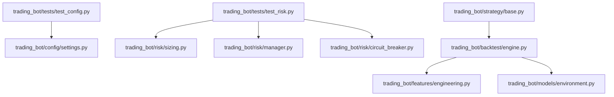
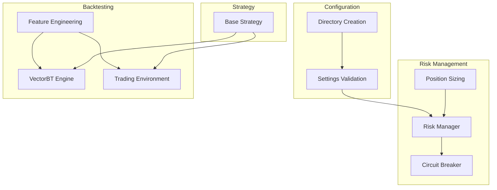
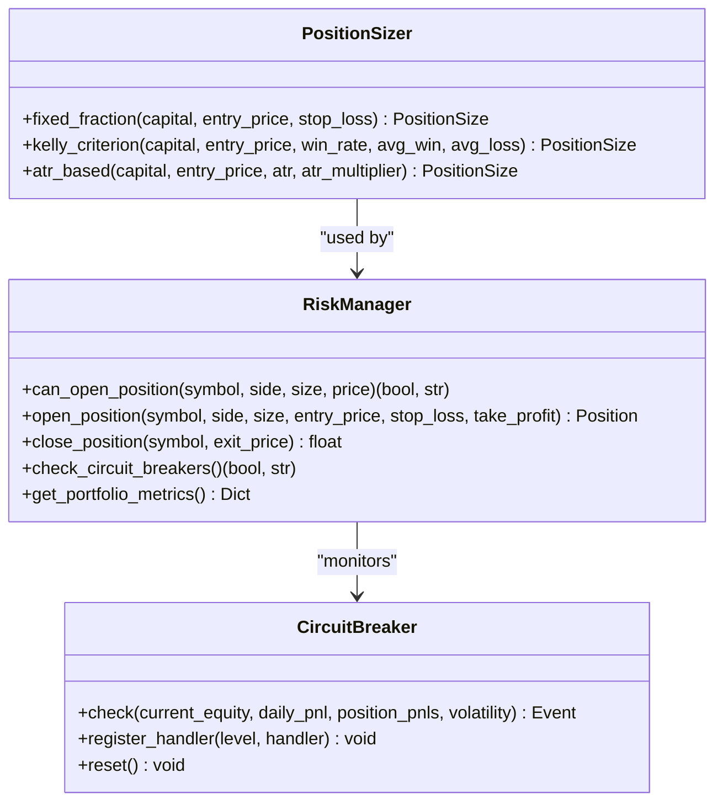
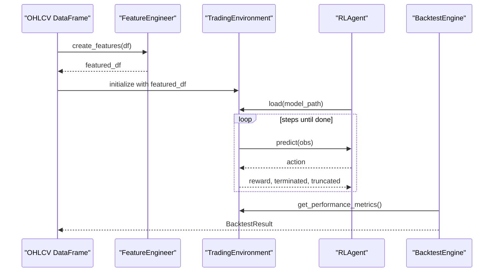
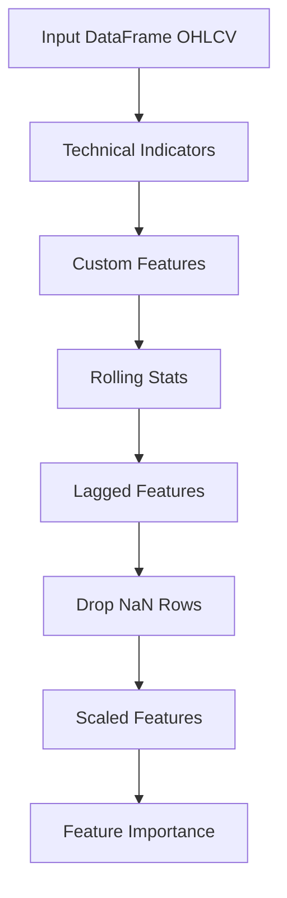
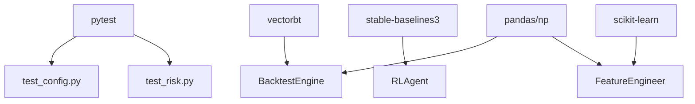

# Testing Strategy

<cite>
**Referenced Files in This Document**
- [README.md](file://README.md)
- [pyproject.toml](file://pyproject.toml)
- [requirements.txt](file://requirements.txt)
- [trading_bot/tests/test_config.py](file://trading_bot/tests/test_config.py)
- [trading_bot/tests/test_risk.py](file://trading_bot/tests/test_risk.py)
- [trading_bot/config/settings.py](file://trading_bot/config/settings.py)
- [trading_bot/risk/sizing.py](file://trading_bot/risk/sizing.py)
- [trading_bot/risk/manager.py](file://trading_bot/risk/manager.py)
- [trading_bot/risk/circuit_breaker.py](file://trading_bot/risk/circuit_breaker.py)
- [trading_bot/backtest/engine.py](file://trading_bot/backtest/engine.py)
- [trading_bot/strategy/base.py](file://trading_bot/strategy/base.py)
- [trading_bot/features/engineering.py](file://trading_bot/features/engineering.py)
- [trading_bot/models/environment.py](file://trading_bot/models/environment.py)
- [trading_bot/models/agent.py](file://trading_bot/models/agent.py)
</cite>

## Table of Contents
1. [Introduction](#introduction)
2. [Project Structure](#project-structure)
3. [Core Components](#core-components)
4. [Architecture Overview](#architecture-overview)
5. [Detailed Component Analysis](#detailed-component-analysis)
6. [Dependency Analysis](#dependency-analysis)
7. [Performance Considerations](#performance-considerations)
8. [Troubleshooting Guide](#troubleshooting-guide)
9. [Conclusion](#conclusion)
10. [Appendices](#appendices)

## Introduction
This document defines a comprehensive testing strategy for the AI Trading Bot. It covers unit testing frameworks, methodologies, and validation procedures across configuration, risk management, and integration domains. It also outlines testing best practices for trading algorithms, backtesting validation, and performance testing, with practical examples for writing tests, running test suites, and interpreting results. Finally, it documents continuous integration considerations and quality assurance processes.

## Project Structure
The repository follows a modular structure with dedicated packages for configuration, risk management, backtesting, feature engineering, strategies, and execution. Tests reside under a dedicated tests package and exercise core modules.

**Diagram sources**
- [trading_bot/tests/test_config.py:1-50](file://trading_bot/tests/test_config.py#L1-L50)
- [trading_bot/tests/test_risk.py:1-178](file://trading_bot/tests/test_risk.py#L1-L178)
- [trading_bot/config/settings.py:1-176](file://trading_bot/config/settings.py#L1-L176)
- [trading_bot/risk/sizing.py:1-312](file://trading_bot/risk/sizing.py#L1-L312)
- [trading_bot/risk/manager.py:1-432](file://trading_bot/risk/manager.py#L1-L432)
- [trading_bot/risk/circuit_breaker.py:1-336](file://trading_bot/risk/circuit_breaker.py#L1-L336)
- [trading_bot/backtest/engine.py:1-418](file://trading_bot/backtest/engine.py#L1-L418)
- [trading_bot/features/engineering.py:1-442](file://trading_bot/features/engineering.py#L1-L442)
- [trading_bot/models/environment.py:1-200](file://trading_bot/models/environment.py#L1-L200)
- [trading_bot/strategy/base.py:1-136](file://trading_bot/strategy/base.py#L1-L136)

**Section sources**
- [README.md:198-232](file://README.md#L198-L232)

## Core Components
- Configuration module validates and normalizes settings, ensuring defaults and path handling are correct.
- Risk management module includes position sizing, portfolio risk controls, and circuit breakers.
- Backtesting engine integrates vectorbt and RL environments to compute performance metrics and supports walk-forward and Monte Carlo analysis.
- Strategy base class defines the interface for trading strategies.
- Feature engineering module builds robust feature sets for training and backtesting.

Key testing areas:
- Configuration validation and directory creation
- Position sizing correctness and constraints
- Risk manager decision logic and state transitions
- Circuit breaker thresholds and event generation
- Backtesting result computation and report generation
- Strategy interface compliance and performance metrics

**Section sources**
- [trading_bot/tests/test_config.py:1-50](file://trading_bot/tests/test_config.py#L1-L50)
- [trading_bot/tests/test_risk.py:1-178](file://trading_bot/tests/test_risk.py#L1-L178)
- [trading_bot/config/settings.py:124-162](file://trading_bot/config/settings.py#L124-L162)
- [trading_bot/risk/sizing.py:48-195](file://trading_bot/risk/sizing.py#L48-L195)
- [trading_bot/risk/manager.py:102-321](file://trading_bot/risk/manager.py#L102-L321)
- [trading_bot/risk/circuit_breaker.py:88-184](file://trading_bot/risk/circuit_breaker.py#L88-L184)
- [trading_bot/backtest/engine.py:41-145](file://trading_bot/backtest/engine.py#L41-L145)
- [trading_bot/strategy/base.py:39-135](file://trading_bot/strategy/base.py#L39-L135)
- [trading_bot/features/engineering.py:31-85](file://trading_bot/features/engineering.py#L31-L85)

## Architecture Overview
The testing strategy targets the following architecture layers:
- Configuration and settings validation
- Risk management and circuit breakers
- Feature engineering and indicator generation
- Backtesting engines (vectorbt and RL)
- Strategy interfaces and environment wrappers

**Diagram sources**
- [trading_bot/config/settings.py:23-176](file://trading_bot/config/settings.py#L23-L176)
- [trading_bot/risk/sizing.py:25-312](file://trading_bot/risk/sizing.py#L25-L312)
- [trading_bot/risk/manager.py:58-432](file://trading_bot/risk/manager.py#L58-L432)
- [trading_bot/risk/circuit_breaker.py:32-336](file://trading_bot/risk/circuit_breaker.py#L32-L336)
- [trading_bot/backtest/engine.py:41-418](file://trading_bot/backtest/engine.py#L41-L418)
- [trading_bot/features/engineering.py:17-442](file://trading_bot/features/engineering.py#L17-L442)
- [trading_bot/strategy/base.py:39-135](file://trading_bot/strategy/base.py#L39-L135)

## Detailed Component Analysis

### Configuration Testing
Objectives:
- Validate default settings and environment variable overrides
- Parse and validate symbol lists and timeframes
- Ensure required directories and log files are created

Methodology:
- Parameterized tests for valid/invalid timeframes
- Path creation assertions using temporary directories
- Symbol list parsing and normalization

**Diagram sources**
- [trading_bot/tests/test_config.py:9-49](file://trading_bot/tests/test_config.py#L9-L49)
- [trading_bot/config/settings.py:124-162](file://trading_bot/config/settings.py#L124-L162)

**Section sources**
- [trading_bot/tests/test_config.py:1-50](file://trading_bot/tests/test_config.py#L1-L50)
- [trading_bot/config/settings.py:124-162](file://trading_bot/config/settings.py#L124-L162)

### Risk Management Testing
Objectives:
- Verify position sizing methods (fixed fraction, Kelly, ATR-based)
- Validate risk manager decisions (position limits, exposure caps, correlation checks)
- Exercise circuit breaker thresholds (daily drawdown, position loss, volatility spikes)

**Diagram sources**
- [trading_bot/risk/sizing.py:25-312](file://trading_bot/risk/sizing.py#L25-L312)
- [trading_bot/risk/manager.py:58-432](file://trading_bot/risk/manager.py#L58-L432)
- [trading_bot/risk/circuit_breaker.py:32-336](file://trading_bot/risk/circuit_breaker.py#L32-L336)

**Section sources**
- [trading_bot/tests/test_risk.py:12-178](file://trading_bot/tests/test_risk.py#L12-L178)
- [trading_bot/risk/sizing.py:48-195](file://trading_bot/risk/sizing.py#L48-L195)
- [trading_bot/risk/manager.py:102-321](file://trading_bot/risk/manager.py#L102-L321)
- [trading_bot/risk/circuit_breaker.py:88-184](file://trading_bot/risk/circuit_breaker.py#L88-L184)

### Backtesting Validation
Objectives:
- Validate vectorbt-based backtests produce expected metrics
- Ensure RL backtest environment runs and computes performance
- Confirm walk-forward and Monte Carlo simulations execute without errors

**Diagram sources**
- [trading_bot/backtest/engine.py:147-240](file://trading_bot/backtest/engine.py#L147-L240)
- [trading_bot/features/engineering.py:31-85](file://trading_bot/features/engineering.py#L31-L85)
- [trading_bot/models/environment.py:15-200](file://trading_bot/models/environment.py#L15-L200)
- [trading_bot/models/agent.py:1-200](file://trading_bot/models/agent.py#L1-L200)

**Section sources**
- [trading_bot/backtest/engine.py:63-145](file://trading_bot/backtest/engine.py#L63-L145)
- [trading_bot/backtest/engine.py:242-295](file://trading_bot/backtest/engine.py#L242-L295)
- [trading_bot/backtest/engine.py:297-356](file://trading_bot/backtest/engine.py#L297-L356)

### Strategy and Feature Engineering Testing
Objectives:
- Ensure strategy base class enforces interface contracts
- Validate feature engineering completeness and NaN handling
- Confirm feature scaling and importance computations

**Diagram sources**
- [trading_bot/features/engineering.py:31-442](file://trading_bot/features/engineering.py#L31-L442)
- [trading_bot/strategy/base.py:39-135](file://trading_bot/strategy/base.py#L39-L135)

**Section sources**
- [trading_bot/features/engineering.py:31-442](file://trading_bot/features/engineering.py#L31-L442)
- [trading_bot/strategy/base.py:39-135](file://trading_bot/strategy/base.py#L39-L135)

## Dependency Analysis
Testing dependencies and external libraries:
- pytest for unit and integration tests
- vectorbt for fast backtesting
- gymnasium and stable-baselines3 for RL environments and agents
- scikit-learn for feature importance
- pandas, numpy for numerical computations

**Diagram sources**
- [pyproject.toml:74-82](file://pyproject.toml#L74-L82)
- [requirements.txt:28-29](file://requirements.txt#L28-L29)
- [requirements.txt:23-24](file://requirements.txt#L23-L24)
- [requirements.txt:48-49](file://requirements.txt#L48-L49)
- [requirements.txt:42-43](file://requirements.txt#L42-L43)

**Section sources**
- [pyproject.toml:74-82](file://pyproject.toml#L74-L82)
- [requirements.txt:1-46](file://requirements.txt#L1-L46)

## Performance Considerations
- Backtesting performance: vectorbt enables vectorized operations; ensure datasets are appropriately sized and preprocessed.
- RL environment performance: LSTM/Transformer feature extractors add computational overhead; tune sequence length and model dimensions.
- Risk manager performance: keep correlation checks lightweight; avoid heavy computations in hot paths.
- Feature engineering: cache expensive computations and drop unnecessary columns to reduce memory footprint.

[No sources needed since this section provides general guidance]

## Troubleshooting Guide
Common issues and resolutions:
- Import errors: Install dependencies via requirements or editable install.
- API connectivity: Verify environment variables and testnet settings.
- Memory issues: Reduce batch sizes or observation windows.
- Model loading failures: Confirm model file paths and compatibility.

Operational tips:
- Run tests with coverage to identify untested code paths.
- Use temporary directories in configuration tests to avoid filesystem side effects.
- Mock external services for integration tests to isolate unit concerns.

**Section sources**
- [README.md:309-323](file://README.md#L309-L323)
- [pyproject.toml:113-117](file://pyproject.toml#L113-L117)

## Conclusion
This testing strategy ensures robust validation across configuration, risk management, and backtesting. By combining unit tests, integration tests, and performance validations, the project maintains reliability and safety for trading operations. Continuous integration should enforce test execution, coverage thresholds, and linting/formatting standards.

[No sources needed since this section summarizes without analyzing specific files]

## Appendices

### Practical Examples

- Running tests
  - Run all tests: [pytest invocation:280-289](file://README.md#L280-L289)
  - Run specific test file: [pytest file example:284-285](file://README.md#L284-L285)
  - Coverage reporting: [pytest coverage example:287-288](file://README.md#L287-L288)

- Writing unit tests
  - Configuration tests: [test_config.py:1-50](file://trading_bot/tests/test_config.py#L1-L50)
  - Risk management tests: [test_risk.py:1-178](file://trading_bot/tests/test_risk.py#L1-L178)

- Interpreting results
  - Backtest reports: [generate_report:358-417](file://trading_bot/backtest/engine.py#L358-L417)
  - Portfolio metrics: [get_portfolio_metrics:355-389](file://trading_bot/risk/manager.py#L355-L389)

- Continuous integration and QA
  - Test runner configuration: [pytest.ini_options:113-117](file://pyproject.toml#L113-L117)
  - Dev dependencies: [dev dependencies:74-82](file://pyproject.toml#L74-L82)
  - Formatting and linting: [black/ruff/mypy:91-112](file://pyproject.toml#L91-L112)

**Section sources**
- [README.md:278-289](file://README.md#L278-L289)
- [trading_bot/tests/test_config.py:1-50](file://trading_bot/tests/test_config.py#L1-L50)
- [trading_bot/tests/test_risk.py:1-178](file://trading_bot/tests/test_risk.py#L1-L178)
- [trading_bot/backtest/engine.py:358-417](file://trading_bot/backtest/engine.py#L358-L417)
- [trading_bot/risk/manager.py:355-389](file://trading_bot/risk/manager.py#L355-L389)
- [pyproject.toml:113-117](file://pyproject.toml#L113-L117)
- [pyproject.toml:74-82](file://pyproject.toml#L74-L82)
- [pyproject.toml:91-112](file://pyproject.toml#L91-L112)