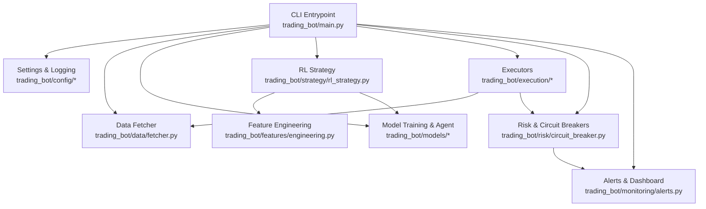
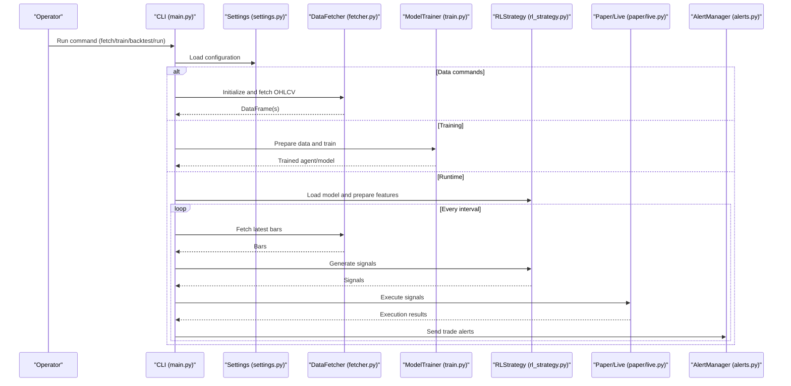
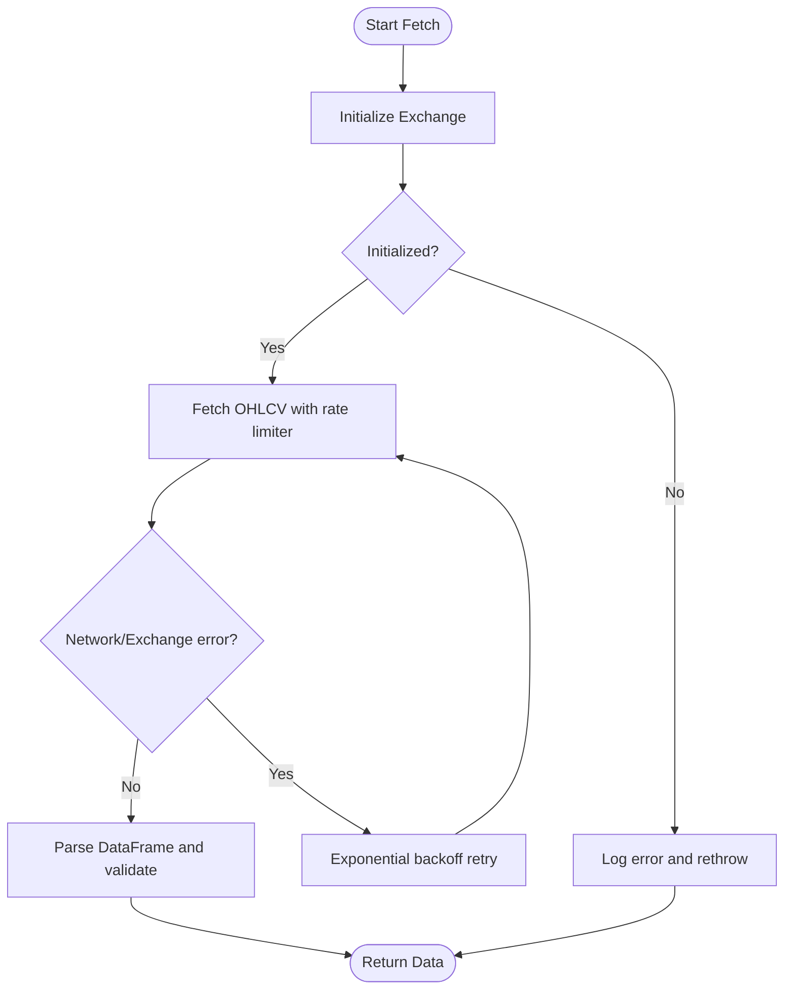
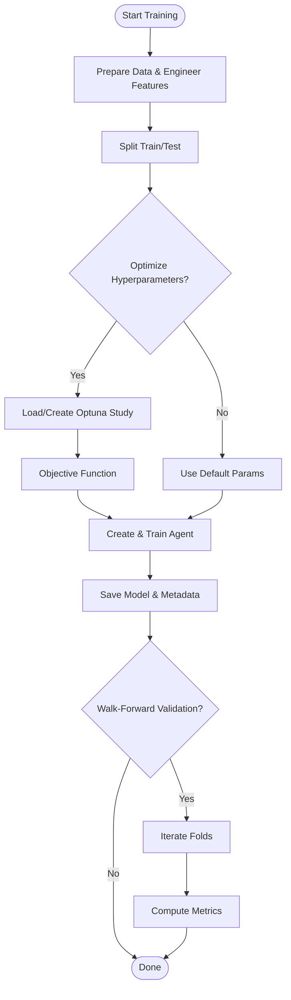
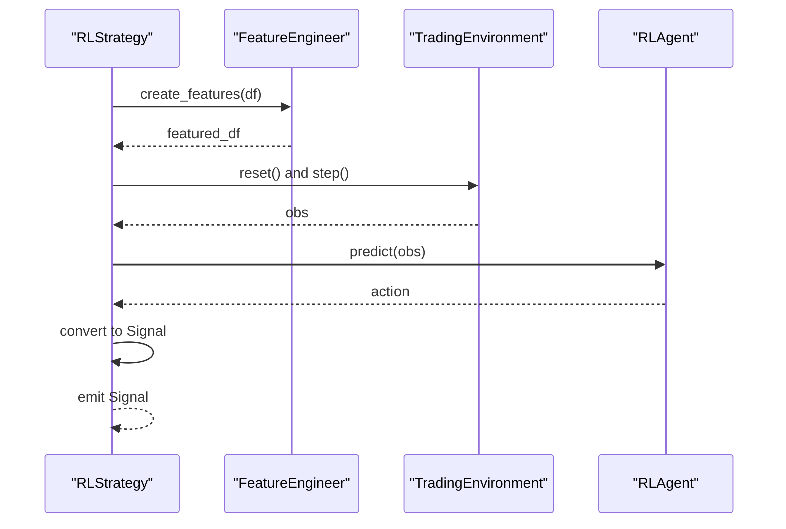
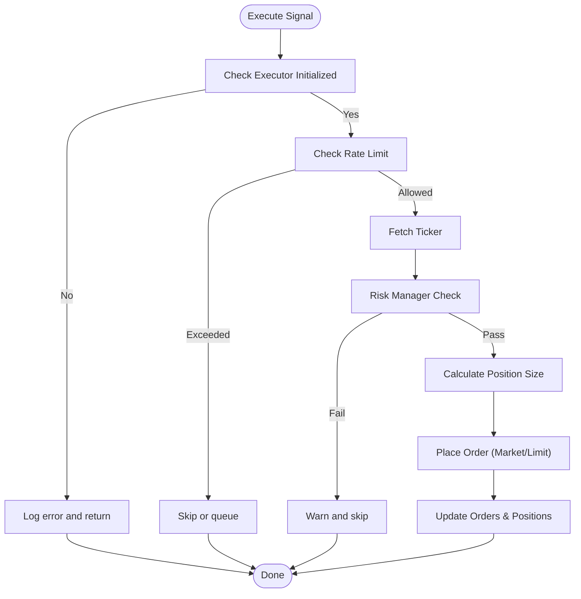
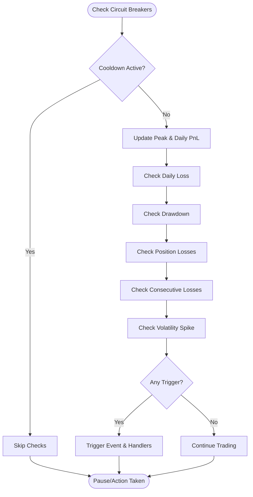
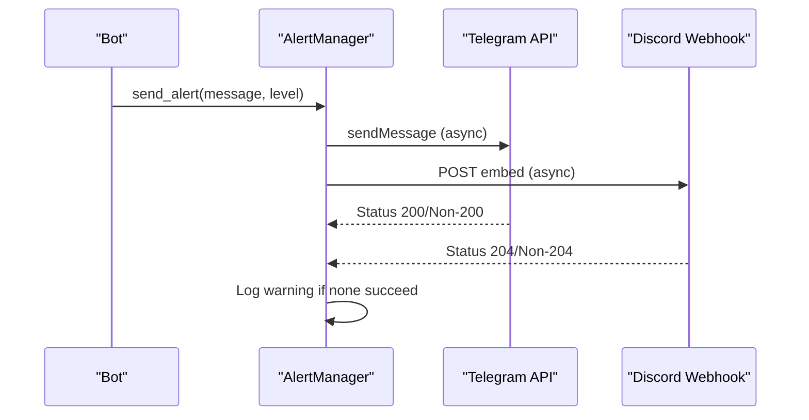
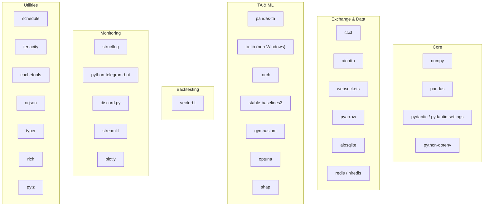

# Troubleshooting Guide

<cite>
**Referenced Files in This Document**
- [README.md](file://README.md)
- [requirements.txt](file://requirements.txt)
- [trading_bot/main.py](file://trading_bot/main.py)
- [trading_bot/config/settings.py](file://trading_bot/config/settings.py)
- [trading_bot/config/logging_config.py](file://trading_bot/config/logging_config.py)
- [trading_bot/data/fetcher.py](file://trading_bot/data/fetcher.py)
- [trading_bot/models/train.py](file://trading_bot/models/train.py)
- [trading_bot/execution/live.py](file://trading_bot/execution/live.py)
- [trading_bot/execution/paper.py](file://trading_bot/execution/paper.py)
- [trading_bot/risk/circuit_breaker.py](file://trading_bot/risk/circuit_breaker.py)
- [trading_bot/monitoring/alerts.py](file://trading_bot/monitoring/alerts.py)
- [trading_bot/strategy/rl_strategy.py](file://trading_bot/strategy/rl_strategy.py)
- [trading_bot/features/engineering.py](file://trading_bot/features/engineering.py)
- [trading_bot/models/environment.py](file://trading_bot/models/environment.py)
</cite>

## Table of Contents
1. [Introduction](#introduction)
2. [Project Structure](#project-structure)
3. [Core Components](#core-components)
4. [Architecture Overview](#architecture-overview)
5. [Detailed Component Analysis](#detailed-component-analysis)
6. [Dependency Analysis](#dependency-analysis)
7. [Performance Considerations](#performance-considerations)
8. [Troubleshooting Guide](#troubleshooting-guide)
9. [Conclusion](#conclusion)
10. [Appendices](#appendices)

## Introduction
This guide provides a comprehensive troubleshooting methodology for the AI Trading Bot. It focuses on diagnosing and resolving common issues such as import errors, API connection problems, memory-related bottlenecks, and model loading failures. It also covers performance optimization, resource management, operational troubleshooting, and proactive monitoring strategies. The goal is to equip operators with practical workflows to identify problems quickly, debug systematically, and prevent recurring issues.

## Project Structure
The trading bot is organized into cohesive modules supporting data ingestion, feature engineering, model training and inference, risk management, execution, and monitoring. The CLI entry point orchestrates commands for data fetching, training, backtesting, and runtime operation.

**Diagram sources**
- [trading_bot/main.py](file://trading_bot/main.py)
- [trading_bot/config/settings.py](file://trading_bot/config/settings.py)
- [trading_bot/data/fetcher.py](file://trading_bot/data/fetcher.py)
- [trading_bot/features/engineering.py](file://trading_bot/features/engineering.py)
- [trading_bot/models/train.py](file://trading_bot/models/train.py)
- [trading_bot/strategy/rl_strategy.py](file://trading_bot/strategy/rl_strategy.py)
- [trading_bot/execution/live.py](file://trading_bot/execution/live.py)
- [trading_bot/execution/paper.py](file://trading_bot/execution/paper.py)
- [trading_bot/risk/circuit_breaker.py](file://trading_bot/risk/circuit_breaker.py)
- [trading_bot/monitoring/alerts.py](file://trading_bot/monitoring/alerts.py)

**Section sources**
- [README.md](file://README.md)
- [trading_bot/main.py](file://trading_bot/main.py)

## Core Components
- CLI orchestration and command routing
- Configuration and logging subsystems
- Data fetching via CCXT with retry and rate limiting
- Feature engineering pipeline with technical indicators and advanced transforms
- Model training with hyperparameter optimization and walk-forward validation
- RL strategy for signal generation and position sizing
- Paper and live executors with risk controls and order management
- Circuit breakers and alerting for proactive monitoring
- Environment for RL training with reward shaping and risk controls

**Section sources**
- [trading_bot/main.py](file://trading_bot/main.py)
- [trading_bot/config/settings.py](file://trading_bot/config/settings.py)
- [trading_bot/config/logging_config.py](file://trading_bot/config/logging_config.py)
- [trading_bot/data/fetcher.py](file://trading_bot/data/fetcher.py)
- [trading_bot/features/engineering.py](file://trading_bot/features/engineering.py)
- [trading_bot/models/train.py](file://trading_bot/models/train.py)
- [trading_bot/strategy/rl_strategy.py](file://trading_bot/strategy/rl_strategy.py)
- [trading_bot/execution/paper.py](file://trading_bot/execution/paper.py)
- [trading_bot/execution/live.py](file://trading_bot/execution/live.py)
- [trading_bot/risk/circuit_breaker.py](file://trading_bot/risk/circuit_breaker.py)
- [trading_bot/monitoring/alerts.py](file://trading_bot/monitoring/alerts.py)
- [trading_bot/models/environment.py](file://trading_bot/models/environment.py)

## Architecture Overview
The system follows a modular, layered architecture with clear separation of concerns. Data flows from CCXT into storage and feature engineering, then into the RL environment and agent. The strategy generates signals, which are executed via paper or live executors under risk controls and monitored via alerts.

**Diagram sources**
- [trading_bot/main.py](file://trading_bot/main.py)
- [trading_bot/config/settings.py](file://trading_bot/config/settings.py)
- [trading_bot/data/fetcher.py](file://trading_bot/data/fetcher.py)
- [trading_bot/models/train.py](file://trading_bot/models/train.py)
- [trading_bot/strategy/rl_strategy.py](file://trading_bot/strategy/rl_strategy.py)
- [trading_bot/execution/paper.py](file://trading_bot/execution/paper.py)
- [trading_bot/execution/live.py](file://trading_bot/execution/live.py)
- [trading_bot/monitoring/alerts.py](file://trading_bot/monitoring/alerts.py)

## Detailed Component Analysis

### Data Fetcher and API Connectivity
Common issues:
- Exchange initialization failures (network, credentials, sandbox mode)
- Rate limiting and timeouts
- Partial or missing OHLCV data

Diagnostic steps:
- Verify API keys and testnet flag in environment settings
- Confirm exchange connectivity and market availability
- Inspect retry behavior and rate limiter configuration
- Validate symbol and timeframe compatibility

**Diagram sources**
- [trading_bot/data/fetcher.py](file://trading_bot/data/fetcher.py)

**Section sources**
- [trading_bot/data/fetcher.py](file://trading_bot/data/fetcher.py)
- [trading_bot/config/settings.py](file://trading_bot/config/settings.py)

### Model Training and Hyperparameter Optimization
Common issues:
- Insufficient or malformed training data
- Optuna study persistence and loading failures
- Walk-forward validation data gaps

Diagnostic steps:
- Confirm data preparation and feature engineering completeness
- Validate training split and environment creation
- Check Optuna study file existence and loadability
- Review walk-forward window sizes and minimum test length

**Diagram sources**
- [trading_bot/models/train.py](file://trading_bot/models/train.py)
- [trading_bot/features/engineering.py](file://trading_bot/features/engineering.py)

**Section sources**
- [trading_bot/models/train.py](file://trading_bot/models/train.py)
- [trading_bot/features/engineering.py](file://trading_bot/features/engineering.py)

### RL Strategy and Signal Generation
Common issues:
- Model not loaded or path incorrect
- Insufficient data for window size
- Confidence thresholds preventing signals

Diagnostic steps:
- Verify model path and file integrity
- Ensure feature engineering aligns with training
- Check window size and data continuity
- Adjust confidence thresholds for testing

**Diagram sources**
- [trading_bot/strategy/rl_strategy.py](file://trading_bot/strategy/rl_strategy.py)
- [trading_bot/features/engineering.py](file://trading_bot/features/engineering.py)
- [trading_bot/models/environment.py](file://trading_bot/models/environment.py)

**Section sources**
- [trading_bot/strategy/rl_strategy.py](file://trading_bot/strategy/rl_strategy.py)
- [trading_bot/models/environment.py](file://trading_bot/models/environment.py)

### Execution Engines (Paper and Live)
Common issues:
- Live executor not initialized
- Rate limiting and order placement failures
- Risk checks blocking trades
- Position synchronization errors

Diagnostic steps:
- Confirm executor initialization and exchange connection
- Monitor rate limit counters and backoff behavior
- Validate risk manager constraints and position sizing
- Check order status updates and emergency close procedures

**Diagram sources**
- [trading_bot/execution/live.py](file://trading_bot/execution/live.py)
- [trading_bot/execution/paper.py](file://trading_bot/execution/paper.py)

**Section sources**
- [trading_bot/execution/live.py](file://trading_bot/execution/live.py)
- [trading_bot/execution/paper.py](file://trading_bot/execution/paper.py)

### Risk Management and Circuit Breakers
Common issues:
- Trigger conditions firing prematurely
- Auto-actions not applied
- Baseline volatility misconfigured

Diagnostic steps:
- Review trigger thresholds and cooldown logic
- Confirm event handlers registration and execution
- Set baseline volatility for spike detection
- Inspect recent events and status reporting

**Diagram sources**
- [trading_bot/risk/circuit_breaker.py](file://trading_bot/risk/circuit_breaker.py)

**Section sources**
- [trading_bot/risk/circuit_breaker.py](file://trading_bot/risk/circuit_breaker.py)

### Alerts and Monitoring
Common issues:
- Notification channels not configured
- Network errors sending alerts
- Session lifecycle management

Diagnostic steps:
- Verify Telegram/Discord credentials and webhook URLs
- Check aiohttp session creation and reuse
- Inspect alert history and error logging
- Ensure graceful shutdown and session closure

**Diagram sources**
- [trading_bot/monitoring/alerts.py](file://trading_bot/monitoring/alerts.py)

**Section sources**
- [trading_bot/monitoring/alerts.py](file://trading_bot/monitoring/alerts.py)

## Dependency Analysis
External dependencies include CCXT for exchange APIs, Stable-Baselines3 for RL agents, Gymnasium for environments, Optuna for hyperparameter tuning, and various libraries for data processing, logging, and notifications. Version constraints are defined in requirements.

**Diagram sources**
- [requirements.txt](file://requirements.txt)

**Section sources**
- [requirements.txt](file://requirements.txt)

## Performance Considerations
- Memory usage
  - Feature engineering creates numerous derived columns; consider reducing window size or feature count for constrained environments
  - Ensure NaN handling and dropping occurs after feature creation to avoid oversized intermediate frames
- CPU and I/O
  - Asynchronous data fetching mitigates blocking; monitor event loop saturation under heavy loads
  - Optimize batch sizes and training timesteps to balance convergence speed and resource usage
- Model inference
  - Use deterministic predictions and appropriate confidence thresholds to reduce unnecessary executions
  - Cache frequently accessed metadata (e.g., feature names) to avoid repeated computation
- Risk controls
  - Circuit breaker thresholds should be tuned to market conditions to minimize false positives while maintaining safety
  - Emergency stop mechanisms should be paired with safe order cancellation and position closure routines

[No sources needed since this section provides general guidance]

## Troubleshooting Guide

### Import Errors
Symptoms:
- ModuleNotFoundError or ImportError when running CLI commands

Systematic approach:
- Verify Python interpreter and virtual environment activation
- Reinstall dependencies from requirements
- Confirm package versions meet constraints defined in requirements
- Check for OS-specific packages (e.g., ta-lib on non-Windows platforms)

Resolution:
- Recreate the virtual environment and reinstall dependencies
- Align Python version with project prerequisites
- Address OS-specific dependency installation

**Section sources**
- [requirements.txt](file://requirements.txt)
- [README.md](file://README.md)

### API Connection Problems
Symptoms:
- Exchange initialization failures
- Network errors during OHLCV fetch
- Authentication errors or rate limit exceeded

Systematic approach:
- Validate API keys and testnet flag in environment settings
- Confirm exchange availability and market support
- Inspect retry configuration and exponential backoff behavior
- Check network connectivity and proxy/firewall settings

Resolution:
- Regenerate API keys and reconfigure testnet/sandbox mode
- Adjust rate limiter and retry parameters
- Use exchange-specific fallbacks or alternative endpoints

**Section sources**
- [trading_bot/data/fetcher.py](file://trading_bot/data/fetcher.py)
- [trading_bot/config/settings.py](file://trading_bot/config/settings.py)

### Memory Issues
Symptoms:
- Out-of-memory errors during training or inference
- Slow performance with large datasets

Systematic approach:
- Reduce feature window size and observation window
- Disable non-essential feature engineering toggles
- Drop unused columns and clean data early
- Monitor memory usage during training and adjust batch sizes

Resolution:
- Scale down feature sets and environment window size
- Use incremental training and smaller batches
- Persist intermediate artifacts to disk and free memory

**Section sources**
- [trading_bot/models/train.py](file://trading_bot/models/train.py)
- [trading_bot/features/engineering.py](file://trading_bot/features/engineering.py)
- [trading_bot/models/environment.py](file://trading_bot/models/environment.py)

### Model Loading Failures
Symptoms:
- Model not found or corrupted file
- Inference errors due to mismatched features

Systematic approach:
- Verify model path and file existence
- Confirm model type matches training configuration
- Ensure feature columns align with training metadata
- Check model metadata for expected features

Resolution:
- Re-train model or restore from a known-good checkpoint
- Recreate feature engineering pipeline to match training
- Validate model metadata and feature names

**Section sources**
- [trading_bot/strategy/rl_strategy.py](file://trading_bot/strategy/rl_strategy.py)
- [trading_bot/models/train.py](file://trading_bot/models/train.py)

### Execution Failures (Paper/Live)
Symptoms:
- Orders not placed or partially filled
- Risk checks blocking trades
- Position synchronization errors

Systematic approach:
- Confirm executor initialization and exchange connection
- Check rate limiting and order frequency caps
- Validate risk manager constraints and position sizing
- Inspect order status updates and emergency close procedures

Resolution:
- Adjust rate limit parameters and backoff
- Tune risk thresholds and position sizing rules
- Implement manual position reconciliation and emergency closures

**Section sources**
- [trading_bot/execution/live.py](file://trading_bot/execution/live.py)
- [trading_bot/execution/paper.py](file://trading_bot/execution/paper.py)
- [trading_bot/risk/circuit_breaker.py](file://trading_bot/risk/circuit_breaker.py)

### Monitoring and Alerting
Symptoms:
- Alerts not sent to Telegram/Discord
- Session errors or connection timeouts

Systematic approach:
- Verify notification credentials and webhook URLs
- Check aiohttp session lifecycle and reuse
- Inspect alert history and error logs
- Ensure graceful shutdown and session cleanup

Resolution:
- Reconfigure credentials and test endpoints
- Implement retry logic for transient network errors
- Monitor alert delivery and maintain fallback channels

**Section sources**
- [trading_bot/monitoring/alerts.py](file://trading_bot/monitoring/alerts.py)

### Proactive Issue Detection and Prevention
- Instrumented logging with structured logs for traceability
- Circuit breakers to halt trading under extreme conditions
- Automated alerts for critical events and configuration drift
- Periodic health checks for data freshness and model performance
- Capacity planning and resource monitoring for training/inference workloads

**Section sources**
- [trading_bot/config/logging_config.py](file://trading_bot/config/logging_config.py)
- [trading_bot/risk/circuit_breaker.py](file://trading_bot/risk/circuit_breaker.py)
- [trading_bot/monitoring/alerts.py](file://trading_bot/monitoring/alerts.py)

## Conclusion
This guide outlined a comprehensive troubleshooting methodology for the AI Trading Bot, covering import issues, API connectivity, memory bottlenecks, model loading, execution failures, and monitoring. By following the diagnostic workflows and applying the recommended resolutions, operators can maintain a robust, resilient trading system. Proactive monitoring, careful configuration management, and iterative performance tuning are essential for long-term stability and reliability.

[No sources needed since this section summarizes without analyzing specific files]

## Appendices

### Quick Reference: Common Commands and Checks
- Install dependencies: [requirements.txt](file://requirements.txt)
- Show configuration: [trading_bot/main.py](file://trading_bot/main.py)
- Fetch data: [trading_bot/main.py](file://trading_bot/main.py)
- Train model: [trading_bot/main.py](file://trading_bot/main.py)
- Backtest model: [trading_bot/main.py](file://trading_bot/main.py)
- Run paper/live: [trading_bot/main.py](file://trading_bot/main.py)

**Section sources**
- [README.md](file://README.md)
- [trading_bot/main.py](file://trading_bot/main.py)