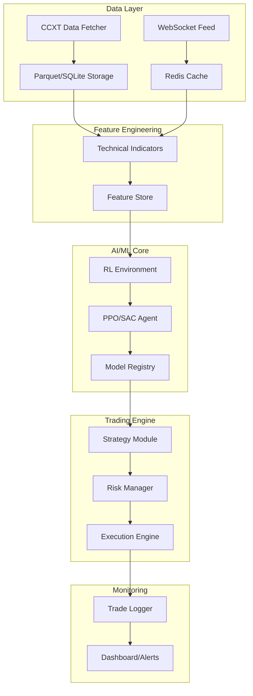

# AI Trading Bot

A production-ready, institutional-grade AI-powered cryptocurrency trading bot using Reinforcement Learning (PPO/SAC) with comprehensive risk management and backtesting capabilities.

## Architecture



## Features

### Core Components
- **Data Pipeline**: Async CCXT integration for OHLCV, orderbook, and funding rate data
- **Feature Engineering**: 100+ technical indicators, volatility regimes, Fourier features
- **RL Models**: PPO/SAC with Stable-Baselines3, LSTM/Transformer feature extractors
- **Training Regimes**: Chronological splits, walk-forward validation, persisted preprocessing artifacts
- **Risk Management**: Kelly criterion, volatility targeting, circuit breakers
- **Backtesting**: VectorBT integration with walk-forward and Monte Carlo analysis
- **Monitoring**: Telegram/Discord alerts, Streamlit dashboard

### Risk Management
- Position sizing: Fixed fraction, Kelly criterion, ATR-based, volatility targeting
- Portfolio limits: Max drawdown, position size, total exposure
- Circuit breakers: Daily loss limits, consecutive loss detection
- Emergency stop: Automatic position closure on critical events

## Local Development Setup

### Prerequisites

- Python 3.11 or 3.12
- Node.js 18+ and npm 9+
- Git
- Optional: Docker and Docker Compose for the paper-trading/Streamlit stack
- Optional: Redis on `localhost:6379` for live-trading workflows that use Redis

The FastAPI backend runs on `http://localhost:8010` during local development. The Vite frontend runs on `http://localhost:5180` and proxies relative `/api/*` requests to the backend.

### 1. Clone and enter the repository

```bash
git clone <repository-url>
cd <repository-directory>
```

### 2. Configure environment variables

Copy the example environment file and keep real credentials out of source control:

```bash
cp .env.example .env
```

For local UI and API development, the defaults are enough to boot the app in paper mode. Broker credentials, notification webhooks, Redis, and paid market-data keys are optional unless you are testing those integrations directly.

Important local settings:

- `TRADING_MODE=paper` keeps local development in paper-trading mode.
- `DATA_DIR=./data`, `DB_PATH=./data/trading.db`, and `PARQUET_PATH=./data/parquet` control local SQLite and data storage.
- `MODEL_PATH=./models` stores local model artifacts.
- `LOG_FILE=./logs/trading_bot.log` stores local logs.
- `GOLD_API_KEY`, `TELEGRAM_BOT_TOKEN`, `DISCORD_WEBHOOK_URL`, and exchange credentials can stay as placeholders for basic backend/frontend work.
- Use demo, testnet, or paper credentials only while developing. Never put live broker keys in committed files.

The frontend does not require a separate `.env` file for local development because `frontend/vite.config.ts` proxies `/api` to `http://localhost:8010`. If the frontend cannot reach the API, verify that the backend is running on port `8010` and that the browser is opened at the Vite URL, not by loading files directly.

### 3. Create local runtime directories

The backend creates these directories when settings are loaded, but creating them up front makes a fresh clone explicit:

```bash
mkdir -p data/parquet models logs
```

These directories contain local databases, downloaded data, model checkpoints, and logs. They are intentionally ignored by Git.

### 4. Set up the backend

Create and activate a virtual environment:

```bash
python3.11 -m venv .venv
source .venv/bin/activate
```

If `python3.11` is not installed but `python3` points to Python 3.11+, use:

```bash
python3 -m venv .venv
source .venv/bin/activate
```

Install backend dependencies and the local package:

```bash
python -m pip install --upgrade pip
python -m pip install -r requirements.txt
python -m pip install -e .
```

Start the FastAPI backend:

```bash
uvicorn trading_bot.api.server:app --reload --host 0.0.0.0 --port 8010
```

> **Note:** Binding to `0.0.0.0` exposes the backend to all network interfaces on your local machine. For local-only access, use `127.0.0.1` instead.

Expected backend URLs:

- Health check: `http://localhost:8010/api/health`
- API docs: `http://localhost:8010/docs`
- OpenAPI schema: `http://localhost:8010/openapi.json`

On startup, the API initializes SQLite at `./data/trading.db`, restores paper-trading state when available, restores broker state when configured, and starts the automation worker.

### 5. Set up the frontend

In a second terminal:

```bash
cd frontend
npm ci
npm run dev
```

Open `http://localhost:5180` in your browser (macOS: `open http://localhost:5180`, Linux: `xdg-open http://localhost:5180`, Windows: `start http://localhost:5180`). Vite is configured with `strictPort: true`, so the frontend should always use port `5180` locally.

To create a production build:

```bash
cd frontend
npm run build
```

The build output is written to `frontend/dist/`, which is ignored by Git.

### 6. Run backend and frontend together

Recommended local terminal layout:

```bash
# Terminal 1: backend
source .venv/bin/activate
uvicorn trading_bot.api.server:app --reload --host 0.0.0.0 --port 8010

# Terminal 2: frontend
cd frontend
npm run dev
```

Smoke checks:

```bash
curl http://localhost:8010/api/health
curl http://localhost:8010/api/broker/active
open http://localhost:5180
```

In the frontend, the backend status indicator should show the API as healthy. Broker status may be disconnected until you configure a broker integration, which is expected for basic local development.

### Optional Docker Compose setup

Docker Compose runs the paper-trading bot, the Streamlit dashboard, and Redis. It does not run the Vite React frontend.

```bash
docker-compose up -d
docker-compose logs -f trading-bot
docker-compose down
```

Useful Compose URLs and ports:

- Streamlit dashboard: `http://localhost:8501`
- Redis: `localhost:6379`

The Compose stack mounts `./data`, `./models`, and `./logs` into the containers, so those directories remain local-only runtime state.

## Configuration

Edit `.env` with your settings:

```env
# Exchange API Keys (Binance)
BINANCE_API_KEY=your_api_key_here
BINANCE_SECRET_KEY=your_secret_key_here
BINANCE_TESTNET=true

# Trading Configuration
TRADING_MODE=paper
SYMBOLS=BTC/USDT,ETH/USDT,SOL/USDT
TIMEFRAME=1h
INITIAL_CAPITAL=10000

# Risk Management
MAX_DAILY_DRAWDOWN=0.05
MAX_POSITION_SIZE=0.3
RISK_PER_TRADE=0.02

# Model Configuration
MODEL_TYPE=PPO
TIMESTEPS=100000

# Notifications (optional)
TELEGRAM_BOT_TOKEN=your_token
TELEGRAM_CHAT_ID=your_chat_id
```

## Usage

### Command Line Interface

```bash
# Show help
python -m trading_bot.main --help

# Show configuration
python -m trading_bot.main config

# Fetch historical data
python -m trading_bot.main fetch-data --days 180

# Train model
python -m trading_bot.main train --model PPO --architecture lstm --timesteps 100000

# Or use the training script
python train.py --symbols BTC/USDT ETH/USDT --architecture lstm --timesteps 100000

# Run backtest
python -m trading_bot.main backtest --model ./models/PPO_20240101.zip

# Or use the backtest script
python backtest.py --model ./models/PPO_20240101.zip --monte-carlo

# Run paper trading
python -m trading_bot.main run --mode paper --model ./models/PPO_20240101.zip

# Run live trading (BE CAREFUL!)
python -m trading_bot.main run --mode live --model ./models/PPO_20240101.zip

# Launch dashboard
python -m trading_bot.main dashboard
```

### Training a Model

```bash
# Basic training
python train.py --model PPO --architecture lstm --timesteps 100000

# With hyperparameter optimization
python train.py --model PPO --architecture transformer --timesteps 100000 --trials 50

# Train on specific symbols
python train.py --symbols BTC/USDT ETH/USDT --architecture lstm --timesteps 50000

# Use existing data
python train.py --data-path ./data --model SAC --architecture mlp

# Run walk-forward validation
python train.py --model PPO --architecture lstm --walk-forward --train-days 180 --test-days 30
```

### Experiment Matrix

```bash
# Print the recommended PPO/SAC experiment matrix
python3 run_experiment_matrix.py

# Execute the full walk-forward experiment matrix
python3 run_experiment_matrix.py --data-path ./data --execute

# Summarize completed experiment folders only
python3 run_experiment_matrix.py --summarize-only

# Promote the best completed winner and write retrain artifacts
python3 run_experiment_matrix.py --summarize-only --promote-winner

# Promote and retrain the best winner on full data
python3 run_experiment_matrix.py --summarize-only --promote-winner --retrain-best
```

See `EXPERIMENT_MATRIX.md` for the full comparison plan and promotion criteria.
Completed runs also produce `experiment_stability.md` for fold-by-fold consistency review.

### Backtesting

```bash
# Basic backtest
python backtest.py --model ./models/PPO_20240101.zip

# With walk-forward analysis
python backtest.py --model ./models/PPO_20240101.zip --walk-forward

# With Monte Carlo simulation
python backtest.py --model ./models/PPO_20240101.zip --monte-carlo

# Specific symbol
python backtest.py --model ./models/PPO_20240101.zip --symbol ETH/USDT
```

## Project Structure

```
trading_bot/
├── config/              # Configuration and logging
├── data/                # Data fetching and storage
│   ├── fetcher.py       # CCXT async fetcher
│   ├── storage.py       # Parquet/SQLite storage
│   └── websocket.py     # WebSocket manager
├── features/            # Feature engineering
│   ├── indicators.py    # Technical indicators
│   ├── engineering.py   # Custom features
│   └── store.py         # Feature store
├── models/              # RL models
│   ├── environment.py   # Gymnasium trading env
│   ├── agent.py         # RL agent wrapper
│   └── train.py         # Training pipeline
├── risk/                # Risk management
│   ├── sizing.py        # Position sizing
│   ├── manager.py       # Risk manager
│   └── circuit_breaker.py
├── strategy/            # Trading strategies
│   ├── base.py          # Base strategy
│   └── rl_strategy.py   # RL strategy
├── execution/           # Order execution
│   ├── paper.py         # Paper trading
│   └── live.py          # Live execution
├── backtest/            # Backtesting
│   └── engine.py        # Backtest engine
├── monitoring/          # Monitoring & alerts
│   ├── alerts.py        # Telegram/Discord
│   └── dashboard.py     # Streamlit UI
└── tests/               # Unit tests
```

## Key Dependencies

- **Data**: CCXT 4.2+, Pandas 2.1+, PyArrow 14+
- **ML/RL**: PyTorch 2.1+, Stable-Baselines3 2.3+, Gymnasium 0.29+, Optuna 3.5+
- **Analysis**: vectorbt 0.26+, pandas-ta 0.3+
- **Monitoring**: structlog 24+, python-telegram-bot 20+, streamlit 1.29+

## Risk Management

### Position Sizing Methods

1. **Fixed Fraction**: Risk fixed percentage per trade
2. **Kelly Criterion**: Optimal position sizing based on win rate
3. **ATR-Based**: Position size based on volatility
4. **Volatility Targeting**: Target specific portfolio volatility

### Circuit Breakers

- Daily loss limit (default: 5%)
- Maximum drawdown (default: 15%)
- Consecutive losses (default: 5)
- Volatility spike detection

## Backtesting Features

- **VectorBT Integration**: Fast vectorized backtesting
- **Realistic Simulation**: Slippage, fees, latency
- **Walk-Forward Analysis**: Out-of-sample testing
- **Monte Carlo Simulation**: Risk analysis
- **Comprehensive Metrics**: Sharpe, Sortino, Calmar, max drawdown

## Monitoring

### Alerts
- Trade execution notifications
- Daily PnL reports
- Circuit breaker triggers
- Error notifications

### Dashboard
- Real-time equity curve
- Drawdown visualization
- Trade history
- Performance metrics

## Validation

Use the fastest targeted checks first, then run broader validation before release:

```bash
# Backend import and smoke checks
python -m compileall trading_bot
python test_basic.py
python test_minimal.py

# Run all backend tests
pytest

# Run a specific backend test file
pytest trading_bot/tests/test_api_integration.py

# Run with coverage when needed
pytest --cov=trading_bot --cov-report=html
```

Frontend checks:

```bash
cd frontend
npm run build
```

### Release Validation

Before release, run the consolidated validation checklist:

```bash
python release_validate.py
```

This checks secret/artifact hygiene, targeted backend broker and trade-ledger tests, the frontend build, and read-only API smoke routes. See `RELEASE_VALIDATION.md` for the full checklist, manual UI smoke notes, and release note template.

## Safety & Risk Warnings

**IMPORTANT DISCLAIMERS:**

1. **Trading Risk**: Cryptocurrency trading involves substantial risk of loss. Past performance does not guarantee future results.

2. **Testing Required**: Always test thoroughly in paper trading mode before using real money.

3. **Start Small**: When going live, start with minimal capital and gradually increase.

4. **Monitoring**: Never leave the bot unattended for extended periods without monitoring.

5. **API Security**: Keep your API keys secure. Use testnet for development. Enable IP restrictions on your exchange API keys.

6. **No Financial Advice**: This software is for educational purposes only. It is not financial advice.

7. **Bugs**: This is complex software that may contain bugs. Use at your own risk.

## Troubleshooting

### Backend import or startup errors

Reinstall dependencies inside the active virtual environment:

```bash
source .venv/bin/activate
python -m pip install -r requirements.txt
python -m pip install -e .
```

Confirm the API module imports:

```bash
python -c "from trading_bot.api.server import app; print(app.title)"
```

### SQLite, data, model, or log path errors

Create the local runtime directories and check `.env` paths:

```bash
mkdir -p data/parquet models logs
```

The default database path is `./data/trading.db`. If startup fails while initializing or restoring persistence, remove only disposable local development databases after confirming you do not need their contents:

```bash
rm ./data/trading.db
```

### Frontend cannot reach the API

- Start the backend on port `8010` with `uvicorn trading_bot.api.server:app --reload --host 0.0.0.0 --port 8010`.
- Start the frontend with `npm run dev` from `frontend/` and open `http://localhost:5180`.
- Use relative `/api/...` requests in frontend code so the Vite proxy can forward them.
- If you change frontend ports, update the backend CORS allowlist in `trading_bot/api/server.py`.

### Broker configuration problems

- Basic local development does not require a connected broker.
- Keep `TRADING_MODE=paper` unless intentionally testing live workflows.
- Use testnet or demo credentials for local integration tests.
- Check broker-specific credentials and environment settings in `.env` before using any live connection.

### Market data provider issues

- XAU/USD can use free public fallback sources without `GOLD_API_KEY`, but paid or authenticated providers may improve reliability.
- Leave optional provider keys blank unless you are testing that provider.
- If requests are rate-limited, wait for provider cooldowns or switch to cached/local workflows.

### API connection errors

Check that `.env` exists, the backend is running, and API keys/testnet settings match the integration you are testing. For frontend connection errors, verify the Vite proxy target in `frontend/vite.config.ts`.

### Out of memory

Reduce batch size, observation window, training timesteps, or the number of concurrent data requests in configuration.

### Model not loading

Ensure `MODEL_PATH` points to an existing local model directory and that the referenced model artifact exists under `./models`.

## Development

### Adding New Features

1. **New Strategy**: Inherit from `BaseStrategy` in `strategy/base.py`
2. **New Indicator**: Add to `features/indicators.py`
3. **New Risk Rule**: Extend `RiskManager` in `risk/manager.py`

### Code Style

```bash
# Format code
black trading_bot/

# Lint code
ruff check trading_bot/

# Type check
mypy trading_bot/
```

## License

MIT License - See LICENSE file for details

## Support

For issues and feature requests, please use GitHub Issues.

## Acknowledgments

- [Stable-Baselines3](https://stable-baselines3.readthedocs.io/)
- [CCXT](https://docs.ccxt.com/)
- [VectorBT](https://vectorbt.dev/)
- [pandas-ta](https://twopirllc.github.io/pandas-ta/)

---

**WARNING**: This is sophisticated trading software. Use at your own risk. The authors assume no responsibility for trading losses.
